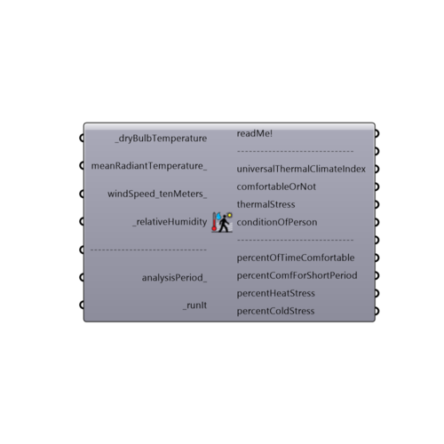

##  Outdoor Comfort Calculator

Use this component to calculate the Universal Thermal Climate Index (UTCI) for a set of input climate conditions.  Perhaps the most familiar application of Univeral Thermal Climate Index (UTCI) is the temperature given by TV weathermen and women when they say that, "even though the dry bulb temperature outside is a certain value, the temperature actually "feels like" something higher or lower."
 UTCI is this temperature of what the weather "feels like" and it takes into account the radiant temperature (sometimes including solar radiation), relative humidity, and wind speed.  UTCI uses these variables in a human energy balance model to give a temperature value that is indicative of the heat stress or cold stress felt by a human body in the outdoors.
 _
 A UTCI between 9 and 26 degrees Celcius indicates no thermal stress or comfortable conditions outdoors.
 _
 A UTCI between 26 and 28 degrees Celcius indicates slight heat stress (comfortable for short periods of time). Between 28 and 32 degrees, UTCI indicates moderate heat stress (hot but not dangerous).  Between 32 and 38 degrees, UTCI indicates strong heat stress (dangerous beyond short periods of time). Above 38, UTCI indicates very strong to extreme heat stress (very dangerous).
 _
 A UTCI between 0 and 9 degrees Celcius indicates slight cold stress (comfortable for short periods of time). Between 0 and -13 degrees, UTCI indicates moderate cold stress (cold but not dangerous).  Between -13 and -27 degrees, UTCI indicates strong cold stress (dangerous beyond short periods of time).  Below -27, UTCI indicates very stong to extreme cold stress (very dangerous).
 _
 _
 UTCI is result of the world's leading comfort specailists' attempt to make an interational standard of outdoor temperature sensation that fills the follwoing requirements:
 1)	Thermo-physiological significance in the whole range of heat exchange conditions of existing thermal environments
 2)	Valid in all climates, seasons, and scales
 3)	Useful for key applications in human biometeorology.
 _
 _
 The code that makes this component possible is a Python version of the original Fortran code for calculating UTCI.  Information on UTCI and the original Fortran code can be found here: http://www.utci.org/.
 -
 

#### Inputs
* ##### dryBulbTemperature [Required]
A number representing the dry bulb temperature of the air in degrees Celcius.  This input can also accept a list of temperatures representing conditions at different times or the direct output of dryBulbTemperature from the Import EPW component.
* ##### meanRadiantTemperature [Optional]
A number representing the mean radiant temperature of the surrounding surfaces in degrees Celcius.  If no value is plugged in here, this component will assume that the mean radiant temperature is equal to air temperature value above.  This input can also accept a list of temperatures representing conditions at different times or the direct output of dryBulbTemperature from the Import EPW component.
* ##### windSpeed_tenMeters [Optional]
A number representing the wind speed of the air in meters per second.  If no value is plugged in here, this component will assume a very low wind speed of 0.05 m/s, characteristic of most indoor conditions.  This input can also accept a list of wind speeds representing conditions at different times or the direct output of windSpeed from of the Import EPW component.
* ##### relativeHumidity [Required]
A number between 0 and 100 representing the relative humidity of the air in percentage.  This input can also accept a list of relative humidity values representing conditions at different times or the direct output of relativeHumidity from of the Import EPW component.
* ##### analysisPeriod [Optional]
An optional analysis period from the Analysis Period component.  If no Analysis period is given and epw data from the ImportEPW component has been connected, the analysis will be run for the enitre year.
* ##### runIt [Required]
Script variable UTCIComfortCalculator

#### Outputs
* ##### readMe!
...
* ##### universalThermalClimateIndex
The UTCI of the input conditions in degrees Celcius. Perhaps the most familiar application of Univeral Thermal Climate Index (UTCI) is the temperature given by TV weathermen and women when they say that, even though the dry bulb temperature outside is a certain value, the temperature actually "feels like" something higher or lower. UTCI is this temperature of what the weather "feels like" and it takes into account radiant temperature (usually including solar radiation), relative humidity, wind speed and uses them in a human energy balance model to give a temperature value that is indicative of the heat stress or cold stress felt by the human body.
* ##### comfortableOrNot
A stream of 0's and 1's (or "False" and "True" values) indicating whether a person outside is comfortable for each hour of the input conditions.  0 indicates that a person is not comfortable while 1 indicates that a person is comfortable.  A person is considered to be comfortable when he/she experiences no thermal stress (9 < UTCI < 26).
* ##### thermalStress
A stream of interger values from -1 to +1 that indicate the following:
 -1 - Cold Stress - cold conditions (UTCI < 9C).
 0  - No Thermal Stress - comfortable conditions (9C < UTCI < 26C).
 +1 - Heat Stress - hot conditions (UTCI > 26C).
* ##### conditionOfPerson
A stream of interger values from -3 to +3 that indicate the following:
 -3 - Strong Cold Stress - potential public health hazard with higher-than-normal mortality rates (UTCI < -13C).
 -2 - Moderate Cold Stress - cold but no public health hazard (-13C < UTCI < 0C).
 -1 - Slight Cold Stress - cool but comfortable for short periods of time (0C < UTCI < 9C)
 0  - No Thermal Stress  - comfortable conditions (9C < UTCI < 26C).
 +1 - Slight Heat Stress - warm but comfortable for short periods of time (26C < UTCI < 28C).
 +2 - Moderate Heat Stress - hot but no public health hazard (28C < UTCI < 32C).
 +3 - Strong Heat Stress - potential public health hazard with higher-than-normal mortality rates (UTCI > 32C).
* ##### percentOfTimeComfortable
The percent of the input data for which the UTCI indicates no thermal stress (comfortable conditions).  Comfortable conditions are when the UTCI is between 9 and 26 degrees Celcius.
* ##### percentComfForShortPeriod
The percent of the input data for which the UTCI indicates slight heat/cold stress.  This indicates conditions that are comfortable for short periods of time with proper attire.  This includes all conditions when the UTCI is between 0 and 9 degrees Celcius or between 26 and 28 degrees Celcius.
* ##### percentHeatStress
The percent of the input data for which the UTCI indicates moderate-to-extreme heat stress.  This indicates conditions that are not comfortable.  This includes all conditions are when the UTCI is above 28 degrees Celcius.
* ##### percentColdStress
The percent of the input data for which the UTCI indicates moderate-to-extreme cold stress.  This indicates conditions that are not comfortable.  This includes all conditions are when the UTCI is below 0 degrees Celcius.

[Check Hydra Example Files for Outdoor Comfort Calculator](https://hydrashare.github.io/hydra/index.html?keywords=Ladybug_Outdoor Comfort Calculator)