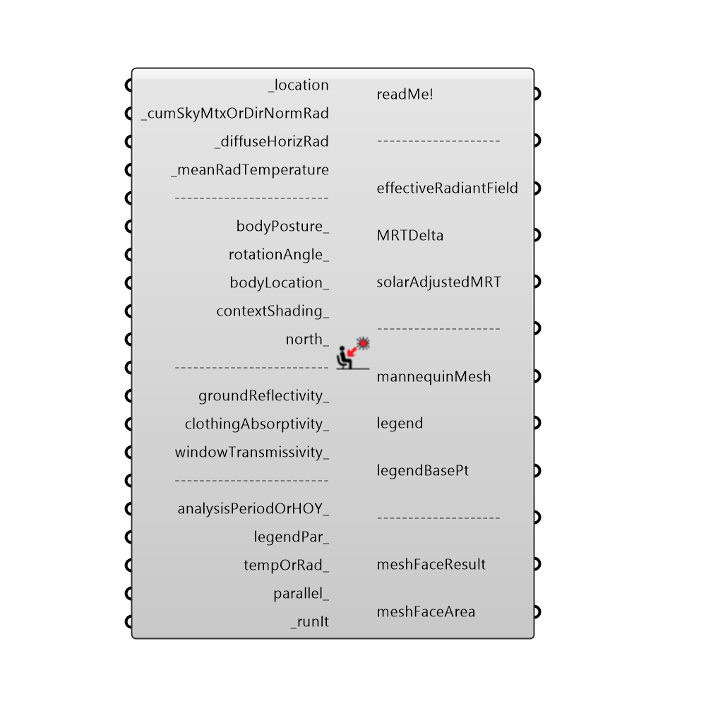

##  Outdoor_Solar_Temperature_Adjustor

Use this component to adjust an existing Mean Radiant Temperature for shortwave solar radiation.  This adjusted mean radiant temperature can then be used in comfort studies.
 _
 Note that this component assumes that you have already accounted for longwave radiation in the form of the _meanRadTemperature input.  If you do not hook up a _meanRadTemperature, this component will assume that the surrounding radiant temperature is the same as the air temperature, which is a decent assumption for someone standing in an unobstructed field.  However, the more obstacles that surround the person (and the more "context" that you add), the more important it is to derive a starting mean radiant temperature from a Honeybee Energy simulation.  Also note that this component is not meant to account for shortwave radiation passing through glass.
 _
 This component uses Radiance functions in order to determine the amount of direct and diffuse solar radiation falling on a comfort mannequin.  The portion reflected off of the ground to the comfort mannequin is derived from these values of direct and diffuse radiation.
 Lastly, the formulas to translate this radiation into an effective radiant field and into a solar-adjusted mean radiant temperature come from this paper:
 Arens, Edward; Huang, Li; Hoyt, Tyler; Zhou, Xin; Shiavon, Stefano. (2014). Modeling the comfort effects of short-wave solar radiation indoors.  Indoor Environmental Quality (IEQ).
 http://escholarship.org/uc/item/89m1h2dg#page-4
 -
 

#### Inputs
* ##### _location [Required]
The location output from the 'Ladybug_Import epw' component.
* ##### _cumSkyMtxOrDirNormRad [Required]
Either the output from a GenCumulativeSkyMtx component (for high-resolution analysis) or the directNormallRadiation ouput from the 'Ladybug_Import epw' component (for simple, low-resolution analsysis).
* ##### _diffuseHorizRad [Required]
If you are running a simple analysis with Direct Normal Radiation above, you must provide the diffuseHorizaontalRadiation ouput from the 'Ladybug_Import epw' component here.  Otherwise, this input is not required.
* ##### _meanRadTemperature [Required]
A number or list of numbers representing the mean radiant temperature of the surrounding surfaces in degrees Celcius.  This number will be modified to account for solar radiation.  This input can be air temperature data from the 'Import_epw' component and will follow the assumption that the surrounding mean radiant temperature is the same as the air temperature.  This assumption is ok for a person in an outdoor open field.  However, the more obstacles that surround the person (and the more 'contextShading_' that you add), the more important it is to derive a starting mean radiant temperature from a Honeybee Energy simulation.
* ##### bodyPosture_ [Optional]
An interger between 0 and 5 to set the posture of the comfort mannequin, which can have a large effect on the radiation for a given sun position.  0 = Standing, 1 = Sitting, 2 = Lying Down, 3 = Low-Res Standing, 4 = Low-Res Sitting, and 5 = Low-Res Lying Down.  The default is set to 1 for sitting.
* ##### rotationAngle_ [Optional]
An optional rotation angle in degrees.  Use this number to adjust the angle of the comfort mannequin in space.  The angle of the mannequin in relation to the sun can have a large effect on the amount of radiation that falls on it and thus largely affect the resulting mean radiant temperature.
* ##### bodyLocation_ [Optional]
An optional point that sets the position of the comfort mannequin in space.  Use this to move the comfort mannequin around in relation to contextShading_ connected below. Note that this point should be the center of gravity of your person.  The default is set to a person just above the Rhino origin.
* ##### contextShading_ [Optional]
Optional breps or meshes that represent shading or opaque solar obstructions around the mannequin.  If you are using this component for indoor studies, windows or any transparent materials should not be included in this geometry.  You should factor the transmissivity of these materials in with the windowTransmissivity_ input.  Also, note that, if you have a lot of this context geometry, you should make sure that you input a starting _meanRadTemperature that accounts for the temperature of all the temperture of these shading surfaces.
* ##### north_ [Optional]
Input a vector to be used as a true North direction for the sun path or a number between 0 and 360 that represents the degrees off from the y-axis to make North.  The default North direction is set to the Y-axis (0 degrees).
* ##### groundReflectivity_ [Optional]
An optional decimal value between 0 and 1 that represents the fraction of solar radiation reflected off of the ground.  By default, this is set to 0.25, which is characteristic of outdoor grass or dry bare soil.  You may want to increase this value for concrete or decrease it for water or dark soil.
* ##### clothingAbsorptivity_ [Optional]
An optional decimal value between 0 and 1 that represents the fraction of solar radiation absorbed by the human body. The default is set to 0.7 for (average/brown) skin and average clothing.  You may want to increase this value for darker skin or darker clothing.
* ##### windowTransmissivity_ [Optional]
An optional decimal value between 0 and 1 that represents the transmissivity of windows around the person.  This can also be a list of 8760 values between 0 and 1 that represents a list of hourly window transmissivties, in order to represent the effect of occupants pulling blinds over the windows, etc. Note that you should only set a value here if you are using this component for indoor analysis where the only means by which sunlight will hit an occupant is if it comes through a window.  The default is set to 1 for outdoor conditions.
* ##### analysisPeriodOrHOY_ [Optional]
An optional analysis period from the 'Analysis Period component' or an hour of the year between 1 and 8760 for which you want to conduct the analysis. If no value is connected here, the component will run for noon on the winter solstice.
* ##### legendPar_ [Optional]
Optional legend parameters from the Ladybug Legend Parameters component.
* ##### tempOrRad_ [Optional]
Set to 'True' to have the mannequin labled with adjusted perceived radiant temperature and set to 'False' to have the mannequin labled with total radiation falling on the person.
* ##### parallel_ [Optional]
Set to 'True' to run the component using multiple CPUs.  This can dramatically decrease calculation time but can interfere with other intense computational processes that might be running on your machine.  For this reason, the default is set to 'True.'
* ##### _runIt [Required]
Set to "True" to run the component and calculate solar-adjusted Mean Radiant Temperature.

#### Outputs
* ##### readMe!
...
* ##### effectiveRadiantField
The estimated effective radiant field of the comfort mannequin induced by the sun for each hour of the analysis period.  This is in W/m2.
* ##### MRTDelta
The estimated change in mean radiant temperature for the comfort mannequin induced by the solar radiation.  This is in degreed Celcius.
* ##### solarAdjustedMRT
The estimated solar adjusted mean radiant temperature for each hour of the analysis period.  This is essentially the change in mean radiant temperature above added to the hourly _meanRadTemperature input.  This is in degreed Celcius and can be plugged into any comfort components for comfort studies.
* ##### mannequinMesh
A colored mesh of a comfort mannequin showing the amount of radiation falling over the mannequin's body.
* ##### legend
A legend that corresponds to the colors on the mannequinMesh and shows the relative W/m2.
* ##### legendBasePt
The input data normalized by the floor area of it corresponding zone.
* ##### meshFaceResult
If 'tempOrRad' is set to True, this will be the estimated solar adjusted radiant temperature for each mesh face of the mannequin in degrees Celcius.  This radiant temperature is averaged over the the entire analysis period. if 'tempOrRad' is set to False, this will be the total radiation on each mesh face over the analysis period.
* ##### meshFaceArea
The areas of each mesh face of the mannequin in square Rhino model units.  This list corresponds to the meshFaceRadTemp list above and can be used to help inform statistical analysis of the radiant assymmetry over the mannequin.

[Check Hydra Example Files for Outdoor Solar Temperature Adjustor](https://hydrashare.github.io/hydra/index.html?keywords=Ladybug_Outdoor Solar Temperature Adjustor)