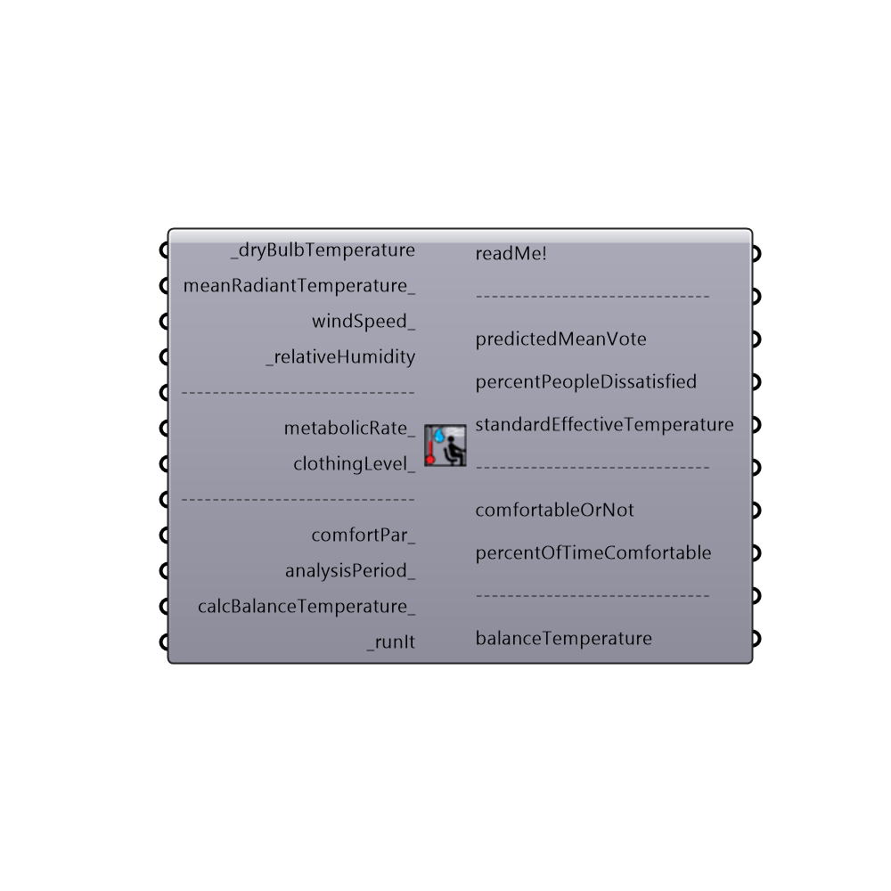

##  PMV_Comfort_Calculator

Use this component to calculate comfort metrics of Predicted Mean Vote (PMV), the Percent of People Dissatisfied (PPD), and the Standard Effective Temperature (SET) for a set of climate conditions and occupant behavior/clothing.
 This component can also calculate Outdoor Standard Effective Temperature (OUT-SET) if EPW weather data is connected.  HOWEVER, if you are interested in knowing whether outdoor conditions are actually comfortable, it is highly recommended that you use the Ladybug UTCI Comfort Calculator.  OUT-SET has been shown to be a poor indicator of outdoor comfort and is better used as a tool to help understand what clothing and metabolic rate a comfortable person might have in the outdoors AFTER running a UTCI study.
 _
 Predicted Mean Vote (PMV) is a seven-point scale of occupant comfort from cold (-3) to hot (+3) that was used in the comfort surveys of P.O. Fanger, who initially developed the scale and the PMV comfort model off of it. Each interger value of the PMV scale indicates the following: -3:Cold, -2:Cool, -1:Slightly Cool, 0:Neutral, +1:Slightly Warm, +2:Warm, +3:Hot.  The range of comfort is generally accepted as a PMV between -1 and +1.  Exceeding +1 will result in an uncomfortably warm occupant while dropping below -1 will result in an uncomfortably cool occupant.  PMV is a MEAN vote because is meant to represent the average vote of all people under the input conditions.
 This component will output the PMV of the occupant for the input conditions as well as an estimated Percentage of People Dissatisfied (PPD) under the given conditions.  PPD refers to the perceont of people that would give a PMV greater than/equal to 1 or less than/equal to -1.  Note that, with this model, it is not possible to get a PPD of 0% and most engineers just aim to have a PPD below 20% when designing a HVAC system.
 This component will also output Standard Effective Temperature (SET), which is an ajusted temperature scale meant to reflect the heat stress or cold felt by the occupant.  Specifically, SET is definied as the equivalent temperature of an imaginary environment at 50% relative humidity, <0.1 m/s air speed, and mean radiant temperature equal to air temperature, in which the total heat loss from the skin of an imaginary occupant is the same as that from a person existing under the input conditions. It is also important to note that the imaginary occupant is modeled with an activity level of 1.0 met and a clothing level of 0.6 clo.  The actual occupant in the real environment can have different values from these.
 _
 The original PMV studies by Fanger involved placing subjects in an air conditioned climate chamber for an hour in which the subjects had no means to adjust their conditions to make them comfortable.  Subjects where then asked to pick an interger on the PMV scale.  Since PMV subjects could not change their layers of clothing or open windows to make themselves comfortable, the PMV model is most useful when applied to these conditions of an air conditioned building in which users cannot open windows, turn on fans or change dress code.  For comfort in conditions where people can adjust these factors, the adaptive comfort calculator or UTCI comfort calculator would be most useful.
 _
 The comfort models that make this component possible were translated to python from a series of validated javascript comfort models coded at the Berkely Center for the Built Environment (CBE).  The PMV model used by both the CBE Tool and this component was originally published in ASHARAE 55.
 Special thanks goes to the authors of the online CBE Thermal Comfort Tool who first coded the javascript comfort models: Hoyt Tyler, Schiavon Stefano, Piccioli Alberto, Moon Dustin, and Steinfeld Kyle. http://cbe.berkeley.edu/comforttool/
 -
 

#### Inputs
* ##### _dryBulbTemperature [Required]
A number representing the dry bulb temperature of the air in degrees Celcius.  This input can also accept a list of temperatures representing conditions at different times or the direct output of dryBulbTemperature from the Import EPW component.
* ##### meanRadiantTemperature_ [Optional]
A number representing the mean radiant temperature of the surrounding surfaces in degrees Celcius.  If no value is plugged in here, this component will assume that the mean radiant temperature is equal to air temperature value above.  This input can also accept a list of temperatures representing conditions at different times or the direct output of dryBulbTemperature from the Import EPW component.
* ##### windSpeed_ [Optional]
A number representing the wind speed of the air in meters per second.  If no value is plugged in here, this component will assume a very low wind speed of 0.05 m/s, characteristic of most indoor conditions.  This input can also accept a list of wind speeds representing conditions at different times or the direct output of windSpeed from of the Import EPW component.
* ##### _relativeHumidity [Required]
A number between 0 and 100 representing the relative humidity of the air in percentage.  This input can also accept a list of relative humidity values representing conditions at different times or the direct output of relativeHumidity from of the Import EPW component.
* ##### metabolicRate_ [Optional]
A number representing the metabolic rate of the human subject in met.  This input can also accept text inputs for different activities.  Acceptable text inputs include Sleeping, Reclining, Sitting, Typing, Standing, Driving, Cooking, House Cleaning, Walking, Walking 2mph, Walking 3mph, Walking 4mph, Running 9mph, Lifting 10lbs, Lifting 100lbs, Shoveling, Dancing, and Basketball.  If no value is input here, the component will assume a metabolic rate of 1 met, which is the metabolic rate of a seated human being.  This input can also accept lists of metabolic rates.
* ##### clothingLevel_ [Optional]
A number representing the clothing level of the human subject in clo.  If no value is input here, the component will assume a clothing level of 1 clo, which is roughly the insulation provided by a 3-piece suit. A person dressed in shorts and a T-shirt has a clothing level of roughly 0.5 clo and a person in a thick winter jacket can have a clothing level as high as 2 to 4 clo.  This input can also accept lists of clothing levels.
* ##### comfortPar_ [Optional]
Optional comfort parameters from the "Ladybug_PMV Comfort Parameters" component.  Use this to adjust maximum and minimum acceptable humidity ratios.  These comfortPar can also change whether comfort is defined by eighty or ninety percent of people comfortable.  By default, comfort is defined as 90% of the occupants comfortable and there are no limits on humidity when there is no thermal stress.
* ##### analysisPeriod_ [Optional]
An optional analysis period from the Analysis Period component.  If no Analysis period is given and epw data from the ImportEPW component has been connected, the analysis will be run for the enitre year.
* ##### calcBalanceTemperature_ [Optional]
Set to "True" to have the component calculate the balance temperature for the input windSpeed_, _relativeHumidity, metabolicRate_, and clothingLevel_.  The balance temperature is essentially the temperature for these conditions at which the PMV is equal to 0 (or the energy flowing into the human body is equal to the energy flowing out).  Note that calculating the balance temperature for a whole year with epw windspeed can take as long as 10 minutes and so, by default, this option is set to "False".
* ##### _runIt [Required]
Set to "True" to run the component and calculate the PMV comfort metrics.

#### Outputs
* ##### readMe!
...
* ##### OUT_SET
The Outdoor Standard Effective Temperature (OUT_SET) in degrees Celcius.  OUT_SET is an ajusted temperature scale meant to reflect the heat stress or cold felt by an individual and has passed peer review as an indicator of outdoor comfort.  HOWEVER, if you are interested in knowing whether outdoor conditions are actually comfortable, it is highly recommended that you use the Ladybug UTCI Comfort Calculator.  OUT-SET has been shown to be a poor indicator of outdoor comfort and is better used as a tool to help understand what clothing and metabolic rate a comfortable person might have in the outdoors AFTER running a UTCI study.
* ##### restrictedComfOrNot
Because the PMV comfort model is derived from indoor comfort studies and you have hooked up outdoor data, the comfortableOrNot values out of this component should be taken with a grain of salt.  The comfort here represents a very narrow range because you are restricting the theoretical person's clothing and metabolic rate, which is normally unrestricted in the outdoors.
* ##### restrictedPercentComf
Because the PMV comfort model is derived from indoor comfort studies and you have hooked up outdoor data, the percentOfTimeComfortable values out of this component should be taken with a grain of salt.  The comfort here represents a very narrow range because you are restricting the theoretical person's clothing and metabolic rate, which is normally unrestricted in the outdoors.
* ##### balanceTemperature
The balance temperature is the temperature for the input windSpeed_, _relativeHumidity, metabolicRate_, and clothingLevel_ at which the PMV is equal to 0 (or the energy flowing into the human body is equal to the energy flowing out).  Setting the dry bulb and radiant temperatures to this value will produce a PMV of 0 and will yield the lowest possible PPD.

[Check Hydra Example Files for PMV Comfort Calculator](https://hydrashare.github.io/hydra/index.html?keywords=Ladybug_PMV Comfort Calculator)