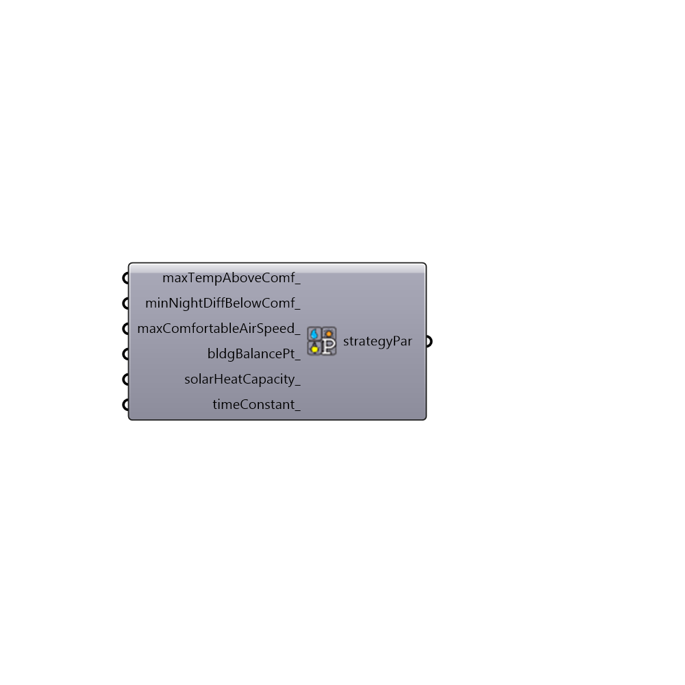

##  Passive_Strategy_Parameters

Use this component to adjust the assumptions of the passive strategies that can be overalid on the Ladybug the Psychrometric Chart. The default assumptions of each of the strategies are as follows: 
 _
 Evaporative Cooling - This polygon represents the conditions under which direct evaporative cooling would be helpful.  As such, it takes as its upper limit the line of constant enthalpy from the edge of the comfort polygon and includes all warm temperatures below it.  If the user has set a minimum humidity tolerance, the polygon will also include the points beneath the comfort polygon as it is assumed that the evaporation of water will both humidify and cool the air.  Nothe that this direct evaporative cooling polygon is slightly different than 2-stage evaporative cooling.
 _
 Thermal Mass + Night Flush - The polygon represents the conditions under which shaded, night-flushed thermal mass can keep occupants cool. By default, this polygon assumes that temperatures can get as high as 16.7 C above the max temperature of the comfort polygon as long temperatures 12 hours before the hot period are 2.8 C lower than the max temperture of the comfort polygon.  This parameter component can be used to adjust these two numbers. The thermal mass polygon is limited in terms of humidity in that it obeys any limits on absolute humidity that the comfort polygon dies.
 _
 Occupant Use of Fans - This polygon is made by assuming that a wind speed of 1.5 m/s is the maximum speed tolerable before it starts blowing papers and becomes annoying to occupants.  This strategy parameters component can be used to adjust this maximum acceptable wind speed. As such, the polygon is determined by running a PMV model with this wind speed and the input rad temp, met rate and clo level of the psych chart.  This component obeys any limits on humidity that the comfort polygon does.  Note that this polygon assumes that you are already naturally ventilating and that your natural ventilation period is defined by your comfort polygon.
 _
 Internal Heat Gain - The component assumes a minimum building balance point of 12.8 C and any conditions that are warmer than that (up to the comfort polygon) will keep occupants comfortable.  It is assumed that, above this outdoor temperature, the building is free-running and occupants are able to open windows as they wish.  Note that this balance temperature of 12.8 is fairly low and assumes a large number of inside heat sources or people as well as in insulated envelope.  This balance temperature can be adjusted with this strategyPar component.
 _
 Dessicant Dehumidification - This polygon represents the conditions under which dessicant dehumidification would be helpful.  As such, it takes as its upper limit the line of constant enthalpy from the edge of the comfort polygon and includes all humid conditions below it.  Note that this polygon does not appear if there is no upper humidity limit on the comfort polygon.
 -
 

#### Inputs
* ##### maxTempAboveComf_ [Optional]
An optional number in degrees C representing the maximum daily temperature above the comfort range which can still be counted in the Thermal Mass + Night Flush polygon.  The default is set to 16.7 C above the highest comfort temperature.
* ##### minNightDiffBelowComf_ [Optional]
An optional number in degrees C representing the minimum temperature below the maximum comfort temperature that the outdoor temperature must drop at night in order to count towards the Thermal Mass + Night Flush polygon. The default is set to 2.8 C.
* ##### maxComfortableAirSpeed_ [Optional]
An optional number in m/s that represents the maximum winds speed tolerable before it starts blowing papers and becomes annoying to occupants.  This is used to shape the "Occupant Use of Fans" Polygon and the default is set ot 1.5 m/s.
* ##### lowestBldgBalancePt_ [Optional]
An optional number representing the building balance point, which will be used to shape the "Internal Heat Gain" strategy polygon.  The default is set to 12.8 C and it is assumed that, above this outdoor temperature, the building is free-running and occupants are able to open windows as they wish.  Note that this default balance temperature of 12.8 is fairly low and assumes a large number of inside heat sources or people as well as in insulated envelope.

#### Outputs
* ##### strategyPar
Passive strategy parameters that can be plugged into the "Ladybug_Psychrometric Chart" to adjust the assumptions of the passive strategy polygons.

[Check Hydra Example Files for Passive Strategy Parameters](https://hydrashare.github.io/hydra/index.html?keywords=Ladybug_Passive Strategy Parameters)