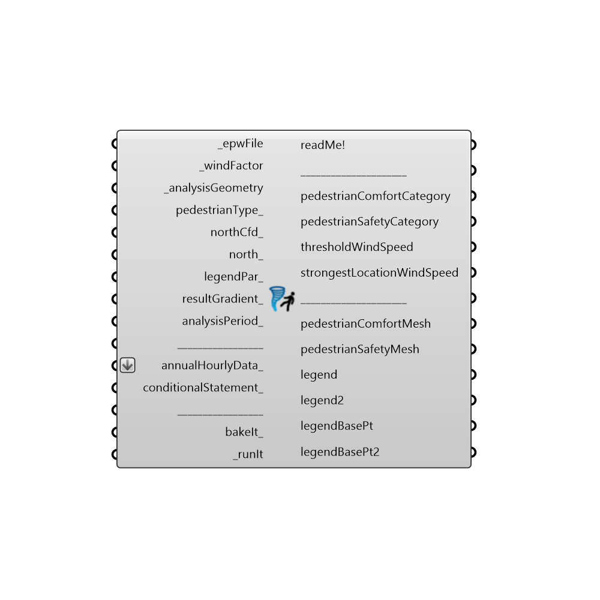

##  Pedestrian Wind Comfort - [[source code]](https://github.com/ladybug-tools/ladybug-legacy/tree/master/src/Ladybug_Pedestrian%20Wind%20Comfort.py)

Use this component to analyse pedestrian wind comfort and safety for the present and potential (newly built) urban environments.
 Construction of a new building changes the wind microclimate in its vicinity. These changes can result in either decreased or increased wind speeds around the building, which may be uncomfortable or even dangerous.
 -
 Based on Lawson’s Pedestrian Comfort Criteria (1990)
 https://www.dropbox.com/s/t9pxhr45vwg2xd2/Wind_Microclimate.pdf?dl=0
 -
 

#### Inputs
* ##### epwFile [Required]
Input an .epw file path by using the "File Path" parameter, or Ladybug's "Open EPW And STAT Weather Files" component.
* ##### windFactor [Required]
Division of cfd simulation's wind speed values, and annual average wind speed value from the weather data (.epw file) at 10 meters height.
 They are used to normalize against the weather data (.epw file), given that a CFD simulation with the exact .epw file wind speed and direction has not been performed.
 -
 _windFactor data should be supplied into different branches corresponding to different directions for which the cfd simulation has been performed.
 For example: the first branch holds windFactors for all analysis points for wind direction 0. Second branch would hold windFactors for all analysis points for wind direction 20. Third branch would hold windFactors for all analysis points for wind direction 40 ... and so on.
* ##### analysisGeometry [Required]
Input a mesh for whose face centroids the cfd simulation has been performed.
 -
 The number of mesh face centroids needs to be equal to the number of values in each of the _windFactor branches.
* ##### pedestrianType [Optional]
Choose the pedestrian type used at the analysis location:
 0 = typical pedestrian (20 m/s)
 1 = sensitive pedestrian (15 m/s): elderly people, cyclists, children.
 -
 This input is used to analyse pedestrian safety.
 -
 If not supplied, the 0 (typical pedestrian) will be used by default.
* ##### northCfd [Optional]
Input a vector to be used as a Cfd simulation's true North direction, or a number between 0 and 360 that represents the clockwise degrees off from the Y-axis.
 -
 If not supplied, default North Cfd direction will be set to the Y-axis (0 degrees).
* ##### north [Optional]
Input a vector to be used as Rhino's true North direction, or a number between 0 and 360 that represents the clockwise degrees off from the Y-axis.
 -
 If not supplied, default North direction will be set to the Y-axis (0 degrees).
* ##### legendPar [Optional]
Optional legend parameters from the Ladybug "Legend Parameters" component.
 -
* ##### resultGradient [Optional]
Choose whether or not the resulting geometry-values will be created as a gradient-float or not.
 -
 It allows the following two inputs:
 True - the resulting pedestrianComfortMesh, pedestrianSafetyMesh will be created as a gradient, and the pedestrianComfortCategory, pedestrianSafetyCategory will be outputed as float values.
 False - the resulting pedestrianComfortMesh, pedestrianSafetyMesh will NOT be created as a gradient, and the pedestrianComfortCategory, pedestrianSafetyCategory will be outputed as integer values.
 -
 If not supplied, no gradient (integer values) will be set by default.
* ##### analysisPeriod [Optional]
An optional analysis period from the "Analysis Period" component.
 -
 This input can be useful in cases where certain areas show higher pedestrianComfortCategory than required. For example: when analysis is run for the whole year period, the component shows that a certain location does not fulfill the comfort criteria for sitting.
 However if we perform the analysis for the period from late spring to early autumn (when the sitting is suppose to happen), the comfort criteria for sitting can be fulfilled.
 -
 If not supplied, the whole year period will be used as an analysis period.
* ##### annualHourlyData [Optional]
An optional list of hourly data from Ladybug's "Import epw" component (e.g. windSpeed), which will be used for "conditionalStatement_".
* ##### conditionalStatement [Optional]
This input allows users to calculate the Pedestrian wind comfort component results only for those annualHourlyData_ values which fit specific conditions or criteria. To use this input correctly, hourly data, such as windSpeed or windDirection, must be plugged into the "annualHourlyData_" input. The conditional statement input here should be a valid condition statement in Python, such as "a>4" or "b<90" (without the quotation marks).
 conditionalStatement_ accepts "and" and "or" operators. To visualize the hourly data, English letters should be used as variables, and each letter alphabetically corresponds to each of the lists (in their respective order): "a" always represents the 1st list, "b" always represents the 2nd list, etc.
 -
 For example, if you have an hourly windSpeed connected as the first list, and windDirection connected as the second list (both to the annualHourlyData_ input), and you want to plot the data for the time period when windSpeed is larger than 4m/s and windDirection is southerly, the conditionalStatement_ should be written as "a>4 and b==180" (without the quotation marks).
* ##### bakeIt [Optional]
Set to "True" to bake the pedestrianComfortMesh, pedestrianSafetyMesh, legend, legend2 into the Rhino scene.
 -
 If not supplied default value "False" will be used.
* ##### runIt [Required]
...

#### Outputs
* ##### readMe!
...
* ##### pedestrianComfortCategory
Pedestrian wind comfort categories for each face centroid of the _analysisGeometry mesh.
 The categories depend on the threshold wind speed for particular point: the wind speed that for 95% of the chosen analysis period is below a certain value. With values being the following:
 -
 0) < 4 m/s  sitting (outdoor cafes, patios, terraces, benches, gardens, parks, fountains, monuments...)
 1) 4-6 m/s  standing (building entrances or exits, bus stops, children’s play areas...)
 2) 6-8 m/s  leisurely walking (general areas of walking, strolling and sightseeing, window shopping, public/private sidewalks, pathways, public spaces...)
 3) 8-10 m/s  business walking (walking from one place to another quickly, or where individuals pass rapidly through local areas around buildings, public/private vehicular drop-off zones, roads and car parks, cyclists pathways...)
 4) > 10 m/s  uncomfortable (uncomfortable for all pedestrian activities)
 -
 If resultGradient_ input is set to True, then upper mentioned category values will be calculated as floats, instead of integers.
* ##### pedestrianSafetyCategory
Pedestrian wind safety categories for each face centroid of the _analysisGeometry mesh.
 -
 Infrequent strong wind can cause some pedestrians to have difficulties with walking, to stumble or fall.
 The location is safe if these infrequent strong winds appear for only 0.01% of the whole year period, and do not exceed the:
 -
 20 m/s for typical pedestrians (pedestrianType_ = 0)
 15 m/s for sensitive pedestrians (pedestrianType_ = 1): elderly people, cyclists, children
 -
 So the pedestrian safety categories are the following:
 -
 0) not safe (upper mentioned wind speeds and its occurrences are exceeded)
 1) safe (upper mentioned winds speeds and its occurrences are NOT exceeded)
 -
 If resultGradient_ input is set to True, then the mentioned category values will be calculated as floats, instead of integers.
* ##### thresholdWindSpeed
Wind speed that for 95% of the chosen analysis period is below the outputted value, for each _analysisGeometry face centroid.
 It is used to determine the pedestrianComfortCategory output.
 -
 In meters/second.
* ##### strongestLocationWindSpeed
The strongest wind speed for the chosen analysis period, for each _analysisGeometry face centroid.
 It is used along with pedestrianType_ input to determine the pedestrianSafetyCategory output.
 -
 In meters/second.
* ##### pedestrianComfortMesh
Colored _analysisGeometry mesh in accordance with disposition of the pedestrian wind comfort categories.
 For explanation of each of the categories, check the upper "pedestrianComfortCategory" output.
* ##### pedestrianSafetyMesh
Colored _analysisGeometry mesh. Coloring performed on the basis of whether the pedestrian safety criteria for the chosen location is fulfilled or not.
 For explanation of each of the categories, check the upper "pedestrianSafetyCategory" output.
 -
 Green colored areas are locations where the pedestrian safety criteria has been fulfilled.
 Red colored areas are locations where the pedestrian safety criteria has NOT been fulfilled.
* ##### legend
Legend for the pedestrianComfortMesh and its title.
* ##### legend2
Legend for the pedestrianSafetyMesh and its title.
 -
 Red colored areas are locations where the pedestrian safety criteria has NOT been fulfilled.
 Green colored areas are locations where the pedestrian safety criteria has been fulfilled.
* ##### legendBasePt
Legend base point, which can be used to move the "legend" geometry with grasshopper's "Move" component.
 -
 Connect this output to a Grasshopper's "Point" parameter in order to preview the point in the Rhino scene.
* ##### legendBasePt2
Legend2 base point, which can be used to move the "legend2" geometry with grasshopper's "Move" component.
 -
 Connect this output to a Grasshopper's "Point" parameter in order to preview the point in the Rhino scene.

[Check Hydra Example Files for Pedestrian Wind Comfort](https://hydrashare.github.io/hydra/index.html?keywords=Ladybug_Pedestrian Wind Comfort)