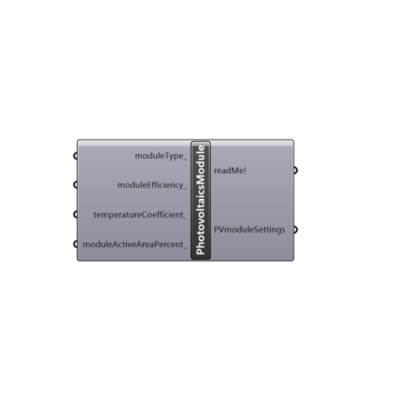

##  Photovoltaics Module

Use this component to define the Photovoltaics module settings.
 -
 If nothing inputed, the following PV module settings will be used by default:
 - moduleType: Close (flush) roof mount 
 - moduleEfficiency: 15%
 - temperatureCoefficient: -0.5 %/°C
 - moduleActiveAreaPercent: 90%
 -
 

#### Inputs
* ##### moduleType [Optional]
Module type and mounting configuration:
 -
 0 = Glass/cell/polymer sheet, Insulated back (pv curtain wall, pv skylights)
 1 = Glass/cell/glass, Close (flush) roof mount (pv array mounted parallel and relatively close to the plane of the roof (between 5 and 15 centimenters))
 2 = Glass/cell/polymer sheet, Open rack (ground mount array, flat/sloped roof array that is tilted, pole-mount solar panels, solar carports, solar canopies)
 3 = Glass/cell/glass, Open rack (the same as upper "2" type, just with a glass on the back part of the module).
 -
 If not supplied, default type: "Glass/cell/glass, Close (flush) roof mount" (1) is used.
* ##### moduleEfficiency [Optional]
The ratio of electrical energy output from the PV module to input solar energy from the sun.
 Current typical module efficiencies for crystalline silicon modules range from 14-20%
 -
 If not defined, default value of 15(%) will be used.
 -
 In percent (%).
* ##### temperatureCoefficient [Optional]
A coefficient which accounts for the percentage the solar module's DC output power decrease/increase for every degree Celsius the solar cells temperature rises above/below 25°C. 
 -
 In general it ranges from -0.44 to -0.5 for crystaline silicon modules.
 -
 If not supplied, -0.5 will be used as a default.
 -
 In %/°C.
* ##### moduleActiveAreaPercent [Optional]
Percentage of the module's area excluding module framing and gaps between cells. 
 -
 If not supplied, default value of 90(%) will be used.
 -
 In percent (%).

#### Outputs
* ##### readMe!
...
* ##### PVmoduleSettings
A list of PV module settings. Plug it to "Photovoltaics surface" component's "PVmoduleSettings_" input.

[Check Hydra Example Files for Photovoltaics Module](https://hydrashare.github.io/hydra/index.html?keywords=Ladybug_Photovoltaics Module)