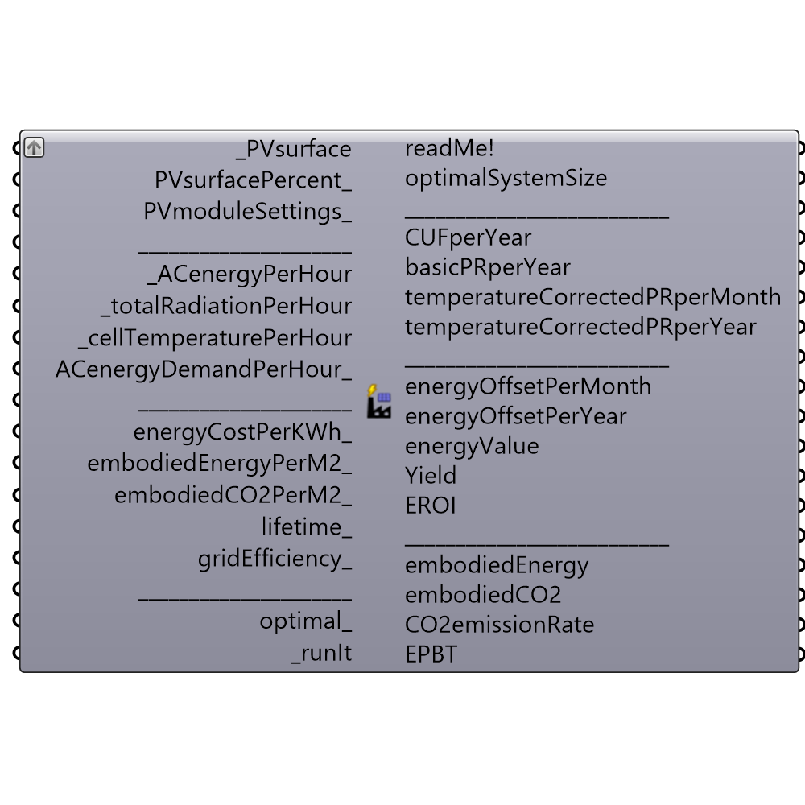

##  Photovoltaics_Performance_Metrics

Use this component to calculate various Photovoltaics performance metrics
 -
 

#### Inputs
* ##### _PVsurface [Required]
- Input planar Surface (not polysurface) on which the PV modules will be applied. If you have a polysurface, explode it (using "Deconstruct Brep" component) and then feed its Faces(F) output to _PVsurface. Surface normal should be faced towards the sun.
 - Or input surface Area, in square meters (example: "100").
 - Or input PV system size (nameplate DC power rating), in kiloWatts at standard test conditions (example: "4 kw").
* ##### PVsurfacePercent_ [Optional]
The percentage of surface which will be used for PV modules (range 0-100).
 -
 If not supplied, default value of 100 (all surface area will be covered in PV modules) is used.
* ##### moduleActiveAreaPercent_ [Optional]
Percentage of the module's area excluding module framing and gaps between cells. 
 -
 If not supplied, default value of 90(%) will be used.
* ##### moduleEfficiency_ [Optional]
The ratio of energy output from the PV module to input energy from the sun. It ranges from 0 to 100 (%).
 -
 If not defined, default value of 15(%) will be used.
* ##### lifetime_ [Optional]
Life expectancy of a PV module. In years.
 -
 If not supplied default value of 30 (years) will be used.
* ##### _ACenergyPerHour [Required]
Import "ACenergyPerYear" output data from "Photovoltaics surface" component.
 In kWh.
* ##### _totalRadiationPerHour [Required]
Import "totalRadiationPerHour" output data from "Photovoltaics surface" component.
 In kWh/m2.
* ##### _cellTemperaturePerHour [Required]
Import "cellTemperaturePerHour" output data from "Photovoltaics surface" component.
 In °C.
* ##### energyCostPerKWh_ [Optional]
The cost of one kilowatt hour in any currency unit (dollar, euro, yuan...)
 -
 If not supplied, 0.15 $/kWh will be used as default value.
* ##### embodiedEnergyPerM2_ [Optional]
Energy necessary for an entire product life-cycle of PV module per square meter.
 In MJ/m2 (megajoules per square meter).
 -
 If not supplied default value of 4410 (MJ/m2) will be used.
* ##### embodiedCO2PerM2_ [Optional]
Carbon emissions produced during PV module's life-cycle per square meter..
 In kg CO2/m2 (kilogram of CO2 per square meter).
 -
 If not supplied default value of 225 (kg CO2/m2) will be used.
* ##### gridEfficiency_ [Optional]
An average primary energy to electricity conversion efficiency.
 -
 If not supplied default value of 29 (%) will be used.
* ##### _runIt [Required]
...

#### Outputs
* ##### readMe!
...
* ##### Yield
Ratio of annual AC power output and nameplate DC power rating.
 In hours (h).
* ##### CUFperMonth
Capacity Utilization Factor - ratio of the annual AC power output and maximum possible output under ideal conditions if the sun shone throughout the day for the each month.
 In percent (%).
* ##### CUFperYear
Capacity Utilization Factor (sometimes called Plant Load Factor (PLF)) - ratio of the annual AC power output and maximum possible output under ideal conditions if the sun shone throughout the day and throughout the year.
 In percent (%).
* ##### basicPRperMonth
Basic Performance Ratio - ratio of the actual and theoretically possible energy output per month.
 In percent(%).
* ##### basicPRperYear
Basic Performance Ratio - ratio of the actual and theoretically possible annual energy output.
 In percent(%).
* ##### temperatureCorrectedPRperMonth
Temperature corrected Performance Ratio - ratio of the actual and theoretically possible energy output per month, corrected for PV module's Cell temperature. Mid-day hours (solarRadiation > 0.6 kWh/m2) only taken into account.
 In percent(%).
* ##### temperatureCorrectedPRperYear
Temperature corrected Performance Ratio - ratio of the actual and theoretically possible annual energy output, corrected for PV module's Cell temperature. Mid-day hours (solarRadiation > 0.6 kWh/m2) only taken into account.
 In percent(%).
* ##### energyValuePerMonth
Total Energy value for each month in currency unit (dollars, euros, yuans...)
* ##### energyValuePerYear
Total Energy value for whole year in currency unit (dollars, euros, yuans...)
* ##### embodiedEnergy
Total energy necessary for an entire product life-cycle of PV modules.
 In GJ (gigajoules).
* ##### embodiedCO2
Total carbon emissions produced during PV module's life-cycle.
 In tCO2 (tons of CO2).
* ##### CO2emissionRate
An index which shows how effective a PV system is in terms of global warming.
 It is used in comparison with other fuels and technologies (Hydroelectricity(15), Wind(21), Nuclear(60), Geothermal power(91), Natural gas(577), Oil(893), Coal(955) ...)
 In gCO2/kWh.
* ##### EPBT
Energy PayBack Time - time it takes for PV modules to produce all the energy used through-out its product life-cycle.
 In years.
* ##### EROI
Energy Return On Investment - a comparison of the generated electricity to the amount of primary energy used throughout the PV module's product life-cycle.
 Unitless.

[Check Hydra Example Files for Photovoltaics Performance Metrics](https://hydrashare.github.io/hydra/index.html?keywords=Ladybug_Photovoltaics Performance Metrics)