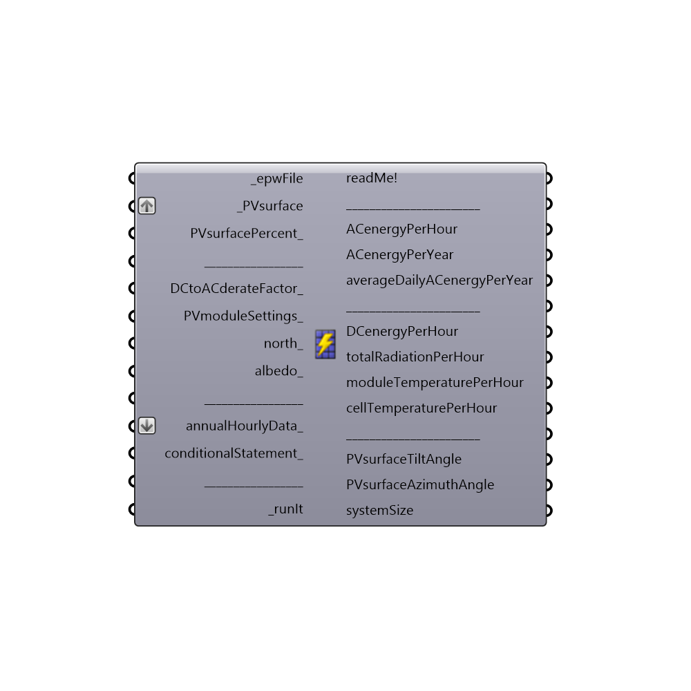

##  Photovoltaics Surface

Use this component to calculate amount of electrical energy that can be produced by a surface
 if a certain percentage of it is covered with Photovoltaics.
 Component based on NREL PVWatts v1 fixed tilt calculator for crystalline silicon (c-Si) and thin-film photovoltaics.
 -
 Sources:
 http://www.nrel.gov/docs/fy14osti/60272.pdf
 https://pvpmc.sandia.gov
 -
 

#### Inputs
* ##### epwFile [Required]
Input .epw file path by using the "File Path" parameter, or Ladybug's "Open EPW And STAT Weather Files" component.
* ##### PVsurface [Required]
- Input planar Grasshopper/Rhino Surface (not a polysurface) on which the PV modules will be applied. If you have a polysurface, explode it (using "Deconstruct Brep" component) and then feed its Faces(F) output to _PVsurface. Surface normal should be faced towards the sun.
 - Or create the Surface based on initial PV system size by using "PV SWH system size" component.
* ##### PVsurfacePercent [Optional]
The percentage of surface which will be used for PV modules (range 0-100).
 -
 Some countries and states, have local codes which limit the portion of the roof, which can be covered by crystalline silicon modules. For example, this may include having setbacks(distances) of approximatelly 90cm from side and top edges of a roof, as a fire safety regulation.
 -
 If not supplied, default value of 100 (all surface area will be covered in PV modules) is used.
 -
 In percent (%).
* ##### DCtoACderateFactor [Optional]
Factor which accounts for various locations and instances in a PV system where power is lost from DC system nameplate to AC power. It ranges from 0 to 1.
 It can be calculated with Ladybug's "DC to AC derate factor" component.
 -
 If not supplied, default value of 0.85 will be used.
* ##### PVmoduleSettings [Optional]
A list of PV module settings. Use the "Simplified Photovoltaics Module" or "Import Sandia Photovoltaics Module" or "Import CEC Photovoltaics Module" components to generate them.
 -
 If not supplied, the following PV module settings will be used by default:
 - module material: crystalline silicon (c-Si)
 - moduleType: Close (flush) roof mount
 - moduleEfficiency: 15 %
 - temperatureCoefficient: -0.5 %/C
 - moduleActiveAreaPercent: 90 %
* ##### north [Optional]
Input a vector to be used as a true North direction, or a number between 0 and 360 that represents the clockwise degrees off from the Y-axis.
 -
 If not supplied, default North direction will be set to the Y-axis (0 degrees).
* ##### albedo [Optional]
A list of 8767 (with header) or 8760 (without the header) albedo values for each hour during a year.
 Albedo (or Reflection coefficient) is an average ratio of the global incident solar radiation reflected from the area surrounding the PV surface.
 It ranges from 0 to 1.
 -
 It depends on the time of the year/day, surface type, temperature, vegetation, presence of water, ice and snow etc.
 -
 If no list supplied, default value of 0.20 will be used, corrected(increased) for the presence of snow (if any).
 -
 Unitless.
* ##### annualHourlyData [Optional]
An optional list of hourly data from Ladybug's "Import epw" component (e.g. dryBulbTemperature), which will be used for "conditionalStatement_".
* ##### conditionalStatement [Optional]
This input allows users to calculate the Photovoltaics surface component results only for those annualHourlyData_ values which fit specific conditions or criteria. To use this input correctly, hourly data, such as dryBulbTemperature or windSpeed, must be plugged into the "annualHourlyData_" input. The conditional statement input here should be a valid condition statement in Python, such as "a>25" or "b<3" (without the quotation marks).
 conditionalStatement_ accepts "and" and "or" operators. To visualize the hourly data, English letters should be used as variables, and each letter alphabetically corresponds to each of the lists (in their respective order): "a" always represents the 1st list, "b" always represents the 2nd list, etc.
 -
 For example, if you have an hourly dryBulbTemperature connected as the first list, and windSpeed connected as the second list (both to the annualHourlyData_ input), and you want to plot the data for the time period when temperature is between 18C and 23C, and windSpeed is larger than 3m/s, the conditionalStatement_ should be written as "18<a<23 and b>3" (without the quotation marks).
* ##### runIt [Required]
...

#### Outputs
* ##### readMe!
...
* ##### ACenergyPerHour
AC power output for each hour during a year.
 -
 In kWh.
* ##### ACenergyPerYear
Total AC power output for a whole year.
 -
 In kWh.
* ##### averageDailyACenergyPerYear
An average AC power output per day for a whole year.
 -
 In kWh/day.
* ##### DCenergyPerHour
DC power output of the PV array for each hour during a year.
 -
 In kWh.
* ##### totalRadiationPerHour
Total Incident POA (Plane of array) irradiance for each hour during a year.
 -
 In kWh/m2.
* ##### cellTemperaturePerHour
Cell temperature for each hour during year.
 -
 In C.
* ##### PVsurfaceTiltAngle
The angle from horizontal of the inclination of the PVsurface. Example: 0 = horizontal, 90 = vertical.
 It ranges from 0-180.
 -
 In degrees.
* ##### PVsurfaceAzimuthAngle
The orientation angle (clockwise from the true north) of the PVsurface normal vector.
 It ranges from 0-360.
 -
 In degrees.
* ##### systemSize
DC rating of the PV system.
 -
 In kW.

[Check Hydra Example Files for Photovoltaics Surface](https://hydrashare.github.io/hydra/index.html?keywords=Ladybug_Photovoltaics Surface)