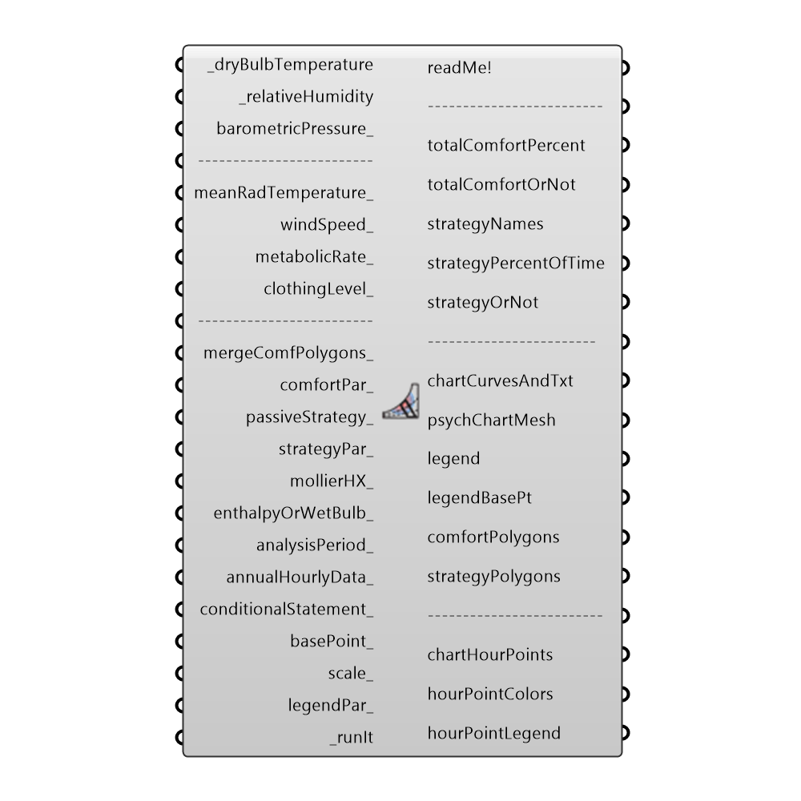

##  Psychrometric Chart

Use this component to draw a psychrometric chart in the Rhino scene and evaluate a set of temperatures and humidity ratios in terms of indoor comfort.  Connected data can include either outdoor temperature and humidty ratios from imported EPW weather data, indoor temperature and humidity ratios from an energy simulation, or indivdual numerical inputs of temperature and humidity.  The input data will be plotted alongside polygons on the chart representing comfort as well as polygons representing the efects of passive building strategies on comfort.
 _
 The specific human energy balance model used by the psychrometric chart is the Predicted Mean Vote (PMV) model developed by P.O. Fanger. PMV is a seven-point scale from cold (-3) to hot (+3) that is used in comfort surveys.  Each interger value of the scale indicates the following: -3:Cold, -2:Cool, -1:Slightly Cool, 0:Neutral, +1:Slightly Warm, +2:Warm, +3:Hot.  The range of comfort is generally accepted as a PMV between -1 and +1 and this is what defines the range of the comfort polygon on the psychrometric chart.
 Accordingly, this component will also output the PMV of the occupant for the input conditions as well as an estimated percentage of people dissatisfied (PPD) in the given conditions.
 _
 The comfort models that make this component possible were translated to python from a series of validated javascript comfort models developed at the Berkely Center for the Built Environment (CBE).
 Specific documentation on the comfort models can be found here: https://code.google.com/p/cbe-comfort-tool/wiki/ComfortModels
 _
 Special thanks goes to the authors of the online CBE Thermal Comfort Tool who first made the javascript models in order to power the tool:
 Hoyt Tyler, Schiavon Stefano, Piccioli Alberto, Moon Dustin, and Steinfeld Kyle, 2013, CBE Thermal Comfort Tool. 
 Center for the Built Environment, University of California Berkeley, http://cbe.berkeley.edu/comforttool/
 _
 The information for the polygons representing passive strategies comes from the climate consultant psychrometric chart.  Further information on how these polygons are calculated can be found here:
 http://apps1.eere.energy.gov/buildings/tools_directory/software.cfm/ID=123/pagename=alpha_list
 -
 

#### Inputs
* ##### dryBulbTemperature [Required]
A number representing the dry bulb temperature of the air in degrees Celcius.  This input can also accept a list of temperatures representing conditions at different times or the direct output of dryBulbTemperature from the Import EPW component.  Indoor temperatures from Honeybee energy simulations are also possible inputs.  Finally, this component can also acccept temperatures in Farenheit in order to draw a chart with IP units but, in order for this component to sense that the values are Farenheit, there must be at least one 'F' or '°F' in the stream of connected data.
* ##### relativeHumidity [Required]
A number between 0 and 100 representing the relative humidity of the air in percentage.  This input can also accept a list of relative humidity values representing conditions at different times or the direct output of relativeHumidity from of the Import EPW component.
* ##### barometricPressure [Optional]
A number representing the barometric pressure in Pascals.  If no value is connected here, the default pressure will be 101325 Pa, which is air pressure at sea level.  It is recommended that you connect the barometric pressure from the Import epw component here as the air pressure at sea level can cause some misleading results for cities at higher elevations.
* ##### meanRadTemperature [Optional]
A number representing the mean radiant temperature of the surrounding surfaces.  This value should be in degrees Celcius unless you have connected values in Farenheit to the dryBulbTemperature and you are seeing a chart in IP units.  If no value is plugged in here, this component will assume that the mean radiant temperature is equal to 23 C.  This input can also accept a list of temperatures and this will produce several comfort polygons (one for each mean radiant temperature).
* ##### windSpeed [Optional]
A number representing the wind speed of the air in meters per second.  If no value is plugged in here, this component will assume a very low wind speed of 0.05 m/s, characteristic of most indoor conditions.  This input can also accept a list of wind speeds representing conditions and this will produce several comfort polygons (one for each wind speed).
* ##### metabolicRate [Optional]
A number representing the metabolic rate of the human subject in met.  This input can also accept text inputs for different activities.  Acceptable text inputs include Sleeping, Reclining, Sitting, Typing, Standing, Driving, Cooking, House Cleaning, Walking, Walking 2mph, Walking 3mph, Walking 4mph, Running 9mph, Lifting 10lbs, Lifting 100lbs, Shoveling, Dancing, and Basketball.  If no value is input here, the component will assume a metabolic rate of 1 met, which is the metabolic rate of a seated human being.  This input can also accept lists of metabolic rates and will produce multiple comfort polygons accordingly.
* ##### clothingLevel [Optional]
A number representing the clothing level of the human subject in clo.  If no value is input here, the component will assume a clothing level of 1 clo, which is roughly the insulation provided by a 3-piece suit. A person dressed in shorts and a T-shirt has a clothing level of roughly 0.5 clo and a person in a thick winter jacket can have a clothing level as high as 2 to 4 clo.  This input can also accept lists of clothing levels and will produce multiple comfort polygons accordingly.
* ##### mergeComfPolygons [Optional]
Set to "True" if you have connected multiple values for any of the four comfort variables in the section above and you wish to merge all of the computed comfort polygons into one.
* ##### comfortPar [Optional]
Optional comfort parameters from the "Ladybug_PMV Comfort Parameters" component.  Use this to adjust maximum and minimum acceptable humidity ratios.  These comfortPar can also change whether comfort is defined by eighty or ninety percent of people comfortable.
* ##### passiveStrategy [Optional]
An optional text input of passive strategies to be laid over the psychrometric chart as polygons.  It is recommended that you use the "Ladybug_Passive Strategy List" to select which polygons you would like to display.  Otherwise, acceptable text inputs include "Evaporative Cooling", "Thermal Mass + Night Vent", "Occupant Use of Fans", "Internal Heat Gain", and "Dessicant Dehumidification".
* ##### strategyPar [Optional]
Optional passive strategy parameters from the "Ladybug_Passive Strategy Parameters" component.  Use this to adjust the maximum comfortable wind speed, the building balance temperature, and the temperature limits for thermal mass and night flushing.
* ##### mollierHX [Optional]
Set to "True" to visualize the psychrometric chart as a mollier-hx diagram.  This is essentially a psychrometric chart where the axes have been switched, which is popular in Europe.
* ##### enthalpyOrWetBulb [Optional]
Set to "True" to have the psychrometric chart plot lines of constant enthalpy and set to "False" to have the chart plot linest of constant wet bulb temperature.  The default is set to "True" for enthalpy.
* ##### analysisPeriod [Optional]
An optional analysis period from the Ladybug_Analysis Period component.  If no Analysis period is given and epw data from the ImportEPW component has been connected, the analysis will be run for the enitre year.
* ##### annualHourlyData [Optional]
An optional list of hourly data from the Import epw component, which will be used to create hourPointColors that correspond to the hours of the data (e.g. windSpeed).  You can connect up several different annualHourly data here.
* ##### conditionalStatement [Optional]
This input allows users to remove data that does not fit specific conditions or criteria from the psychrometric chart. The conditional statement input here should be a valid condition statement in Python, such as "a>25" or "b<80" (without quotation marks).
 The current version of this component accepts "and" and "or" operators. To visualize the hourly data, only lowercase English letters should be used as variables, and each letter alphabetically corresponds to each of the lists (in their respective order): "a" always represents dryBulbtemperature, "b" always represents the relativeHumidity, "c" always represents the 1st list plugged into annualHourlyData_, "d" represents the 2nd list, etc.
 For example, if you want to plot the data for the time period when temperature is between 18C and 23C, and humidity is less than 80%, the conditional statement should be written as “18<a<23 and b<80” (without quotation marks).
* ##### basePoint [Optional]
An optional base point that will be used to place the Psychrometric Chart in the Rhino scene.  If no base point is provided, the base point will be the Rhino model origin.
* ##### scale [Optional]
An optional number to change the scale of the spychrometric chart in the Rhino scene.  By default, this value is set to 1.
* ##### legendPar [Optional]
Optional legend parameters from the Ladybug Legend Parameters component.
* ##### bakeIt [Optional]
An integer that tells the component if/how to bake the bojects in the Rhino scene.  The default is set to 0.  Choose from the following options:
 0 (or False) - No geometry will be baked into the Rhino scene (this is the default).
 1 (or True) - The geometry will be baked into the Rhino scene as a colored hatch and Rhino text objects, which facilitates easy export to PDF or vector-editing programs.
 2 - The geometry will be baked into the Rhino scene as colored meshes, which is useful for recording the results of paramteric runs as light Rhino geometry.
* ##### runIt [Required]
Set to "True" to run the component and generate a psychrometric chart!
 Returns:

#### Outputs
* ##### readMe!
...
* ##### totalComfortPercent
The percent of the input data that are  inside all comfort and passive strategy polygons.
* ##### totalComfortOrNot
A list of 0's and 1's indicating, for each hour of the input data, if the hour is inside a comfort or strategy polygon (1) or not(0).
* ##### strategyNames
A list of names for the comfort polygons and strategeis that corresponds to the numbers in the following outputs.
* ##### strategyPercentOfTime
The percent of the input data that are in each of the comfort or passive strategy polygons.  Each number here corresponds to the names in the "strategyNames" output above.
* ##### strategyOrNot
A list of 0's and 1's indicating, for each hour of the input temperature and humidity ratio, if the hour is inside a given comfort or passive strategy polygon (1) or not(0).  If there are multiple comfort polyogns or passive strategies connected to the passiveStrategy_ input, this output will be a grafted list for each polygon.  Each list here corresponds to the names in the "strategyNames" output above.
* ##### chartCurvesAndTxt
The chart curves and text labels of the psychrometric chart.
* ##### psychChartMesh
A colored mesh showing the number of input hours happen in each part of the psychrometric chart.
* ##### legend
A colored legend showing the number of hours that correspond to each color.
* ##### legendBasePt
The legend base point, which can be used to move the legend in relation to the chart with the grasshopper "move" component.
* ##### comfortPolygons
A brep representing the range of comfort for the input radiant temperature, wind speed, metabolic rate and clothing level.  IF multiple values have been hooked up for any of these inputs, multiple polygons will be output here.
* ##### strategyPolygons
A brep representing the area of the chart made comfortable by the passive strategies.  If multiple strategies have been hooked up to the passiveStrategy_ input, multiple polygons will be output here.
* ##### chartHourPoints
Points representing each of the hours of input temperature and humidity ratio.  By default, this ouput is hidden and, to see it, you should connect it to a Grasshopper preview component.
* ##### hourPointColors
Colors that correspond to the chartHourPoints above and can be hooked up to the "Swatch" input of a Grasshopper Preview component that has the hour points above connected as geometry.  By default, points are colored red if they lie inside comfort or strategy polygons and are colored blue if they do not meet such comfort criteria.  In the event that you have hooked up annualHourlyData_ this output will be a grafted list of colors.  The first list corresponds to the comfort conditions while the second list colors points based on the annualHourlyData.
* ##### hourPointLegend
A legend that corresponds to the hour point colors above.  In the event that annualHourlyData_ is connected, this output will be a grafted list of legends that each correspond to the grafted lists of colors.

[Check Hydra Example Files for Psychrometric Chart](https://hydrashare.github.io/hydra/index.html?keywords=Ladybug_Psychrometric Chart)