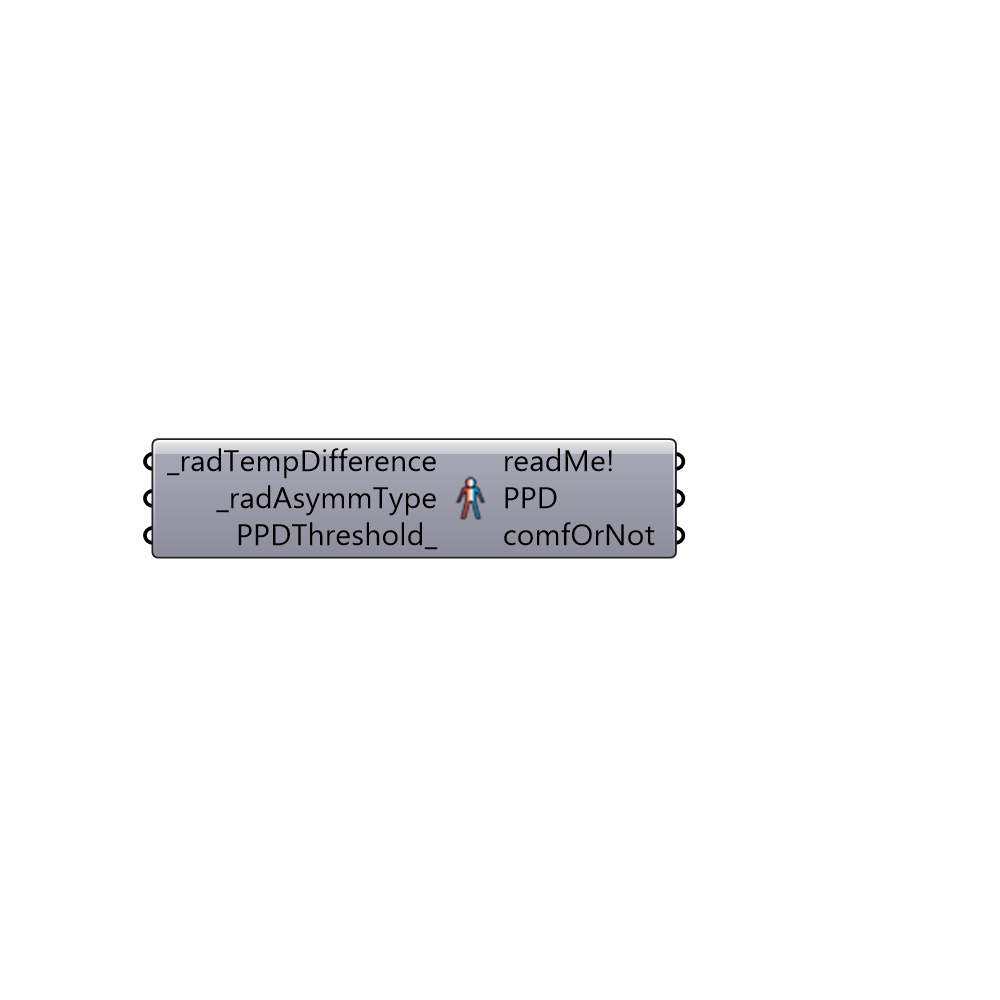

##  Radiant Asymmetry Discomfort

Use this component to calculate discomfort from radiant assymetry.
 _
 The comfort functions in this function come from Figure 5.2.4.1 of ASHRAE 55 2010.
 -
 

#### Inputs
* ##### radTempDifference [Required]
The temperature difference between one side of a pla
* ##### radAsymmType [Required]
An integer that represents the type of radiant assymetry being evaluated.  Occupants are more sensitive to warm cielings and cool walls than cool ceilings and warm walls.  Choose from the following options:
 0 = Warm Ceiling
 1 = Cool Wall
 2 = Cool Cieling
 3 = Warm Wall
* ##### PPDThreshold [Optional]
The percentage of people dissatisfied (PPD) above which conditions are not longer considered acceptable.  The default is set to 5%, which is the specification for the ASHRAE 55 comfort standard.  The EN-7730 varies from 6% to 10% depending on the building class.

#### Outputs
* ##### readMe!
...
* ##### PPD
The percentage of people dissatisfied (PPD) from radiant asymmetry.
* ##### comfOrNot
A lidt of 0's and 1's (or "False" and "True" values) indicating whether occupants are comfortable under the input conditions.

[Check Hydra Example Files for Radiant Asymmetry Discomfort](https://hydrashare.github.io/hydra/index.html?keywords=Ladybug_Radiant Asymmetry Discomfort)