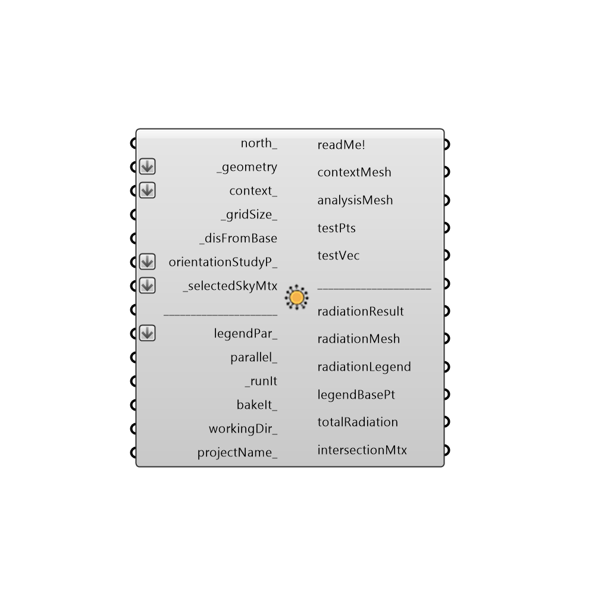

##  Radiation Analysis

This component allows you to calculate the radiation fallin on input _geometry using a sky matrix from the selectSkyMxt component.
 This type of radiation sutdy is useful for building surfaces such as windows, where you might be interested in solar heat gain, or solar panels, where you might be interested in the energy that can be collected.
 This component is also good for surfaces representing outdoor spaces (such as parks or seating areas) where radiation could affect thermal comfort or vegetation growth.
 No reflection of sunlight is included in the radiation analysis with this component and it should therefore be used
 neither for interior daylight studies nor for complex geometries nor for surfaces with high a reflectivity.
 For these situations where the relfection of light is important, the Honeybee daylight components should be used instead of this one.
 -
 

#### Inputs
* ##### north [Optional]
Input a vector to be used as a true North direction for the sun path or a number between 0 and 360 that represents the degrees off from the y-axis to make North.  The default North direction is set to the Y-axis (0 degrees).
* ##### geometry [Required]
Geometry for which radiation analysis will be conducted.  Geometry must be either a Brep, a Mesh or a list of Breps or Meshes.
* ##### context [Optional]
Context geometry that could block sunlight to the test _geometry.  Conext geometry must be either a Brep, a Mesh or a list of Breps or Meshes.
* ##### gridSize [Default]
A number in Rhino model units that represents the average size of a grid cell for radiation analysis on the test surface(s).  This value should be smaller than the smallest dimension of the test geometry for meaningful results.  Note that, the smaller the grid size, the higher the resolution of the analysis and the longer the calculation will take.
* ##### disFromBase [Required]
A number in Rhino model units that represents the offset distance of the test point grid from the input test _geometry.  Usually, the test point grid is offset by a small amount from the test _geometry in order to ensure that radiation analysis is done for the correct side of the test _geometry.  If the resulting testPts of this component are offset to the wrong side of test _geometry, you should use the "Flip" Rhino command on the test _geometry before inputting it to this component.
* ##### orientationStudyP [Optional]
Optional output from the "Orientation Study Parameter" component.  You can use an Orientation Study input here to answer questions like "What orientation of my building will give me the highest or lowest radiation gain for my analysis period?"  An Orientation Study will automatically rotate your input _geometry around several times and record the radiation results each time in order to output a list of values for totalRadiation and a grafted data stream for radiationResult.
* ##### selectedSkyMtx [Required]
The output from the selectSkyMtx component.
* ##### legendPar [Optional]
Optional legend parameters from the Ladybug Legend Parameters component.
* ##### parallel [Optional]
Set to "True" to run the radiation analysis using multiple CPUs.  This can dramatically decrease calculation time but can interfere with other intense computational processes that might be running on your machine.
* ##### runIt [Required]
Set to "True" to run the component and perform radiation analysis on the input _geometry.
* ##### bakeIt [Optional]
An integer that tells the component if/how to bake the bojects in the Rhino scene.  The default is set to 0.  Choose from the following options:
 0 (or False) - No geometry will be baked into the Rhino scene (this is the default).
 1 (or True) - The geometry will be baked into the Rhino scene as a colored hatch and Rhino text objects, which facilitates easy export to PDF or vector-editing programs.
 2 - The geometry will be baked into the Rhino scene as colored meshes, which is useful for recording the results of paramteric runs as light Rhino geometry.
* ##### workingDir [Optional]
Use this input to change the working directory of the radiation analysis on your system. Input here must be a valid file path location on your computer.  The default is set to "C:\Ladybug" and it is from this file location that radiation results are loaded into grasshopper after the analysis is done.
* ##### projectName [Optional]
Use this input to change the project name of the files generated in the working directory.  Input here must be a string without special characters.  If "bakeIt_" is set to "True", the result will be baked into a layer with this project name.

#### Outputs
* ##### readMe!
...
* ##### contextMesh
An uncolored mesh representing the context_ geometry that was input to this component. Connect this output to a "Mesh" grasshopper component to preview this output seperately from the others of this component. Note that this mesh is generated before the analysis is run, allowing you to be sure that the right geometry will be run through the analysis before running this component.
* ##### analysisMesh
An uncolored mesh representing the test _geometry that will be analyzed.  Connect this output to a "Mesh" grasshopper component to preview this output seperately from the others of this component. Note that this mesh is generated before the analysis is run, allowing you to be sure that the right geometry will be run through the analysis before running this component.
* ##### testPts
The grid of test points on the test _geometry that will be used to perform the radiation analysis.  Note that these points are generated before the analysis is run, allowing you to preview the resolution of the result before you run the component.
* ##### testVec
Vectors for each of the test points on the test _geometry, which indicate the direction for which radiation analysis is performed.  Hook this and the test points up to a Grasshopper "Vector Display" component to see how analysis is performed on the test _geometry.
* ##### radiationResult
The amount of radiation in kWh/m2 falling on the input test _geometry at each of the test points.
* ##### radiationMesh
A colored mesh of the test _geometry representing the radiation in kWh/m2 falling on this input _geometry for the selected sky.
* ##### radiationLegend
A legend for the radiation study showing radiation values that correspond to the colors of the radiationMesh. Connect this output to a grasshopper "Geo" component in order to preview the legend separately in the Rhino scene.  
* ##### legendBasePt
The legend base point, which can be used to move the legend in relation to the radiation mesh with the grasshopper "move" component.
* ##### totalRadiation
The total radiation in kWh falling on the input test _geometry.  This is computed through a mass addition of results at each of the test points in kWh/m2 multiplied by the area of the face that the test point is representing.
* ##### intersectionMtx
A python list that includes the relation between each test point and all the sky patchs on the sky dome.  After running a basic radiation study, you can connect this output to the Ladybug "Real Time Radiation Analysis" component to scroll through the radiation falling on your test geometry on an hour-by-hour, day-by-day, or month-by-month basis in real time.

[Check Hydra Example Files for Radiation Analysis](https://hydrashare.github.io/hydra/index.html?keywords=Ladybug_Radiation Analysis)