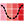
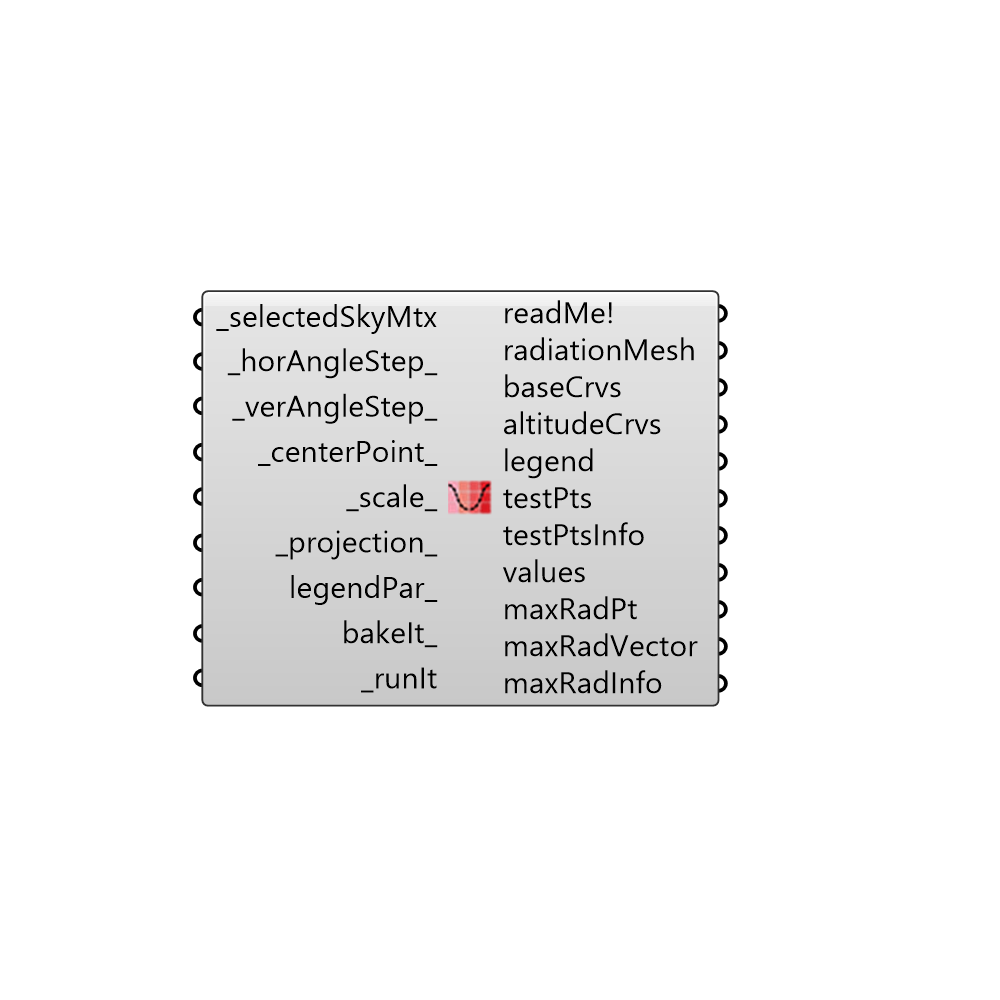

##  Radiation Calla Dome - [[source code]](https://github.com/mostaphaRoudsari/ladybug/tree/master/src/Ladybug_Radiation%20Calla%20Dome.py)

Use this component to draw Radiation Calla Dome, which shows you how radiation would fall on an object from all directions for a given sky.
 _
 It is useful for finding the best direction with which to orient solar panels and gives a sense of the consequences of deviating from such an orientation.
 _
 The Calla Dome can be understood in three different ways:
 _
 1) The Calla Dome a 3D representation of all possible radiation roses for a given sky since it includes all vertical angles from 0 to 90.
 2) The Calla Dome is the reciprocal of the Tergenza Sky Dome since the Cala Dome essentially shows you how the radiation from the sky will fall onto a hemispherical object.
 3) The Calla Dome is a smart radiation analysis of a hemisphere.  Your results would effectively be the same if you made a hemisphere in Rhino and ran it through the "Radiation Analysis" component but, with this component, you will get a smoother color gradient and the component will automatically output the point (or vector) with the most radiation.
 -
 

#### Inputs
* ##### selectedSkyMtx [Required]
The output from the selectSkyMtx component.
* ##### horAngleStep [Default]
An angle in degrees between 0 and 360 that represents the step for horizontal rotation. Smaller numbers will yeild a finer and smoother mesh with smoother colors.  The number input here should be smaller than 360 and divisible by 360.  The default is set to 10 degrees.
* ##### verAngleStep [Default]
Angle in degrees step between 0 and 90 that represents the step for vertical rotation. Smaller numbers will yeild a finer and smoother mesh with smoother colors.  The number input here should be smaller than 90 and divisible by 90.  The default is set to 10 degrees.
* ##### centerPoint [Default]
Input a point to locate the center point of the Calla Lily Graph
* ##### scale [Default]
Input a number here to change horizontal (XY) scale of the graph. The default value is set to 1.  Note that, for the dome representation, this input will change the scale of the entire dome (both horizontal and vertical).
* ##### projection [Default]
A number to set the projection of the sky hemisphere.  The default is set to draw a 3D hemisphere.  Choose from the following options:
 0 = 3D hemisphere
 1 = Orthographic (straight projection to the XY Plane)
 2 = Stereographic (equi-angular projection to the XY Plane)
* ##### legendPar [Optional]
Optional legend parameters from the Ladybug Legend Parameters component.
* ##### bakeIt [Optional]
An integer that tells the component if/how to bake the bojects in the Rhino scene.  The default is set to 0.  Choose from the following options:
 0 (or False) - No geometry will be baked into the Rhino scene (this is the default).
 1 (or True) - The geometry will be baked into the Rhino scene as a colored hatch and Rhino text objects, which facilitates easy export to PDF or vector-editing programs.
 2 - The geometry will be baked into the Rhino scene as colored meshes, which is useful for recording the results of paramteric runs as light Rhino geometry.
* ##### runIt [Required]
Set to "True" to run the component and generate a radiation Calla Dome.

#### Outputs
* ##### readMe!
...
* ##### radiationMesh
A colored mesh representing radiation of the Calla Dome.
* ##### baseCrvs
A set of guide curves for the Calla Dome.
* ##### altitudeCrvs
Script variable radiationCallaLily
* ##### legend
A legend of the radiation on the Calla Dome. Connect this output to a grasshopper "Geo" component in order to preview the legend in the Rhino scene.  
* ##### testPts
The vertices of the Calla Dome mesh.  These are hidden by default.
* ##### testPtsInfo
Information for each test point of the Calla Dome mesh.  "HRA" stands for "Horizontal Rotation Angle" while "VRA" stand for "Vertical Rotation Angle."  HRA varies from 0 to 360 while VRA varies from 0 to 90.
* ##### values
The radiation values for each test points (or mesh faces) of the Calla Doem in kWh/m2.
* ##### maxRadPt
The point on the Cala Lilly with the greatest amount of solar radiation.  This is useful for understanding the best direction to orient solar panels.
* ##### maxRadVector
The vector that should be used to orient solar panels such that they recieve the greatest possible solar radiation.
* ##### maxRadInfo
Information about the test point with the greates amount of radiation in the Calla Dome.  "HRA" stands for "Horizontal Rotation Angle" while "VRA" stand for "Vertical Rotation Angle."  HRA varies from 0 to 360 while VRA varies from 0 to 90.

[Check Hydra Example Files for Radiation Calla Dome](https://hydrashare.github.io/hydra/index.html?keywords=Ladybug_Radiation Calla Dome)