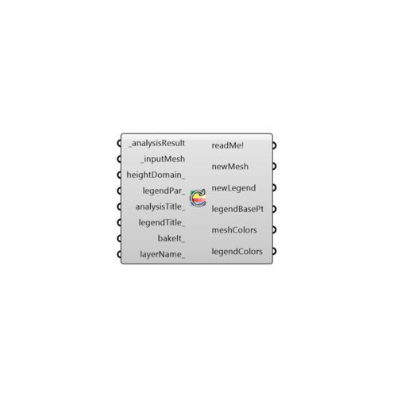

##  Re-Color Mesh

Use this component to re-color a mesh with new a numerical data set whose length corresponds to the number of faces in the _inputMesh.
 This component is useful if you have post-processed any of the numerical data out of the Ladybug components using Grasshopper math components.
 It is also necessary to view results from the Ladybug Real Time Radiation Analysis.
 -
 

#### Inputs
* ##### analysisResult [Required]
A numerical data set whose length corresponds to the number of faces in the _inputMesh.  This data will be used to re-color the _inputMesh.
* ##### inputMesh [Required]
An already-colored mesh from one of the Ladybug components which you would like to re-color based on data in the _analysisResult.
* ##### heightDomain [Optional]
Optional height domain to create a 3D mesh result. Use Construct Domain component to create a domain
* ##### legendPar [Optional]
Optional legend parameters from the Ladybug Legend Parameters component.  Legend Parameters can be used to change the colors, numerical range, and/or number of divisions of any Ladybug legend along with the corresponding colored mesh.
* ##### analysisTitle [Optional]
Text representing a new title for the re-colored mesh.  If no title is input here, the default will read "unnamed."
* ##### legendTitle [Optional]
Text representing a new legend title for re-colored mesh. Legends are usually titled with the units of the _analysisResult.  If no text is provided here, the default title will read "unkown units."
* ##### bakeIt [Optional]
Set to "True" to bake the resulting mesh and legend into the Rhino scene.
* ##### layerName [Optional]
If bakeIt_ is set to "True", input Text here corresponding to the Rhino layer onto which the resulting mesh and legend should be baked.

#### Outputs
* ##### readMe!
...
* ##### newMesh
A new mesh that has been re-colored based on the _analysisResult data.
* ##### newLegend
A new legend that that corresponds to the colors of the newMesh. Connect this output to a grasshopper "Geo" component in order to preview this legend separately in the Rhino scene.  
* ##### legendBasePt
The legend base point, which can be used to move the legend in relation to the newMesh with the grasshopper "move" component.
* ##### meshColors
Script variable reColorMesh
* ##### legendColors
Script variable reColorMesh

[Check Hydra Example Files for Re-Color Mesh](https://hydrashare.github.io/hydra/index.html?keywords=Ladybug_Re-Color Mesh)