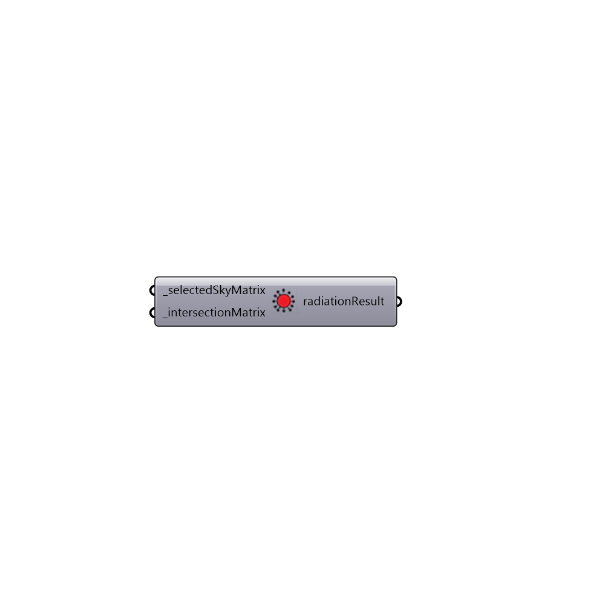

##  Real Time Radiation Analysis

Use this component to scroll through the results of a Ladybug Radiation Analysis on an hour-by-hour, day-by-day, or month-by-month basis in real time!
 The component uses a sky matrix (SkyMxt) from the selectSkyMxt component and the intersection matrix (intersectionMxt) from the Radiation Analysis component to calculate real time radiation results.
 Once the correct inputs have been hooked up to this component, you should use the inputs of the connected selectSkyMxt component to scroll through results.
 -
 

#### Inputs
* ##### selectedSkyMatrix [Required]
The output from a Ladybug selectedSkyMtx component.  This matrix basically carries all of the radiation values that define a sky and includes a radiation value for each sky patch on the sky dome.  You should use the selectSkyMxt component connected here to scroll through radiation results.
* ##### intersectionMatrix [Required]
The intersectionMxt output from a Ladybug Radiation Analysis component that has been run for test geometry.  This matrix is basically a python list that includes the relation between each test point in the Radiation Analysis and all the sky patchs on the sky dome.

#### Outputs
* ##### radiationResult
New radiation values for each test point in the original Radiation Analysis.  Values indicate radiation for the the connected sky matrix.  To visualize these new radiation values in the Rhino scene, connect these values to the Ladybug Re-Color Mesh component to re-color the mesh from the original Radiation Analysis with these new values.

[Check Hydra Example Files for Real Time Radiation Analysis](https://hydrashare.github.io/hydra/index.html?keywords=Ladybug_Real Time Radiation Analysis)