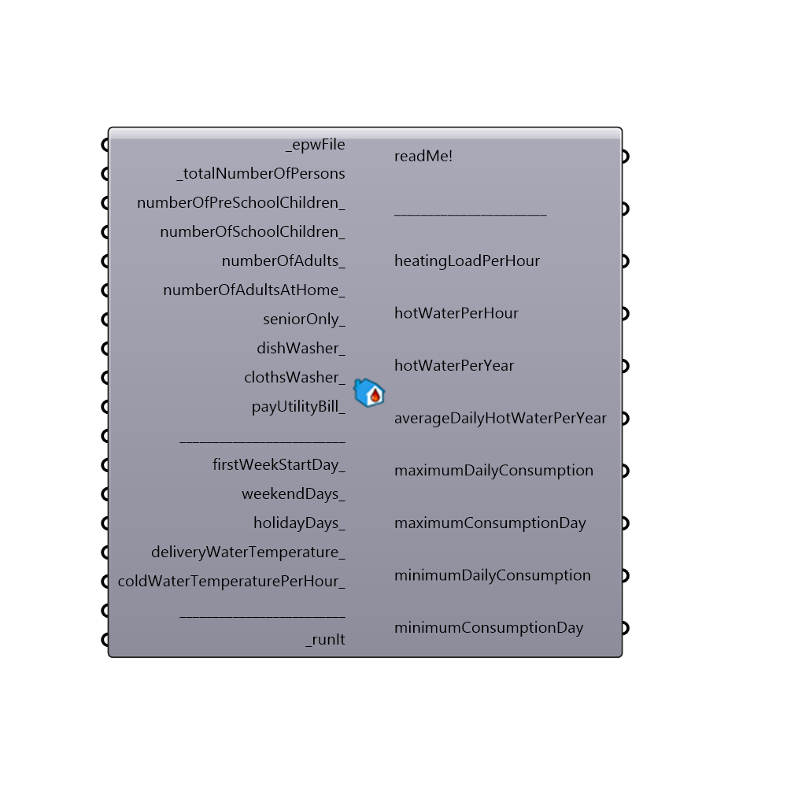

##  Residential Hot Water - [[source code]](https://github.com/ladybug-tools/ladybug-legacy/tree/master/src/Ladybug_Residential%20Hot%20Water.py)

Use this component to calculate domestic hot water consumption for each hour during a year, for a single family household (house).
 -
 Component based on paper: "Modeling patterns of hot water use in households", Ernest Orlando Lawrence Berkeley National Laboratory; Lutz, Liu, McMahon, Dunham, Shown, McGrue; Nov 1996:
 http://ees.lbl.gov/sites/all/files/modeling_patterns_of_hot_water_use_in_households_lbl-37805_rev.pdf
 -
 

#### Inputs
* ##### epwFile [Required]
Input .epw file path by using the "File Path" parameter, or Ladybug's "Open EPW And STAT Weather Files" component.
* ##### totalNumberOfPersons [Required]
Total number of persons in a household.
* ##### numberOfPreSchoolChildren [Optional]
Number of preschool children(0-5) in household.
 -
 If not supplied, default value: 0 (no preschool children) will be used.
* ##### numberOfSchoolChildren [Optional]
Number of school age(6-13) children in household.
 -
 If not supplied, default value: 0 (no school children) will be used.
* ##### numberOfAdults [Optional]
Number of adults (14 years and older) in household.
 -
 If not supplied, it will be equal to _totalNumberOfPersons.
* ##### numberOfAdultsAtHome [Optional]
Number of adults that stay at home during a day.
 -
 If not supplied, default value: 0 (no adults at home) will be used.
* ##### seniorOnly [Optional]
Senior only household.
 -
 If not supplied, default value: False (not senior only household) will be used.
* ##### dishWasher [Optional]
A household owns a dish washer.
 -
 If not supplied, default value: True (a household owns a dish washer) will be used.
* ##### clothsWasher [Optional]
A household owns a cloths washer.
 -
 If not supplied, default value: True (a household owns a cloths washer) will be used.
* ##### payUtilityBill [Optional]
Household occupants pay a utility bill.
 Tenants who pay their own utility bills in general, tend to spend less, then those who do not.
 -
 If not supplied, default value: True (household occupants pay their utility bill) will be used.
* ##### firstWeekStartDay [Optional]
A day of week on which a year starts (1 - Monday, 2 - Tuesday, 3 - Wednesday...)
 -
 If not supplied, default value: 1 will be used (year starts on Monday, 1st January).
* ##### weekendDays [Optional]
Define a list of two weekend (nonworking) days. Through out the World, countries have different days as their weekend days:
 -
 Thursday and Friday (4,5)
 Friday and Saturday (5,6)
 Saturday and Sunday (6,7)
 -
 If not supplied, Saturday and Sunday (6,7) will be taken as a default weekend days.
* ##### holidayDays [Optional]
List of days (1 to 365) which are holiday (nonworking) days.
 -
 Here is an example holiday days list for August:
 213, 214, 215, 216, 217, 218, 219, 220, 221, 222, 223, 224, 225, 226, 227, 228, 229, 230, 231, 232, 233, 234, 235, 236, 237, 238, 239, 240, 241, 242, 243
 -
 If not supplied, no holiday days will be used.
* ##### deliveryWaterTemperature [Optional]
Required (set) water temperature.
 It is recommended for delivery water temperature to not be lower than 60°C (140°F) to avoid the risk of propagation of Legionella pneumophila bacteria.
 -
 Electric water heater used as a default.
 -
 If not supplied, default value: 60°C (140°F) will be used.
 -
 In Celsius degrees.
* ##### coldWaterTemperaturePerHour [Optional]
Cold (inlet) water temperature supplied from public water system, for each hour during a year. In Celsius.
 To calculate it, use the "coldWaterTemperaturePerHour" output of the Ladybug "Cold Water Temperature" component.
 -
 If not supplied, it will be calculated based on Christensen and Burch method (method 1 from "Cold Water Temperature" component), with pipes depth from 0.3 to 1 meters, and unknown soil type.
 -
 In Celsius degrees.
* ##### runIt [Required]
...

#### Outputs
* ##### readMe!
...
* ##### heatingLoadPerHour
Thermal energy (or electrical energy) required to heat the domestic hot water consumption for each hour during a year.
 -
 In kWh.
* ##### hotWaterPerHour
Domestic hot water consumption for each hour during a year.
 -
 In L/h (Liters/hour).
* ##### hotWaterPerYear
Domestic hot water consumption for a whole year.
 -
 In L (Liters).
* ##### averageDailyHotWaterPerYear
Average daily hot water consumption for a whole year.
 -
 In L/day (Liters/day).
* ##### maximumDailyConsumption
Maximal hot water consumption per day during a year.
 -
 In (L/day) Liters/day.
* ##### maximumConsumptionDay
Day with maximal hot water consumption.
* ##### minimumDailyConsumption
Minimal hot water consumption per day during a year.
 -
 In (L/day) Liters/day.
* ##### minimumConsumptionDay
Day with minimal hot water consumption.

[Check Hydra Example Files for Residential Hot Water](https://hydrashare.github.io/hydra/index.html?keywords=Ladybug_Residential Hot Water)