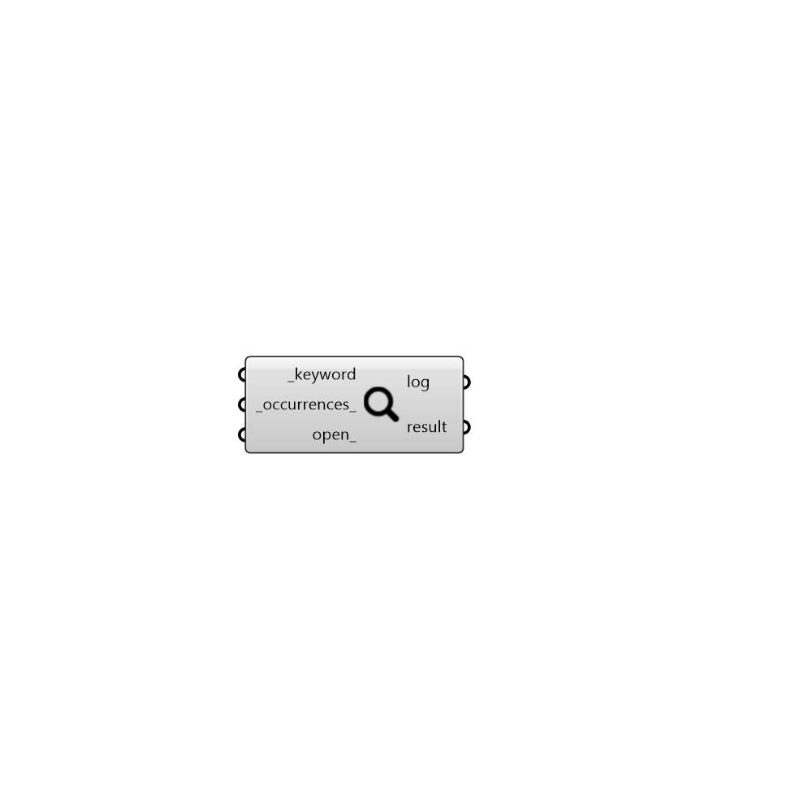

##  Search - [[source code]](https://github.com/ladybug-tools/ladybug-legacy/tree/master/src/Ladybug_Search.py)

Use this to look for the components in the Ladybug suite of tools that are most relevant to your query.
 -
 

#### Inputs
* ##### keyword [Required]
A word. This only accepts text inputs. Example is ("drybulb Temperature" or "tunnel") without quotation marks.
* ##### occurrences [Default]
An integer. This number determines the search resolution. The default value is set to 3. 
 Meaning, all the components in which the keyword appears at least 3 times, will be served as results.
 You may raise or reduce this number as per your convenience. This number can not be less than 1.
* ##### open [Optional]
A boolean. If boolean of True value is provided, primer pages for the components that appear in the result
 will be opened in your browser. PLEASE BE MINDFUL of the number of components in the result. If the list of components
 in the result is long, opening up the primer pages for all of them at once may free your browser. If the number of
 components in result is large, you are advised to raise the number to _occurrences_ input before connecting
 a boolean value of True to this input.

#### Outputs
* ##### log
Run time messages
* ##### result
The list of components across all Lasybug Tools plugins in which the keyword appears at least the number of times set in
 _occurrences_ input.

[Check Hydra Example Files for Search](https://hydrashare.github.io/hydra/index.html?keywords=Ladybug_Search)