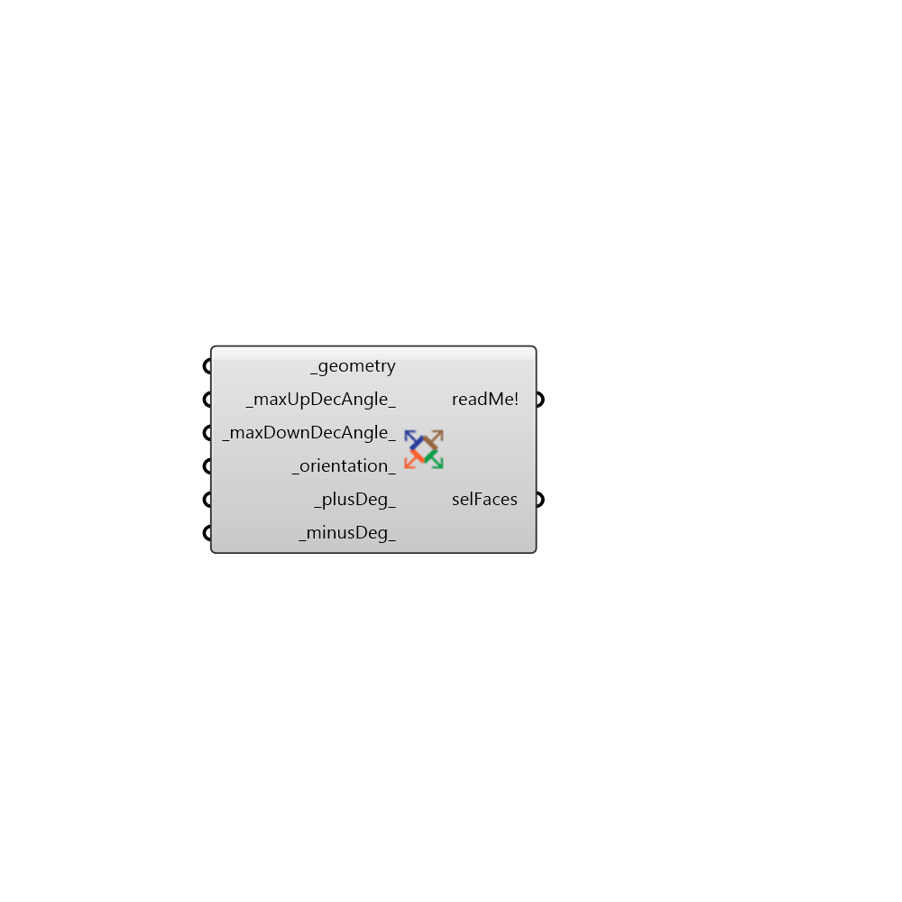

##  Separate By Normal - [[source code]](https://github.com/ladybug-tools/ladybug-legacy/tree/master/src/Ladybug_Separate%20By%20Normal.py)

Select surfaces based on orientation.
 -
 

#### Inputs
* ##### geometry [Required]
Geometry for which facades will be selected.  Geometry must be either a Brep, a Mesh or a list of Breps or Meshes.
* ##### maxUpDecAngle [Default]
Maximum normal declination angle from ZAxis that should be still considerd up
* ##### maxDownDecAngle [Default]
Maximum normal declination angle from ZAxis that should be still considerd down
* ##### orientation [Default]
A number between 0 and 8 for desired orientation. 0 = North, 1 = NE, 2 = East, ... 7 = NW, 8 = Roof. Default is South.
* ##### plusDeg [Default]
Angle in degrees for deviation from _orientation. Default = 23. For selecting all vertical orientations give 359 for this input and 0 for the _minusDeg_ (or viceversa)
* ##### minusDeg [Default]
Angle in degrees for deviation from _orientation. Default = 23. For selecting all vertical orientations give 359 for this input and 0 for the _plusDeg_ (or viceversa)

#### Outputs
* ##### readMe!
...
* ##### selFaces
Selected faces/surfaces

[Check Hydra Example Files for Separate By Normal](https://hydrashare.github.io/hydra/index.html?keywords=Ladybug_Separate By Normal)