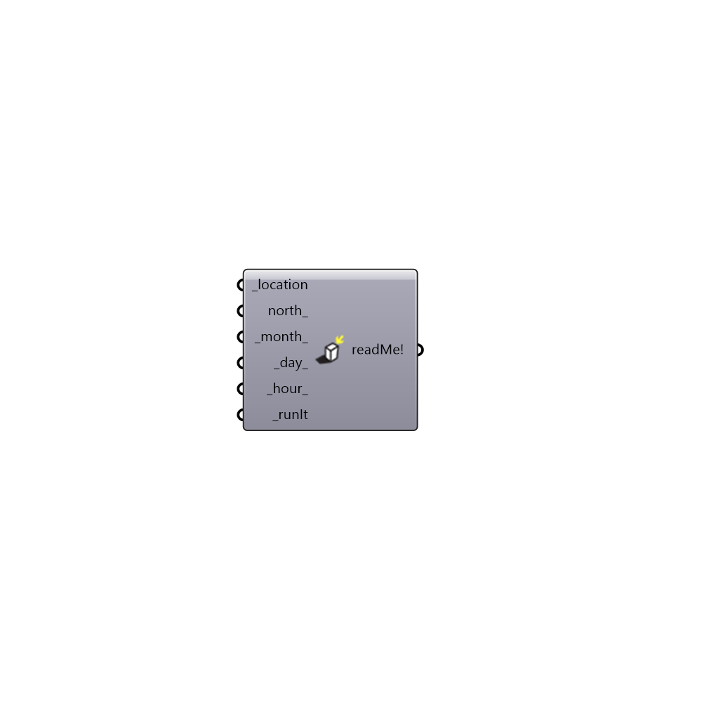

##  Set Rhino Sun - [[source code]](https://github.com/ladybug-tools/ladybug-legacy/tree/master/src/Ladybug_Set%20Rhino%20Sun.py)

Use this component to set the Rhino sun from grasshopper and coordinate your Rhino visualizations with the Ladybug weatherfile and other solar parameters.
 -
 

#### Inputs
* ##### location [Required]
get location from Ladybug_Import epw component. This will update rhino solar system to the correct coordinates and timezone
* ##### north [Optional]
North direction of the model. This can be either an number representing angle, or a vector. (by default North is set on the y axis)
* ##### month [Default]
A number that represents the month you want to visualize
* ##### day [Default]
A number that represents the Day you want to visualize
* ##### hour [Default]
A number that represents the Hour you want to visualize
* ##### runIt [Required]
Set to True to run the component and position the Rhino Sun.

#### Outputs
* ##### readMe!
...

[Check Hydra Example Files for Set Rhino Sun](https://hydrashare.github.io/hydra/index.html?keywords=Ladybug_Set Rhino Sun)