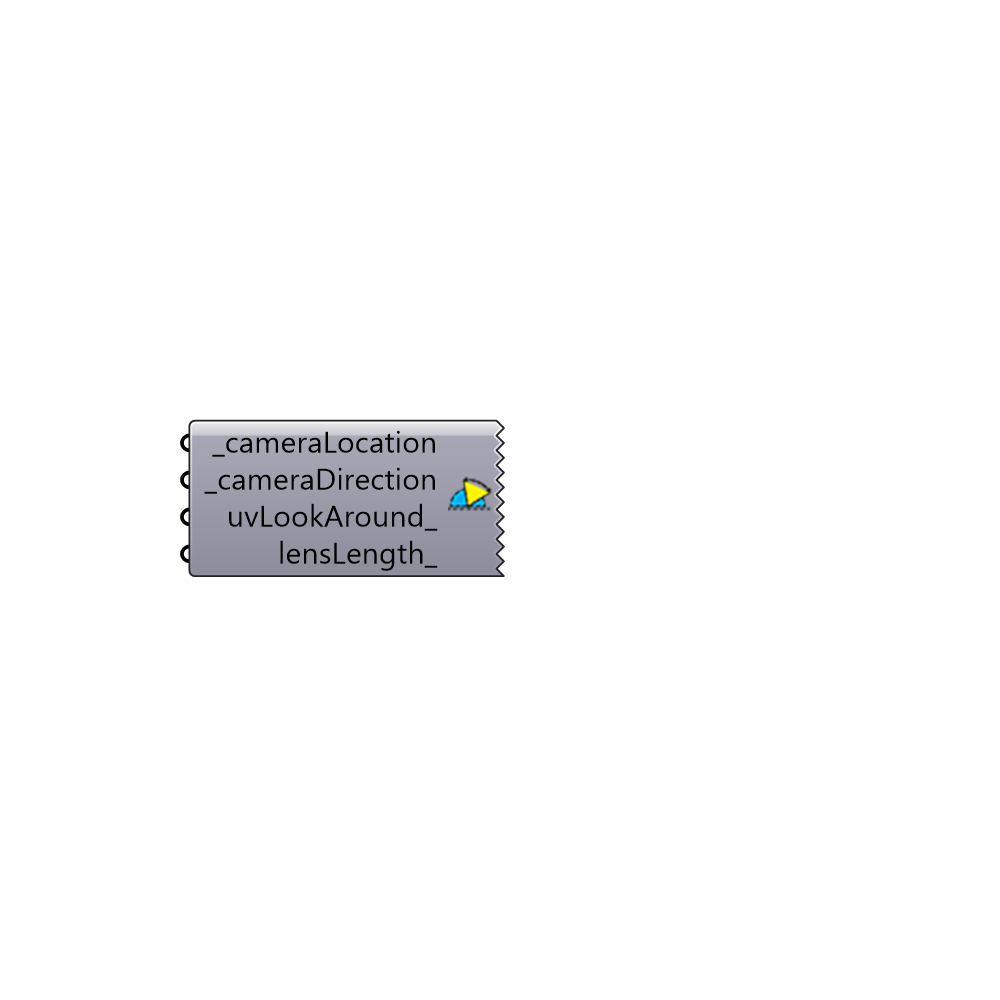

## Set the View []

Use this component to set the camera location and direction for the Rhino "Perspective" viewport.
 Here is the video that shows how it works: http://www.youtube.com/watch?v=7Mmhz867zY8
 -
 

#### Inputs
* ##### _cameraLocation [Required]
A point representing the location of the viewport camera.
* ##### _cameraDirection [Required]
A vector that represents the direction that the viewport camera should face.
* ##### uvLookAround_ [Optional]
Optional UV coordinates to tilt the viewport camera off from from the input _cameraDirection. Values for UV coordinates must be between -1 and 1 and these correspond to a tilt of 180 degrees in either direction.  It is recommended that you use a Grasshopper sliderMD comonent for input.
* ##### lensLength_ [Optional]
An optional float number that sets the lens length of the viewport camera.

#### Outputs
* ##### readMe!
...

[Check Hydra Example Files for Set the View](https://hydrashare.github.io/hydra/index.html?keywords=Ladybug_Set the View)