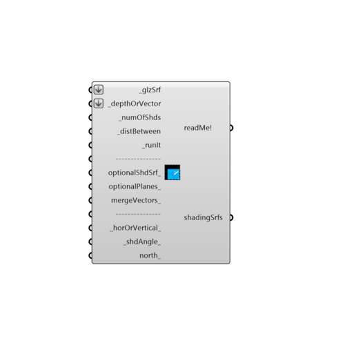

##  ShadingDesigner

Use this component to generate shading breps for any glazed surface or list of glazed surfaces.  The component supports two methods for shading generation.  The first is a simple depth method, which will generate an overhang of the speficied depth (or multiple overhangs if the _numOfShds is increased).  The second method is to input a set of solar vectors from the Sunpath component that should be blocked by the shade.
 -
 

#### Inputs
* ##### glzSrf [Required]
A Surface or Brep representing a window to be used for shading design.  This can also be a list of Surfaces of Breps.
* ##### depthOrVector [Required]
A number representing the depth of the shade to be generated or a sun vector to be shaded from the _glzSrf.  You can also input lists of depths, which will assign different depths based on cardinal direction.  For example, inputing 4 values for depths will assign each value of the list as follows: item 0 = north depth, item 1 = west depth, item 2 = south depth, item 3 = east depth.  Lists of vectors to be shaded can also be input and shades can be joined together with the mergeVectors_ input.
* ##### numOfShds [Required]
The number of shades to generated for each glazed surface.
* ##### distBetween [Required]
An alternate option to _numOfShds where the input here is the distance in Rhino units between each shade.
* ##### runIt [Required]
Set to 'True' to run the component and generate shades.
* ##### optionalShdSrf [Optional]
An optional shade surface representing a 2D area under consideration for shading. This input can only be used with the sun vector method.
* ##### optionalPlanes [Optional]
An optional plane (or list of planes) representing a 2D area under consideration for shading.  This input can only be used with the sun vector method.
* ##### mergeVectors [Optional]
Set to 'True' to merge all the shades generated from a list of sun vectors into a single shade. This input can only be used with the sun vector method.
* ##### horOrVertical [Default]
Set to 'True' to generate horizontal shades or 'False' to generate vertical shades. You can also input lists of _horOrVertical_ input, which will assign different orientations based on cardinal direction.
* ##### shdAngle [Default]
A number between -90 and 90 that represents an angle in degrees to rotate the shades.  The default is set to '0' for no rotation.  If you have vertical shades, use this to rotate them towards the South by a certain value in degrees.  If applied to windows facing East or West, tilting the shades like this will let in more winter sun than summer sun.  If you have horizontal shades, use this input to angle shades downward.  You can also put in lists of angles to assign different shade angles to different cardinal directions.
* ##### north [Optional]
Input a vector to be used as a true North direction or a number between 0 and 360 that represents the degrees off from the y-axis to make North.  The default North direction is set to the Y-axis (0 degrees).

#### Outputs
* ##### readMe!
...
* ##### shadingSrfs
Shading surfaces that were generated based on the inputs.

[Check Hydra Example Files for ShadingDesigner](https://hydrashare.github.io/hydra/index.html?keywords=Ladybug_ShadingDesigner)