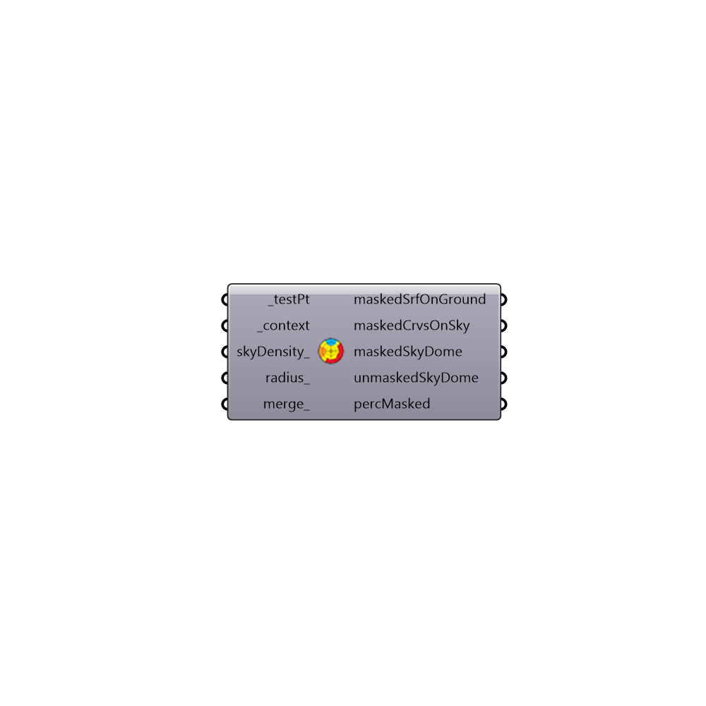

##  Shading Mask_II - [[source code]](https://github.com/mostaphaRoudsari/ladybug/tree/master/src/Ladybug_Shading%20Mask_II.py)

Use this component to see the portion of the sky dome that is masked by context geometry around a given viewpoint.
 The component will generate separate meshs for the portions of the sky dome that are masked and visible.
 The component will also calculate the percentage of the sky that is masked by the context geometry and the percentage that is visible (the sky view factor).
 -
 

#### Inputs
* ##### testPt [Required]
A view point for which one wants to see the portion of the sky masked by the context geometry surrounding this point.
* ##### context [Required]
Context geometry surrounding the _testPt that could block the view to the sky.  Geometry must be a Brep or list of Breps. You are also advised to provide surfaces instead of solid objects. Providing surfces will make the calculation faster and accurate. So if you are using this component to check the percent of sky visible from a courtyard, please only provide surfaces immediate to the couryard and the not the whole building as a brep.
* ##### skyDensity [Optional]
An integer, that is greater than or equal to 0. This value is used to generate test points on skyDome. from which the maskedSky surfaces are derived. The default value is set to 1. Incresing this value will increase the calculation time. You are adviced to increase this number only if you are trying to analyze too many shading surfaces.
* ##### radius [Optional]
A float, that controls the radius of skyDome.
* ##### merge [Optional]
A boolean. Set it to True to merge maskedSky surfaces

#### Outputs
* ##### maskedSrfOnGround
A list of surfaces. These are masked horizontal projections of maskedSky surfaces. They're useful when the skyDome is viewed from the top.
* ##### maskedCrvsOnSky
A list of Curves. These are edge curves for maskedSky surfaces.
* ##### maskedSkyDome
A list of surfaces. The portion of sky not blocked by the context geometry
* ##### unmaskedSkyDome
A list of surfaces. The portion of sky blocked by the context geometry
* ##### percMasked
Percentage of the sky blocked by the context geometry

[Check Hydra Example Files for Shading Mask_II](https://hydrashare.github.io/hydra/index.html?keywords=Ladybug_Shading Mask_II)