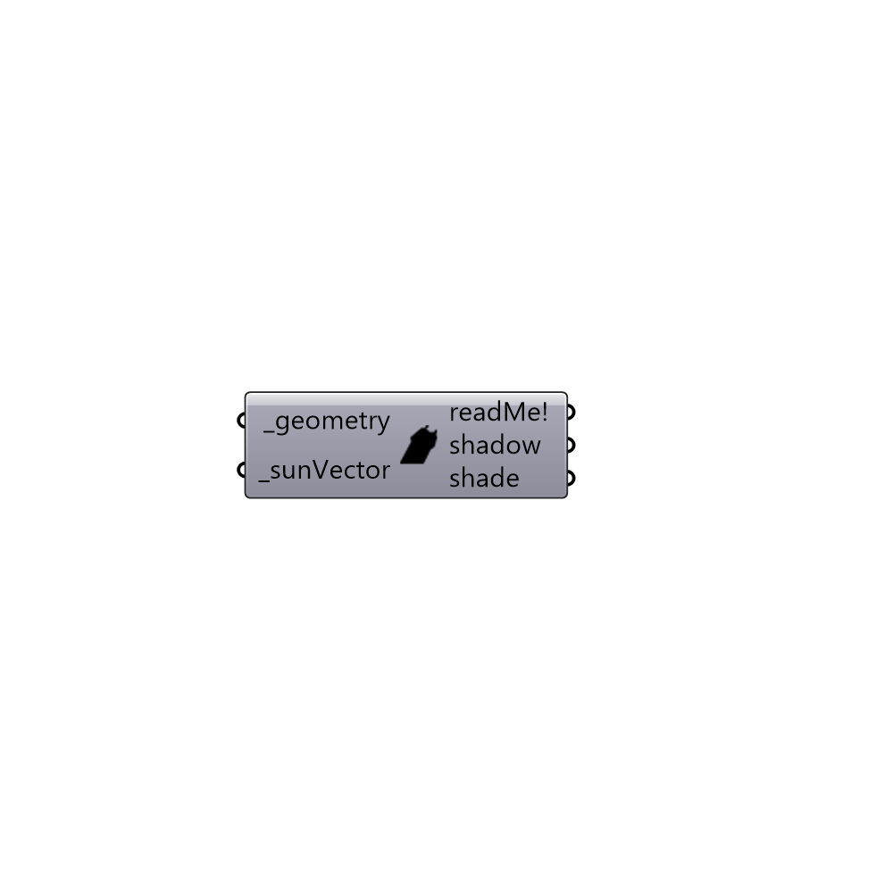

##  Shadow_Study

Use this component to generate outline curves representing shadows cast by input _geometry for a given _sunVector.
 Note that, to see shadows cast onto a ground, a surface representing the ground plane must be included in the input _geometry.
 Also, please note that, for a list of input _geometry that is larger than 4 or 5 breps, the calculation time of this component can be very long.  Please keep the input geometry to small lists or be prepared to wait a long time.
 WARNING: This component is a proof of concept that will not work in every situation.  It is not ideal for analyzing curved surfaces and it is not able to calculate shadows for geometries that are intersecting each other.
 -
 

#### Inputs
* ##### geometry [Required]
Breps representig test geometries that will cast shadows on each other.
* ##### sunVector [Required]
A sun vector from the Ladybug sunPath component.

#### Outputs
* ##### readMe!
...
* ##### shadow
Outline curves representing the shadows cast by the individual input Breps on other input Breps.  Note that, if all input _geometry is planar, this output can be hooked up to a Grasshopper "Brep" component to give Breps representing shadows cast.
* ##### shade
Outline curves representing the the parts of individual input Breps that are not in the sun.  In other words, this is the self-shaded part of the Breps. Note that, if all input _geometry is planar, this output can be hooked up to a Grasshopper "Brep" component to give Breps representing self-shaded areas.

[Check Hydra Example Files for Shadow Study](https://hydrashare.github.io/hydra/index.html?keywords=Ladybug_Shadow Study)