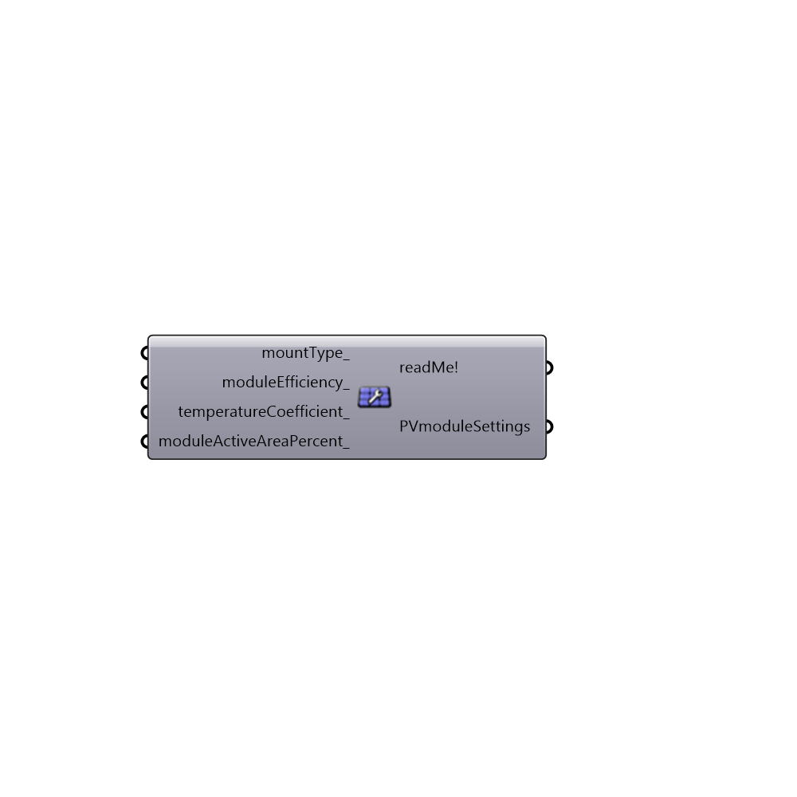

##  Simplified Photovoltaics Module

Use this component to define simplified Photovoltaics crystalline silicon (c-Si) module settings.
 -
 If nothing inputed, the following PV module settings will be used by default:
 - module material: crystalline silicon (c-Si)
 - mountType: Close (flush) roof mount 
 - moduleEfficiency: 15%
 - temperatureCoefficient: -0.5 %/C
 - moduleActiveAreaPercent: 90%
 -
 If you would like to use a thin-film module, then use the thin-film module from "Import Sandia Photovoltaics Module" or "Import CEC Photovoltaics Module" components.
 Also for choosing a specific module, not a simplified one, use one of those two components as well.
 -
 Sources:
 http://prod.sandia.gov/techlib/access-control.cgi/2004/043535.pdf
 -
 

#### Inputs
* ##### mountType [Optional]
Mounting type (configuration) of a module. There are three of them:
 -
 0 = Insulated back (pv curtain wall, pv skylights, BIPV installations with obstructed bakside airflow)
 1 = Close (flush) roof mount (pv array mounted parallel and relatively close to the plane of the roof (between 5 and 15 centimenters))
 2 = Open rack (ground mount array, flat/sloped roof array that is tilted, pole-mount solar panels, solar carports, solar canopies, BIPV installations with sufficient bakside airflow)
 -
 If not supplied, default type: "Glass/cell/glass, Close (flush) roof mount" (1) is used.
* ##### moduleEfficiency [Optional]
The ratio of electrical energy output from the PV module to input solar energy from the sun.
 Current typical module efficiencies for crystalline silicon modules range from 14-20%
 -
 If not defined, default value of 15(%) will be used.
 -
 In percent (%).
* ##### temperatureCoefficient [Optional]
A coefficient which accounts for the percentage the solar module's DC output power decrease/increase for every degree Celsius the solar cells temperature rises above/below 25C. 
 -
 In general it ranges from -0.44 to -0.5 for crystaline silicon modules.
 -
 If not supplied, -0.5 will be used as a default.
 -
 In %/C.
* ##### moduleActiveAreaPercent [Optional]
Percentage of the module's area excluding module framing and gaps between cells. 
 -
 If not supplied, default value of 90(%) will be used.
 -
 In percent (%).

#### Outputs
* ##### readMe!
...
* ##### PVmoduleSettings
A list of PV module settings. Plug it to "Photovoltaics surface" component's "PVmoduleSettings_" input.

[Check Hydra Example Files for Simplified Photovoltaics Module](https://hydrashare.github.io/hydra/index.html?keywords=Ladybug_Simplified Photovoltaics Module)