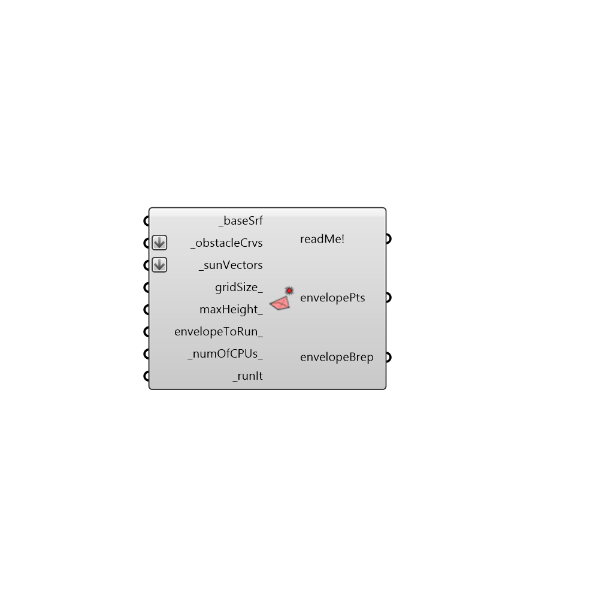

##  SolarEnvelope - [[source code]](https://github.com/ladybug-tools/ladybug-legacy/tree/master/src/Ladybug_SolarEnvelope.py)

Use this component to generate a solar envelope for a given test surface, set of solar vectors,
 and context geometry that you want to ensure solar access to.  Solar envelopes are typically used to
 illustrate the volume that can be built within in order to ensure that a new development does not
 shade the surrounding properties for a given set of sun vectors.
 -
 

#### Inputs
* ##### baseSrf [Required]
A surface representing the area for which you want to create the solar envelope.
* ##### obstacleCrvs [Required]
List of curves indicating the top borders of our surroundings that are taken into account in calculating the solar collection.
* ##### context [Optional]
An optional list of existing context shading objects, which already block solar access and therefore permit a higher solar envelope in their 'wake'.
* ##### sunVectors [Required]
Sun vectors representing hours of the year when sun should be accessible to the properties surrounding the baseSrf.  sunVectors can be generated using the Ladybug sunPath component.
* ##### gridSize [Optional]
A numeric value inidcating the gird size of the analysis in Rhino model units. The smaller the grid size - the more test points( more accurate but slower). Default value is automatically set based on the size of the input _baseSrf.
* ##### maxHeight [Optional]
If there are no obstrucsions this would be the lowest value for the solar collection points. Default value set to 20 meters below the average baseSrf height.
* ##### increment [Optional]
A number for the height at which the vector will be incremented duing context intersection calculations. The default value is 1 meter. Note that this value is only used when context is input.
* ##### envelopeToRun [Optional]
Set to 'True' if you would like the component to calculate a solar rights boundary and 'False' if you would like a solar collection boundary.  The default is set to solar envelope.
* ##### numOfCPUs [Default]
Number of CPUs to be used for the simulation. Default value would be 1
* ##### runIt [Required]
Set to 'True' to run the component and generate solar collection points.

#### Outputs
* ##### readMe!
Log of the component.
* ##### envelopePts
A list of 3d points representing the heights to which the solar collection reaches.  Plug into a native GH 'Delunay Mesh' component to visualize the full solar collection boundary.
* ##### envelopeBrep
The closed volume in which you can build above which the building will have direct solar access to the input sunVectors.

[Check Hydra Example Files for SolarEnvelope](https://hydrashare.github.io/hydra/index.html?keywords=Ladybug_SolarEnvelope)