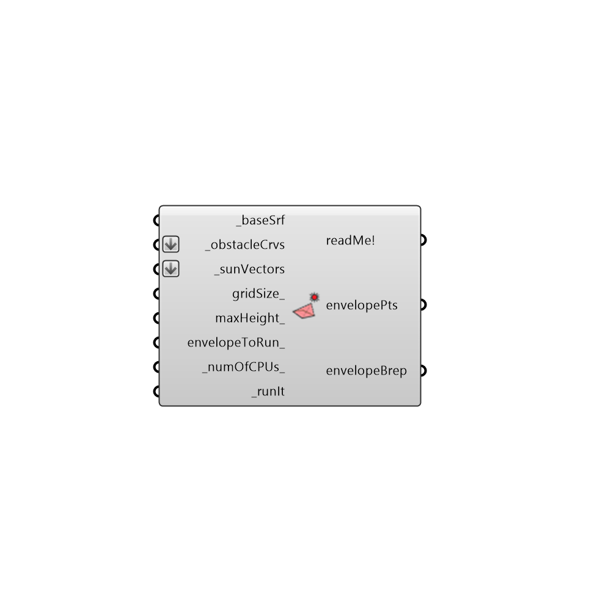

##  SolarEnvelopeAdvanced

Use this component to generate a solar envelope for a given test surface, set of solar vectors, and context geometry that you want to ensure solar access to.  Solar envelopes are typically used to illustrate the volume that can be built within in order to ensure that a new development does not shade the surrounding properties for a given set of sun vectors.
 -
 

#### Inputs
* ##### baseSrf [Required]
A surface representing the area for which you want to create the solar envelope.
* ##### obstacleCrvs [Required]
List of curves indicating the bottom borders of our surroundings that are taken into account in calculating the solar envelope.
* ##### sunVectors [Required]
Sun vectors representing hours of the year when sun should be accessible to the properties surrounding the baseSrf.  sunVectors can be generated using the Ladybug sunPath component.
* ##### gridSize [Optional]
A numeric value inidcating the gird size of the analysis in Rhino model units. The smaller the grid size - the more test points( more accurate but slower). Default value is automatically set based on the size of the input _baseSrf.
* ##### maxHeight [Optional]
If there are no obstrucsions, this would be the heighest value for the solar envelope points. The default value set to 100 meters above the average baseSrf height.
* ##### envelopeToRun [Optional]
Set to 'True' if you would like the component to calculate a solar rights boundary and 'False' if you would like a solar collection boundary.  The default is set to solar envelope.
* ##### numOfCPUs [Default]
Number of CPUs to be used for the simulation. Default value would be 1
* ##### runIt [Required]
Set to 'True' to run the component and generate solar envelope points.

#### Outputs
* ##### readMe!
Log of the component.
* ##### envelopePts
A list of 3d points representing the heights to which the solar envelope reaches.  Plug into a native GH 'Delunay Mesh' component to visualize the full solar envelope.
* ##### envelopeBrep
The closed volume in which you can build that will not shade the surrounding obstacleCrvs from the input sunVectors.

[Check Hydra Example Files for SolarEnvelopeAdvanced](https://hydrashare.github.io/hydra/index.html?keywords=Ladybug_SolarEnvelopeAdvanced)