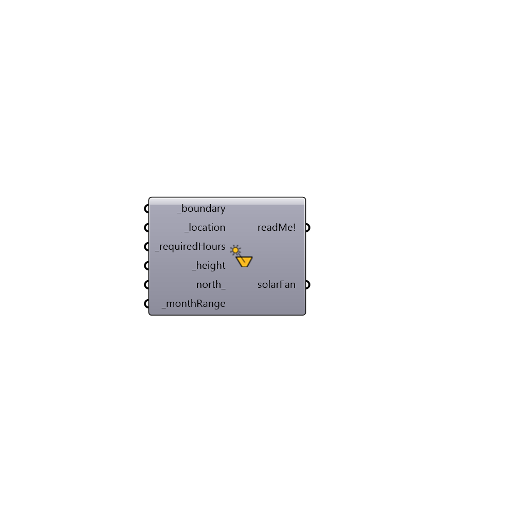

## SolarFanBasic []

Use this component to generate a solar fan with minimumal input data. This component predefines monthly and hourly ranges in order to simplify the creation of useful fan geometry.    
 The solar fan is used to ensure that a given property within a boundary curve is guarenteed a specified minimum hours of direct solar access for each day in a specified month range of the year.
 Thus, context geometries surrounding this boundary curve that do not penetrate the solar fan will not cast shadows onto the boundary area for the specified hour and month range.
 The start and end dates that determine the month range for solar access can be chosen from the following options:
 0) Mar 21 - Jun 21
 1) Mar 21 - Sep 21
 2) Mar 21 - Dec 21
 3) Jun 21 - Sep 21
 4) Jun 21 - Dec 21
 5) Sep 21 - Dec 21
 The default set to 3) June 21 to September 21.
 Note that extremely complicated concave shapes will take a long time to calculate a solar fan for.
 -
 

#### Inputs
* ##### _boundary [Required]
closed boundary curve representing a piece of land (such as a park) or a window for which solar access is desired.
* ##### _location [Required]
The output from the importEPW or constructLocation component.  This is essentially a list of text summarizing a location on the earth.
* ##### _requiredHours [Required]
The number of hours of direct solar access that the property inside the boundary curve should receive during the _monthRange. For example an input of 4 will define the hour range roughly between 10AM and 2PM. The component will compute the hour range that will maximize the fan volume. 
* ##### _height [Required]
The number of Rhino model units that the solar fan should be extended above the boundary curve.
* ##### north_ [Optional]
Input a vector to be used as a true North direction or a number between 0 and 360 that represents the degrees off from the y-axis to make North.  The default North direction is set to the Y-axis (0 degrees).
* ##### _monthRange [Required]
An optional interger value to change the month range for which solar access is being considered. The default month range is Jun 21 - Sep 21.
 Integers input here must be between 0 - 5 and correspond to the following :
 ---
 0 = Mar 21 - Jun 21
 1 = Mar 21 - Sep 21
 2 = Mar 21 - Dec 21
 3 = Jun 21 - Sep 21
 4 = Jun 21 - Dec 21
 5 = Sep 21 - Dec 21
 ---
 Where, in the North/South Hemispheres, these dates repsectively signify:
 Mar 21 = Vernal/Autumnal Equinox
 Jun 21 = Summer/Winter Solstice
 Sep 21 = Autumnal/Vernal Equinox
 Dec 21 = Winter/Summer Solstice

#### Outputs
* ##### out
...
* ##### solarFan
Brep representing a solar fan.  This volume should be clear of shading in order to ensure solar access to the area inside the boundary curve for the given number of hours.

[Check Hydra Example Files for SolarFanBasic](https://hydrashare.github.io/hydra/index.html?keywords=Ladybug_SolarFanBasic)