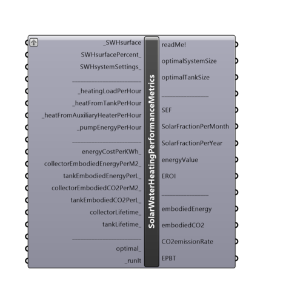

##  Solar Water Heating Performance Metrics

Use this component to calculate various Solar water heating performance metrics.
 Also use it to calculate the optimal SWH system size and tank storage volume.
 -
 

#### Inputs
* ##### SWHsurface [Required]
Use the same "_SWHsurface" you supplied to the "Solar Water Heating Surface" component.
* ##### SWHsurfacePercent [Optional]
The percentage of surface which will be used for SWH collectors (range 0-100).
 -
 There are no general rules or codes which would limit the percentage of the roof(surface) covered with SWH collectors.
 -
 If not supplied, default value of 100 (all surface area will be covered in SWH collectors) is used.
 -
 In percent (%).
* ##### SWHsystemSettings [Optional]
A list of all Solar water heating system settings. Use the same "SWHsystemSettings_" you supplied to the "Solar Water Heating Surface" component.
 -
 If not supplied, the following swh system settings will be used by default:
 - glazed flat plate collectors
 - active
 - closed loop
 - pipe length: 20 meters
 - unshaded
* ##### heatingLoadPerHour [Required]
Use the same "_heatingLoadHour" you supplied to the "Solar Water Heating Surface" component.
 -
 In kWh.
* ##### heatFromTankPerHour [Required]
Import "heatFromTankPerHour" output data from "Solar water heating surface" component.
 -
 In kWh.
* ##### heatFromAuxiliaryHeaterPerHour [Required]
Import "heatFromAuxiliaryHeaterPerHour" output data from "Solar water heating surface" component.
 -
 In kWh.
* ##### pumpEnergyPerHour [Required]
Import "pumpEnergyPerHour" output data from "Solar water heating surface" component.
 -
 In kWh.
* ##### energyCostPerKWh [Optional]
The cost of one kilowatt hour in any currency unit (dollar, euro, yuan...)
 -
 If not supplied, 0.15 $/kWh will be used as default value.
 -
 In currency/kWh.
* ##### collectorEmbodiedEnergyPerM2 [Optional]
Energy necessary for product life-cycle of SWH collector per square meter.
 -
 If not supplied default value of 1135 (MJ/m2) for unglazed or glazed flat plate collector will be used.
 -
 In MJ/m2 (megajoules per square meter).
* ##### tankEmbodiedEnergyPerL [Optional]
Energy necessary for product life-cycle of storage tank per liter.
 -
 If not supplied default value of 20 (MJ/l) will be used.
 -
 In MJ/l (megajoules per liter).
* ##### collectorEmbodiedCO2PerM2 [Optional]
Carbon emissions produced during SWH collector's life-cycle per square meter..
 -
 If not supplied default value of 65.5 (kg CO2/m2) for unglazed or glazed flat plate collector will be used.
 -
 In kg CO2/m2 (kilogram of CO2 per square meter).
* ##### tankEmbodiedCO2PerL [Optional]
Carbon emissions produced during storage tank's life-cycle per liter.
 -
 If not supplied default value of 0.14 (kg CO2/l) for unglazed or glazed flat plate collector will be used.
 -
 In kg CO2/l (kilogram of CO2 per liter).
* ##### collectorLifetime [Optional]
Life expectancy of a SWH collector.
 -
 If not supplied default value of 15 (years) will be used.
 -
 In years.
* ##### tankLifetime [Optional]
Life expectancy of a storage tank.
 -
 If not supplied default value of 10 (years) will be used.
 -
 In years.
* ##### optimal [Optional]
Set to "True" to calculate optimal system size and tank storage volume.
 -
 Larger system sizes and tank volumes produce more energy, therefor cover more initial heating load, which results in less usage of auxiliary energy. However, the larger the system size and tank volume, more embodied energy is spent.
 In order to find an optimal system size (total size of all collectors) and storage tank volume, life-cycle energy analysis is used to acheive the maximal net energy saving of the swh system. The net energy saving of swh system is the energy saving in kWh remained after an annualized embodied energy (of collectors or storage tank) has been deducted from the operating energy saving of swh system.
 This method of optimization is superior in comparison with other simulation-based methods due to consideration of all energy performance stages (production, operation, maintenance...).
 -
 This optimization method can be used to account for capital costs, instead of embodied energy. This would account only for operation performance stage.
 In this case capital costs of collector/per square meter, and tank/per liter would need to be inputted into: "collectorEmbodiedEnergyPerM2_" and "tankEmbodiedEnergyPerL_" inputs.
 -
 Optimization analysis based on the law of diminishing marginal utility:
 "A simplified method for optimal design of solar water heating systems based on life-cycle energy analysis", Renewable Energy journal, Yan, Wang, Ma, Shi, Vol 74, Feb 2015
 www.sciencedirect.com/science/article/pii/S0960148114004807
* ##### runIt [Required]
...

#### Outputs
* ##### readMe!
...
* ##### optimalSystemSize
Optimal SWH system size (optimal total size of SWH collector's array) for a given SWHsurface's tilt, array and "_heatingLoadHour".
 Minimum SWH system size is 0.15 kWt.
 Input it to "systemSize_" input of "PV SWH system size" component to see how much area it would require.
 -
 To calculate it, set the "optimal_" input to "True".
 -
 In thermal kiloWatts (kWt).
* ##### optimalTankSize
Solar water heating storage tank optimal size (volume). Minimum size is 100 liters.
 To calculate it, set the "optimal_" input to "True".
 -
 In liters.
* ##### SEF
Solar Energy Factor - ratio of total energy provided by the swh system to auxiliary plus parasitic (circulation pump) energy for a whole year.
 -
 Unitless.
* ##### SolarFractionPerMonth
Solar Fraction (or Solar Savings Fraction) - percentage of the heating load requirement that is provided by a swh system for each month during a year.
 It ranges from 0 to 100%.
 -
 In percent (%).
* ##### SolarFractionPerYear
Solar Fraction (or Solar Savings Fraction) - percentage of the total heating load requirement that is provided by a swh system for a whole year.
 It ranges from 0 to 100%.
 -
 In percent (%).
* ##### energyValue
Total Energy value generated by SWH system for a whole year in currency unit (dollars, euros, yuans...)
* ##### EROI
Energy Return On Investment - a comparison of the generated electricity to the amount of primary energy used throughout the SWH collector's product life-cycle.
 -
 Unitless.
* ##### embodiedEnergy
Total energy necessary for an entire product life-cycle of SWH collectors and storage tank.
 -
 In GJ (gigajoules).
* ##### embodiedCO2
Total carbon emissions produced during SWH collector and storage tank life-cycle.
 -
 In tCO2 (tons of CO2).
* ##### CO2emissionRate
Also called Embodied GHG emissions or GHGEmissions. An index which shows how effective a SWH system is in terms of global warming.
 It is used in comparison with other fuels and technologies (Hydroelectricity(15), Wind(21), Nuclear(60), Geothermal power(91), Natural gas(577), Oil(893), Coal(955) ...)
 -
 In gCO2/kWh.
* ##### EPBT
Energy PayBack Time - time it takes for SWH system to produce all the energy used through-out its collector's product life-cycle.
 -
 In years.

[Check Hydra Example Files for Solar Water Heating Performance Metrics](https://hydrashare.github.io/hydra/index.html?keywords=Ladybug_Solar Water Heating Performance Metrics)