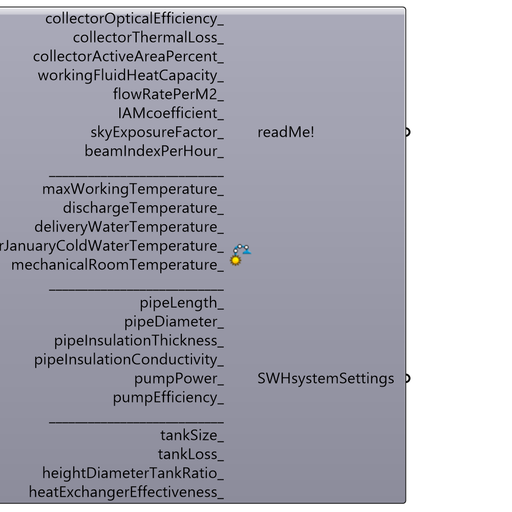

##  Solar Water Heating System Detailed - [[source code]](https://github.com/ladybug-tools/ladybug-legacy/tree/master/src/Ladybug_Solar%20Water%20Heating%20System%20Detailed.py)

Use this component to define a detailed Solar water heating system settings.
 -
 If nothing inputed, the following swh system will be used by default:
 - glazed flat plate collectors
 - active
 - closed loop
 - pipe length: 20 meters
 - unshaded
 -
 

#### Inputs
* ##### collectorOpticalEfficiency [Optional]
Fr(tau alpha) Collector's optical efficiency coefficient. Also called Collector heat removal factor. Varies based on collector's type. Some default values by type:
 -
 0.87 - unglazed flat plate
 0.70 - glazed flat plate
 0.50 - evacuated tube
 -
 If not supplied, default value 0.70 (glazed flat plate) will be used.
 -
 Unitless.
* ##### collectorThermalLoss [Optional]
(FrUL) Collector's thermal loss coefficient. Varies based on collector's type. Some default values by type:
 -
 21 - unglazed flat plate
 4 - glazed flat plate
 1.5 - evacuated tube
 -
 If not supplied, default value 4 (glazed flat plate) will be used.
 -
 In W/m2/°C.
* ##### collectorActiveAreaPercent [Optional]
Percentage of the collector's area excluding collector framing, lateral insulation, or gaps between evacuated tubes... Also called aperture area.
 It ranges from 70 to 95% depending on the type of collector.
 -
 If not supplied, default value of 90(%) will be used.
 -
 In percent.
* ##### workingFluidHeatCapacity [Optional]
Specific heat of the working fluid.
 -
 If swh system is intended to be used in a non-freezing or light freezing climate (tropical and subtropical regions), then water should be used as a working fluid. The specific heat of water is: 4180 J/kg/°C.
 -
 If swh system is used in freezing climates (temperate, polar...), an antifreeze needs to be added to the water. In most cases this is Propylen glycol, Ethylen glycol or Bio glycol added in certain percentages to the water. Depending on the freezing temperatures of the climates, there are the following specific heats of water-glycol mixtures:
 up to -10°C:  water-propylenglycol 25%:  4080 J/kg/°C.
 up to -10°C:  water-ethylenglycol 20%:  4020 J/kg/°C.
 up to -20°C:  water-propylenglycol 38%:  4000 J/kg/°C.
 up to -20°C:  water-ethylenglycol 34%:  3840 J/kg/°C.
 up to -30°C:  water-propylenglycol 47%:  3890 J/kg/°C.
 up to -40°C:  water-ethylenglycol 52%:  3560 J/kg/°C.
 -
 If not supplied 3840 (water-ethylenglycol 34%) J/kg/°C will be used.
 -
 In J/kg/°C.
* ##### flowRatePerM2 [Optional]
Test flow rate of working fluid through the collector per square meter of collector's area.
 The higher the flow rate, the higher the collector efficiency is. On the other hand higher flow rates require more pump power, larger pipe diameters and can cause erosion corrosion.
 -
 If not supplied, a value of 0.012 kg/s/m2 will be used.
 -
 In kg/s/m2.
* ##### IAMcoefficient [Optional]
Incidence angle modifier coefficient (bo) - Use this input to account for collector efficiency losses due to different angles of incidence.
 Depends on the type of collector, tilt angle...
 Some default values depending on the type of collector:
 -
 0.1 - glazed flat plate
 0.1 - unglazed flat plate
 -0.05 - evacuated tube
 -
 If not supplied, 0.1 (glazed flat plate) will be used.
 -
 Unitless.
* ##### skyExposureFactor [Optional]
Continuous Sky Exposure Factor - portion of the visible sky (dome). It defines the shading of the diffuse irradiance components. It ranges from 0 to 1.
 Import it from "Sunpath shading" component's "skyExposureFactor" output.
 -
 If not supplied, 1 will be used as a default value (SWHsurface is unshaded).
 -
 Unitless.
* ##### beamIndexPerHour [Optional]
Transmission index of beam (direct) irradiance for each hour during a year. It ranges from 0-1.
 Import it from "Sunpath shading" component's "beamIndexPerHour" output.
 -
 If not supplied, a value of 1 for each hour during a year, will be used (SWHsurface is unshaded).
 -
 Unitless.
* ##### maxWorkingTemperature [Optional]
Maximal working temperature of the tank storage.
 It is used to prevent the overheating problems and damage of the swh system due to exceedance of allowable temperature (and pressure) and appearance of fluid boiling.
 Depends on the quality of pipes, valves, tank, working fluid type... Generally ranges from 93-99°C.
 -
 If not supplied 95°C (203°F) will be used.
 -
 In °C.
* ##### dischargeTemperature [Optional]
Storage tank temperature at which the discharge of the excess heat and cold water makeup stops.
 It is generally 2-3°C degrees less than maximal working temperature.
 -
 If not supplied maxWorkingTemperature-3°C will be used.
 -
 In °C.
* ##### deliveryWaterTemperature [Optional]
Water heater lower thermostat setting. Depends on the type of usage of solar hot water system. In Celsius
 For domestic hot water, it is recommended not be lower than 60°C (140°F).
 For space heating, it varies from 33 to 82°C (90 to 180°F) depending on the type (in-floor tubes, radiators/baseboards, heat exchanger inside a forced-air heater).
 For space cooling it varies from 60 to 80°C (140 to 176°F) depending on the cooling system used.
 -
 If not supplied, default value: 60°C (140°F) will be used.
 -
 In °C.
* ##### avrJanuaryColdWaterTemperature [Optional]
Average January cold water inlet temperature. This is the temperature of the water from the local pipe grid.
 Input it from first item of "Cold Water Temperature" component's "avrColdWaterTemperaturePerMonth" output.
 -
 If not supplied it will be calculated for the following input data: method "1" (Christensen and Burch), pipes depth from 0.3 to 1 meters.
 -
 In °C.
* ##### mechanicalRoomTemperature [Optional]
Temperature of the room where the storage tank will be located.
 This input accepts list of values (8760 values or 8767 with heading included) or a single value. If you input a single value, this means that for each 8760 hours during a year, the mechanicalRoomTemperature will correspond to that inputted value.
 -
 In case your storage tank is located outside, not inside the building (thermosyphon, ics-batch swh systems or active swh systems), supply the "dryBulbTemperature" data from Ladybug's "Import epw" component to "mechanicalRoomTemperature_" input.
 -
 If not supplied, a value of 20°C degrees will be used for each hour during a year (meaning: storage tank is located inside the building).
 -
 In °C.
* ##### pipeLength [Optional]
Total pipes length run in the solar loop.
 -
 If collectors are located on the roof: a rule of a thumb is to add 10 meters for each story (basement is calculated as a story too) and additionally 10 meters for the roof.
 For example: for a 3 story building with a basement (basement, ground floor, first floor, second floor, roof), if storage tank is located in the basement and collectors are on the roof, the piping length would be: 4 stories * 10m + 10m (on the roof) = 50m.
 -
 If collectors are located on the ground, one would have to estimate the distance from the house to collectors and multiply it by 2 (supply pipes go to collectors and return ones from them).
 -
 If nothing inputted, a default value of 20 meters will be used (Ground story house without a basement. Collectors are located on a roof, the storage tank is at the ground story).
 -
 In meters.
* ##### pipeDiameter [Optional]
Average pipes inner diameter, in milimeters.
 Depends on overall collector area, working fluid type, piping length...
 -
 If not supplied, for active swh systems, it will be calculated as:
 √(4 * flowRatePerM2 * collectorActiveArea / flowSpeed / pi), with flowSpeed assumed to be 0.7 liters/sec.
 -
 For passive swh systems as:
 1.5 times the value of upper formula.
 -
 In millimetres.
* ##### pipeInsulationThickness [Optional]
Thickness of the pipes insulation, in milimeters.
 For pipes with insulation thermal conductivity lower than 0.04 W/(m*K), based on pipeDiameter, the following insulation thicknesses can be used:
 -
 20 mm - pipeDiameter < 22mm
 25mm - pipeDiameter 22 to 28mm
 30mm - pipeDiameter 28 to 42mm
 equal to pipeDiameter - pipeDiameter 42 to 100mm
 100mm - pipeDiameter > 100mm
 -
 If not supplied, it will be calculate based on pipeDiameter and upper criteria.
 -
 In millimetres.
* ##### pipeInsulationConductivity [Optional]
Pipe's insulation thermal conductivity (k value).
 Depends on the type of insulation material used.
 Some common solar piping insulation materials are:
 -
 0.33 - Polyethylene (PEL)
 0.04 - Glass wool
 0.027 - Polyurethane (PUR) = 0.027
 0.0245 - Ethylene Propylene Diene Rubber (EPDM, EPT)
 0.023 - Plyisocyanurate (PIR) = 0.023
 -
 If not supplied, 0.027 (Polyurethane) will be used as a default value.
 -
 In W/(m*°C).
* ##### pumpPower [Optional]
Overall circulation pumps power.
 In SWH systems, there are typically two pumps: solar and storage tank ones.
 -
 Circulation pumps power depends on SWH active area, flow rate, working fluid, pipe length and its disposition...
 Generally they range from 30 W for small swh system, up to a couple of hundreds for large ones (SWH active area > 30m2)
 -
 In case of passive circulation (thermosyphon, ICS or batch systems), set the pumpPower to 0.
 -
 If not supplied, it will be calculated based on SWHsurface active area (that's "Surface active area" from SWHsurface component's "readMe!" output) and pipeLength.
 -
 In Watts.
* ##### pumpEfficiency [Optional]
Circulation pumps efficiency (ni) - ratio between hydraulic and supplied, electrical power.
 Ranges from 0.5 to 0.95 depending on the type, and size of the circulation pump.
 -
 If not supplied, 0.85 will be used.
 -
 Unitless.
* ##### tankSize [Optional]
Storage tank volume in liters.
 It varies depending on heating load and SWHsurface area.
 -
 If not supplied, a default value equal to 1.5 * daily average hot water consumption per year (with 100 liters minimum), will be used.
 -
 In Liters.
* ##### tankLoss [Optional]
Storage tank's heat loss coefficient (U). Varies from 0.30 to 0.50 depending on the tank volume, insulation type, thickness ...
 -
 If not supplied, default value 0.30 will be used.
 -
 In W/m2/°C.
* ##### heightDiameterTankRatio [Optional]
Storage tank height and diameter ratio. It mostly ranges from 1 to 3.
 This input is important for calculation of tank's area.
 -
 If not supplied 2.6 will be used.
 -
 Unitless.
* ##### heatExchangerEffectiveness [Optional]
Depends on the type of heat exchanger: its transfer coefficient, surface, flow rates, working fluid...
 It mostly ranges from 0.6 to 0.9 for closed (indirect) loop swh systems. Accepted default value can be 0.8.
 -
 Set it to 1.0 in case of open (direct) loop swh system (no heat exchanger is used).
 -
 If not supplied it will be set to 0.8.
 -
 Unitless.

#### Outputs
* ##### readMe!
...
* ##### SWHsystemSettings
A list of all Solar water heating system settings. Plug it to SWHsurface component's "SWHsystemSettings_" input.

[Check Hydra Example Files for Solar Water Heating System Detailed](https://hydrashare.github.io/hydra/index.html?keywords=Ladybug_Solar Water Heating System Detailed)