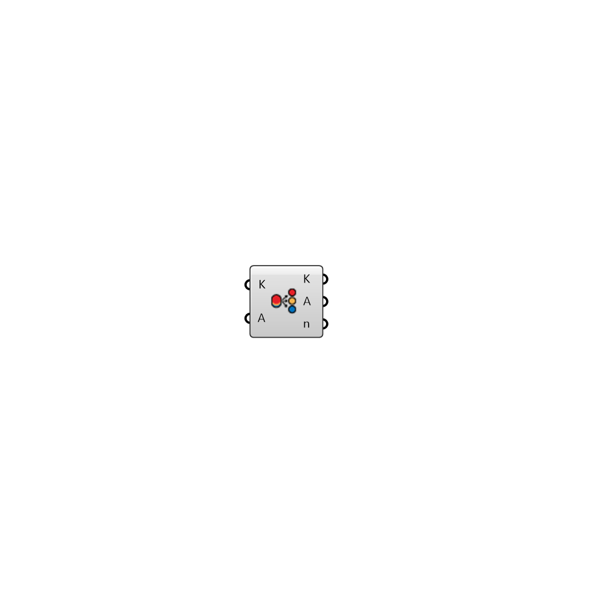

##  SortByLayers - [[source code]](https://github.com/mostaphaRoudsari/ladybug/tree/master/src/Ladybug_SortByLayers.py)

Sort and group Rhino objects by layers.  Please find the source code from: https://github.com/MingboPeng/Ironbug

#### Inputs
* ##### K []
A list of Rhino objects that associated with sortable layers
* ##### A []
Optional object list to sort synchronously

#### Outputs
* ##### K
Sorted objects by layers
* ##### A
Synchronously sorted objects
* ##### n
Grouped layer names

[Check Hydra Example Files for SortByLayers](https://hydrashare.github.io/hydra/index.html?keywords=Ladybug_SortByLayers)