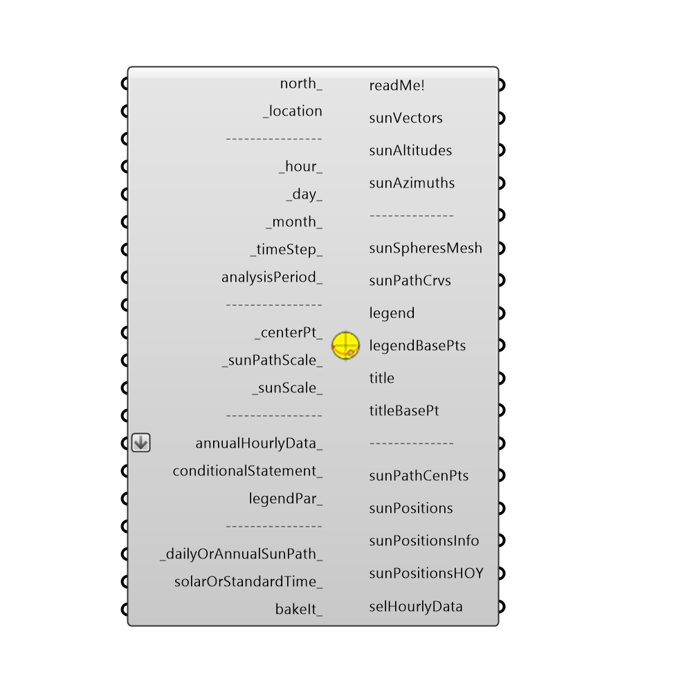

##  SunPath - [[source code]](https://github.com/ladybug-tools/ladybug-legacy/tree/master/src/Ladybug_SunPath.py)

Use this component to make a 3D sun-path (aka. sun plot) in the Rhino scene.  The component also outputs sun vectors that can be used for sunlight hours analysis or shading design with the other Ladybug components.
 The sun-path function used here is a Python version of the RADIANCE sun-path script by Greg Ward. The RADIANCE source code can be accessed at:
 http://www.radiance-online.org/download-install/CVS%20source%20code
 -
 

#### Inputs
* ##### north [Optional]
Input a vector to be used as a true North direction for the sun path or a number between 0 and 360 that represents the degrees off from the y-axis to make North.  The default North direction is set to the Y-axis (0 degrees).
* ##### location [Required]
The output from the importEPW or constructLocation component.  This is essentially a list of text summarizing a location on the earth.
* ##### hour [Default]
A number between 1 and 24 (or a list of numbers) that represent hour(s) of the day to position sun sphere(s) on the sun path.  The default is 12, which signifies 12:00 PM.
* ##### day [Default]
A number between 1 and 31 (or a list of numbers) that represent days(s) of the month to position sun sphere(s) on the sun path.  The default is 21, which signifies the 21st of the month (when solstices and equinoxes occur).
* ##### month [Default]
A number between 1 and 12 (or a list of numbers) that represent months(s) of the year to position sun sphere(s) on the sun path.  The default is 12, which signifies December.
* ##### timeStep [Default]
The number of timesteps per hour in the sun path. This number should be smaller than 60 and divisible by 60. The default is set to 1 such that one sun sphere and one sun vector is generated for each hour.
 Note that a linear interpolation will be used to generate curves and suns for timeSteps greater than 1.
* ##### analysisPeriod [Optional]
An optional analysis period from the Analysis Period component.  Inputs here will override the hour, day, and month inputs above.
* ##### centerPt [Default]
Input a point here to change the location of the sun path in the Rhino scene.  The default is set to the Rhino model origin (0,0,0).
* ##### sunPathScale [Default]
Input a number here to change the scale of the sun path.  The default is set to 1.
* ##### sunScale [Default]
Input a number here to change the scale of the sun spheres located along the sun path.  The default is set to 1.
* ##### projection [Default]
A number to set the projection of the sky hemisphere.  The default is set to draw a 3D hemisphere.  Choose from the following options:
 0 = 3D hemisphere
 1 = Orthographic (straight projection to the XY Plane)
 2 = Stereographic (equi-angular projection to the XY Plane)
* ##### annualHourlyData [Optional]
An optional list of hourly data from the Import epw component, which will be used to color the sun spheres of the sun path (e.g. dryBulbTemperature).
* ##### conditionalStatement [Optional]
This input allows users to remove data that does not fit specific conditions or criteria from the sun path. To use this input correctly, hourly data, such as temperature or humidity, must be plugged into the annualHourlyData_ input. The conditional statement input here should be a valid condition statement in Python, such as "a>25" or "b<80" (without quotation marks).
 The current version of this component accepts "and" and "or" operators. To visualize the hourly data, only lowercase English letters should be used as variables, and each letter alphabetically corresponds to each of the lists (in their respective order): "a" always represents the 1st list, "b" always represents the 2nd list, etc.
 For example, if you have hourly dry bulb temperature connected as the first list, and relative humidity connected as the second list (both to the annualHourlyData_ input), and you want to plot the data for the time period when temperature is between 18C and 23C, and humidity is less than 80%, the conditional statement should be written as 18<a<23 and b<80 (without quotation marks).
* ##### legendPar [Optional]
Optional legend parameters from the Ladybug Legend Parameters component.
* ##### dailyOrAnnualSunPath [Default]
By default, this value is set to "True" (or 1), which will produce a sun path for the whole year.  Set this input to "False" (or 0) to generate a sun path for just one day of the year (or several days if multiple days are included in the analysis period).
* ##### solarOrStandardTime [Default]
Set to 'True' to have the sunPath display in solar time and set to 'False' to have it display in standard time.  The default is set to 'False.'  Note that this input only changes the way in which the supath curves are drawn currently and does not yet change the position of the sun based on the input hour.
* ##### bakeIt [Optional]
An integer that tells the component if/how to bake the bojects in the Rhino scene.  The default is set to 0.  Choose from the following options:
 0 (or False) - No geometry will be baked into the Rhino scene (this is the default).
 1 (or True) - The geometry will be baked into the Rhino scene as a colored hatch and Rhino text objects, which facilitates easy export to PDF or vector-editing programs.
 2 - The geometry will be baked into the Rhino scene as colored meshes, which is useful for recording the results of paramteric runs as light Rhino geometry.

#### Outputs
* ##### readMe!
...
* ##### sunVectors
Vector(s) indicating the direction of sunlight for each sun position on the sun path. 
* ##### sunAltitudes
Number(s) indicating the sun altitude(s) in degrees for each sun position on the sun path.
* ##### sunAzimuths
Number(s) indicating the sun azimuths in degrees for each sun position on the sun path.
* ##### sunSpheresMesh
A colored mesh of spheres representing sun positions.  Colors indicate annualHourlyData_ and will be yellow if no data is hooked up to annualHourlyData_.
* ##### sunPathCrvs
A set of curves that mark the path of the sun across the sky dome.
* ##### compassCrvs
A set of curves and text meshes that denote the cardinal directions and azimuth angles.
* ##### altitudeCrvs
A set of circular curves that denote the altitude.  Note that these will only appear when the _projection_ is set to something other than a 3D sun path.
* ##### legend
A legend for the sun path. Connect this output to a grasshopper "Geo" component in order to preview the legend separately in the Rhino scene.  
* ##### legendBasePts
The legend base point(s), which can be used to move the legend(s) in relation to the sun path with the grasshopper "move" component.
* ##### title
The title text of the sun path.  Hook this up to a native Grasshopper 'Geo' component to preview it separately from the other outputs.
* ##### titleBasePt
Point for the placement of the title, which can be used to move the title in relation to the sun path with the native Grasshopper "Move" component.
* ##### sunPathCenPts
The center point of the sun path (or sun paths if multiple annualHourlyData_ streams are connected).  Use this to move sun paths around in the Rhino scene with the grasshopper "move" component.
* ##### sunPositions
Point(s) idicating the location on the sun path of each sun position.
* ##### sunPositionsInfo
Detailied information for each sun position on the sun path including date and time.
* ##### sunPositionsHOY
The hour of the year for each sun position on the sun path.
* ##### selHourlyData
The annualHourlyData_ for each sun position on the sun path. Note that this data has the following removed from it: 1) Any parts of the annualHourlyData_ that happen when the sun is down, 2) annualHourlyData_ that is not apart of the analysisPeriod_ and, 3) annualHourlyData_ that does not fit the conditional statement.

[Check Hydra Example Files for SunPath](https://hydrashare.github.io/hydra/index.html?keywords=Ladybug_SunPath)