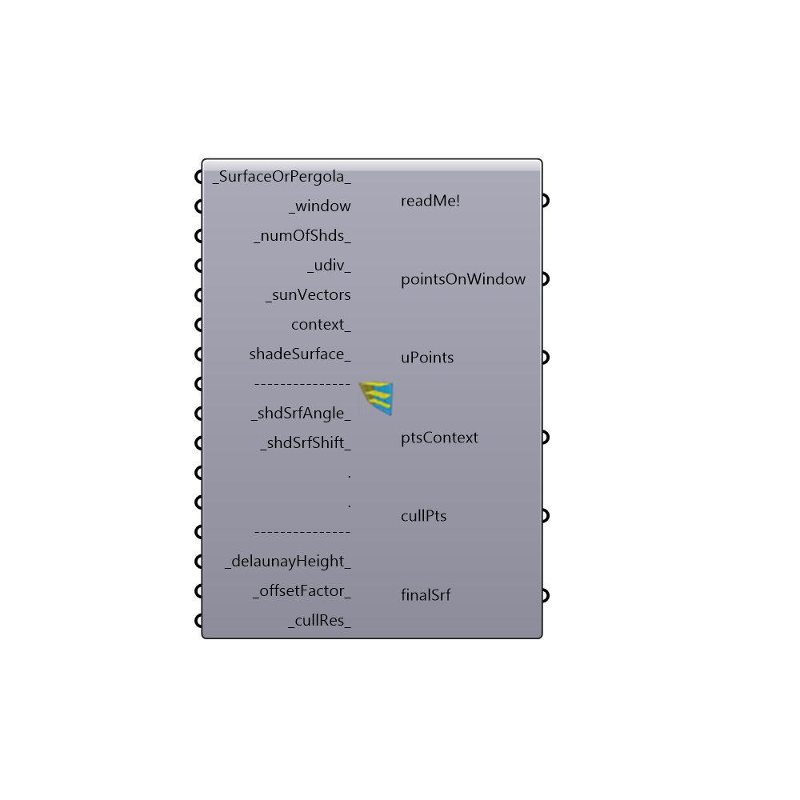

##  Sun_Shades_Calculator - [[source code]](https://github.com/mostaphaRoudsari/ladybug/tree/master/src/Ladybug_Sun_Shades_Calculator.py)

Use this component to generate shading devices, either surface or pergola, for any glazed surface or list of glazed surfaces.  
 The component first culls all sun vectors obstructed by the context, if provided.
 By default it calculates the device as a "new brand" one but it also can calculate the cut profile for a given surface.
 The default it will generate an overhang over the window (or multiple overhangs if the _numOfShds is increased).  
 -
 

#### Inputs
* ##### SurfaceOrPergola [Default]
0= Device optimised for period, will give the horizontal or tilted surface over the top of the window, or the cut profile device on a provided shading surface. 1= Pergola with fins. Default is 0.
* ##### window [Required]
A Surface or Brep representing a window to be used for shading design.  This can also be a list of Surfaces of Breps.
* ##### numOfShds [Default]
The number of shades to generated for each glazed surface.
* ##### udiv [Default]
Number of row divisions of the window. Used for choosing the lower and higher rows you want to protect. Default is 1.
* ##### sunVectors [Required]
Output of Ladybug sunPath component.
* ##### context [Optional]
Breps/surfaces that you want to account for as blocking objects. 
* ##### shadeSurface [Optional]
An optional shade surface representing a 2D area under consideration for shading. 
* ##### shdSrfAngle [Default]
In case NO shadeSurface is provided a plane over the window will be used as base for the calculation. In this case you can provide the angle of this plane. Default is 0.0.
* ##### finsAngle [Default]
Angle for pergola fins. Default is 45.
* ##### delaunayHeight [Default]
Distance from base curve and top intersection points. Used by the Delauney Mesh component. Default is 5.
* ##### offsetFactor [Default]
VERY important input!! The offset factor for the ConvexHull curve. Will be used for the Delauneay mesh. Default is 40.
* ##### res [Default]
Divide the offset curve for the Delaunay operation.

#### Outputs
* ##### readMe!
...
* ##### pointsOnWindow
Net of points on window
* ##### uPoints
Net of points on window
* ##### ptsContext
Show the intersection point of sun vectors with context
* ##### cullPts
Show the points that define the contour of the shading device. Pay attention to those more/less dense areas covered by these points.
* ##### finalSrf
Surface representing the shape of the shading device.

[Check Hydra Example Files for Sun_Shades_Calculator](https://hydrashare.github.io/hydra/index.html?keywords=Ladybug_Sun_Shades_Calculator)