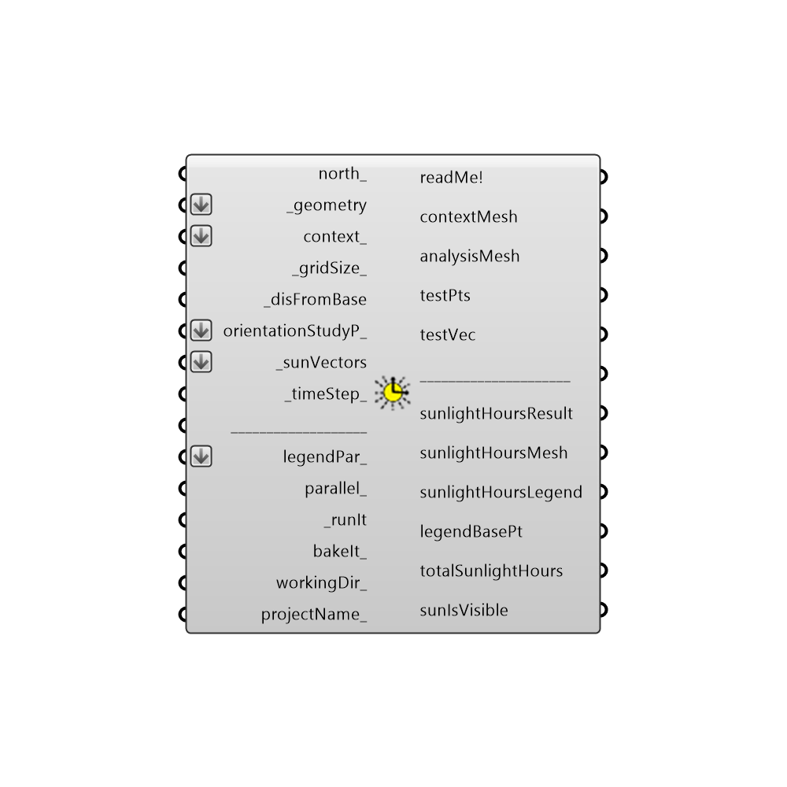

##  Sunlight_Hours_Analysis

This component calculates the number of hours of direct sunlight received by input geometry using sun vectors from the sunPath component.
 This component can be used to evaluate the number of hours of sunlight received by vegetation in a park or the hours where direct sunlight might make a certain outdoor space comfortable or uncomfortable.
 It can also be used for coarsely-gridded shadow studies in the Rhino scene .  For finer and more detailed shadow studies with simple input geometry, the Ladybug ShadowStudy component can be used.  For detailed shadow studies with complex geometry, the Honeybee daylight tools are recommended.
 -
 

#### Inputs
* ##### north_ [Optional]
Input a vector to be used as a true North direction for the sun path or a number between 0 and 360 that represents the degrees off from the y-axis to make North.  The default North direction is set to the Y-axis (0 degrees).
* ##### _geometry [Required]
Geometry for which sunlight hours analysis will be conducted.  Geometry must be either a Brep, a Mesh or a list of Breps or Meshes.
* ##### context_ [Optional]
Context geometry that could block sunlight to the test _geometry.  Conext geometry must be either a Brep, a Mesh or a list of Breps or Meshes.
* ##### _gridSize_ [Default]
A number in Rhino model units that represents the average size of a grid cell for sunlight hours analysis on the test _geometry.  This value should be smaller than the smallest dimension of the test _geometry for meaningful results.  Note that, the smaller the grid size, the higher the resolution of the analysis and the longer the calculation will take.
* ##### _disFromBase [Required]
A number in Rhino model units that represents the offset distance of the test point grid from the input test _geometry.  Usually, the test point grid is offset by a small amount from the test _geometry in order to ensure that sunlight hours analysis is done for the correct side of the test _geometry.  If the resulting mesh of this component is offset to the wrong side of test _geometry, you should use the "Flip" Rhino command on the test _geometry before inputting it to this component.
* ##### orientationStudyP_ [Optional]
Optional output from the "Orientation Study Parameter" component.
* ##### _sunVectors [Required]
Sun vectors from the sunPath component, which will be used to determine the number of hours of direct sunlight received by the test _geometry.
* ##### _timeStep_ [Default]
The number of timesteps per hour used by the sunPath component that generated the sun vectors. This number should be smaller than 60 and divisible by 60. The default is set to 1 such that one ssun vector is generated for each hour.
* ##### ___________________ [Default]
...
* ##### legendPar_ [Optional]
Optional output from the "Orientation Study Parameter" component.  You can use an Orientation Study input here to answer questions like "What orientation of my building will give me the highest or lowest hours of direct sunlight for my analysis period?"  An Orientation Study will automatically rotate your input _geometry around several times and record the sunlight hours results each time in order to output a list of values for totalSunlightHours and a grafted data stream for sunlightHoursResult.
* ##### parallel_ [Optional]
Set to "True" to run the sunlight hours analysis using multiple CPUs.  This can dramatically decrease calculation time but can interfere with other intense computational processes that might be running on your machine.
* ##### _runIt [Required]
Set to "True" to run the component and perform sunlight hours analysis on the input _geometry.
* ##### bakeIt_ [Optional]
Set to "True" to bake the analysis results into the Rhino scene.
* ##### workingDir_ [Optional]
Use this input to change the working directory of the sunlight hours analysis on your system. Input here must be a valid file path location on your computer.  The default is set to "C:\Ladybug" and it is from this file location that sunlight hours results are loaded into grasshopper after the analysis is done.
* ##### projectName_ [Optional]
Use this input to change the project name of the files generated in the working directory.  Input here must be a string without special characters.  If "bakeIt_" is set to "True", the result will be baked into a layer with this project name.

#### Outputs
* ##### readMe!
...
* ##### contextMesh
An uncolored mesh representing the context_ geometry that was input to this component. Connect this output to a "Mesh" grasshopper component to preview this output seperately from the others of this component. Note that this mesh is generated before the analysis is run, allowing you to be sure that the right geometry will be run through the analysis before running this component.
* ##### analysisMesh
An uncolored mesh representing the test _geometry that will be analyzed.  Connect this output to a "Mesh" grasshopper component to preview this output seperately from the others of this component. Note that this mesh is generated before the analysis is run, allowing you to be sure that the right geometry will be run through the analysis before running this component.
* ##### testPts
The grid of test points on the test _geometry that will be used to perform the sunlight hours analysis.  Note that these points are generated before the analysis is run, allowing you to preview the resolution of the result before you run the component.
* ##### testVec
Vectors for each of the test points on the test _geometry, which indicate the direction for which sunlight hours analysis is performed.  Hook this and the test points up to a Grasshopper "Vector Display" component to see how analysis is performed on the test _geometry.
* ##### _____________________
...
* ##### sunlightHoursResult
The number of hours of direct sunlight received by each of the test points of the input test _geometry.  Note that is is the number of hours out of the total number of connected _sunVectors.
* ##### sunlightHoursMesh
A colored mesh of the test _geometry representing the hours of direct sunlight received by this input _geometry for the input sunVectors.
* ##### sunlightHoursLegend
A legend for the sunlight hours study showing the number of hours that correspond to the colors of the sunlightHoursMesh. Connect this output to a grasshopper "Geo" component in order to preview the legend separately in the Rhino scene.  
* ##### legendBasePt
The legend base point, which can be used to move the legend in relation to the sunlight hours mesh with the grasshopper "move" component.
* ##### totalSunlightHours
The average number of hours of direct sunlight received by the test _geometry.
* ##### sunIsVisible
A grafted data stream for each test point with a "1" for each hour of the sunVectors that the sun is visible and a "0" for each hour of the sunVectors when the sun is blocked.

[Check Hydra Example Files for Sunlight Hours Analysis](https://hydrashare.github.io/hydra/index.html?keywords=Ladybug_Sunlight Hours Analysis)