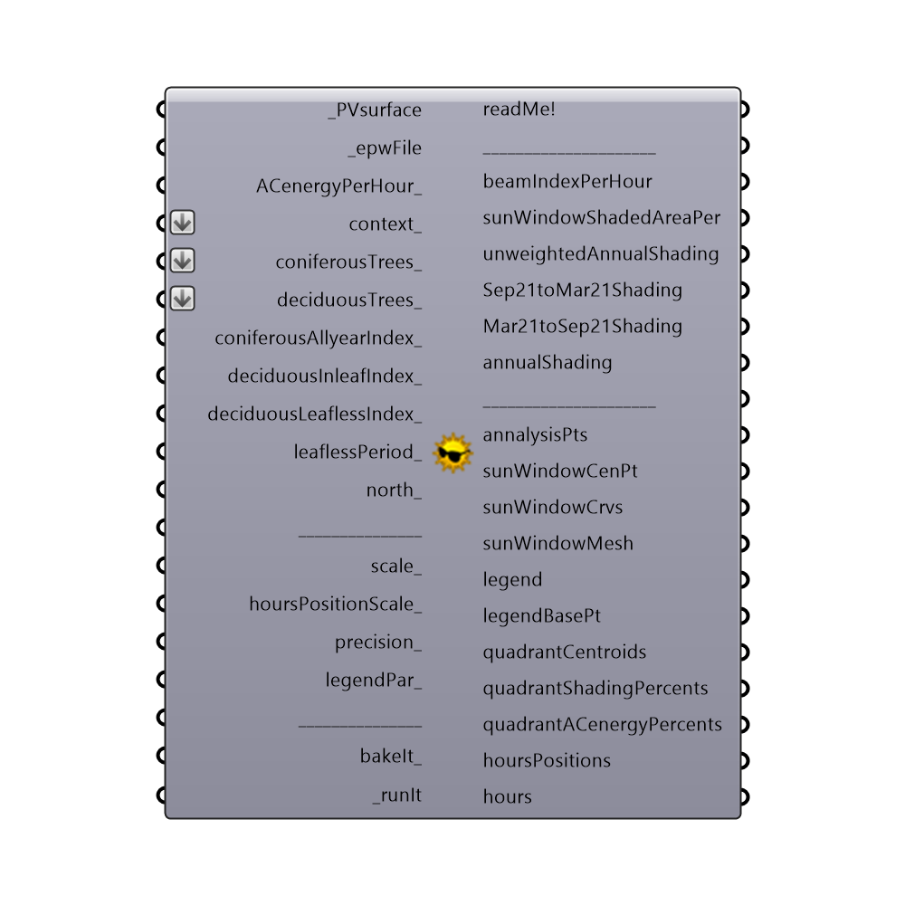

##  Sunpath Shading

This component calculates the shading of:
 - Photovoltaic modules
 - Solar Water Heating collectors
 - any other purpose (shading of points)
 -
 Use "annualShading", "Sep21toMar21Shading" and "Mar21toSep21Shading" outputs for Photovoltaic modules shading. 
 Use "beamIndexPerHour" and "skyExposureFactor" outputs for Solar Water Heating collectors shading, or any other purpose.
 Use "shadedSolarRadiationPerHour" data for "solarRadiationPerHour_" input of "Thermal Comfort Indices" component to account for shading.
 -
 "annualShading" output is based on "Using sun path charts to estimate the effects of shading on PV arrays", University of Oregon, Frank Vignola:
 http://solardat.uoregon.edu/download/Papers/UsingSunPathChartstoEstimatetheEffectofShadingonPVArrays.pdf
 -
 

#### Inputs
* ##### epwFile [Required]
Input .epw file path by using the "File Path" parameter, or Ladybug's "Open EPW And STAT Weather Files" component.
* ##### analysisGeometry [Required]
Input surface(a) or point(b) (a single one or more of them).
 -
 a) Input planar Surface (not polysurface) on which the PV modules/Solar water heating collectors will be applied.
 If you have a polysurface, explode it (using "Deconstruct Brep" component) and then feed its Faces(F) output to _analysisGeometry. Surface normal should be faced towards the sun.
 -
 b) You can also supply point(s) and its shading will be calculated.
 -
 Geometry inputted to "_analysisGeometry", will be accounted for self-shading, so there is no need to input it to the "context_" also.
* ##### context [Optional]
Buildings, structures, mountains and other permanent obstructions.
 -
 If you supplied surface(s) to the "_analysisGeometry", input them into the "context_" too, to account for self-shading.
 If you inputted point(s) into the "_analysisGeometry", there's no need to input them into the "context_".
 -
 Input polysurfaces, surfaces, or meshes.
* ##### coniferousTrees [Optional]
This input allows for partial shading from coniferous(evergreen) context trees.
 -
 Input polysurfaces, surfaces, or meshes.
* ##### deciduousTrees [Optional]
This input allows for partial shading during in-leaf and leaf-less periods from deciduous context trees.
 In-leaf being a period from 21st March to 21st September in the northern hemisphere, and from 21st September to 21st March in the southern hemisphere.
 Leaf-less being a period from 21st September to 21st March in the northern hemisphere, and from 21st March to 21st September in the in the southern hemisphere.
 -
 Input polysurfaces, surfaces, or meshes.
* ##### coniferousAllyearIndex [Optional]
All year round transmission index for coniferous(evergreen) context trees. It ranges from 0 to 1.0. 0 represents deciduous trees which do not allow solar radiation to pass through them (100% shading). 1 represents all solar radiation passing through deciduous trees, like the trees do not exist (0% shading).
 -
 If not supplied default value of 0.30 (equals 70% shading) will be used.
 -
 Unitless.
* ##### deciduousInleafIndex [Optional]
Deciduous context trees transmission index for in-leaf period. In-leaf being a period from 21st March to 21st September in the northern hemisphere, and from 21st September to 21st March in the southern hemisphere.
 It ranges from 0 to 1.0. 0 represents deciduous trees which do not allow solar radiation to pass through them (100% shading). 1 represents all solar radiation passing through deciduous trees, like the trees do not exist (0% shading).
 -
 If not supplied default value of 0.23 (equals 77% shading) will be used.
 -
 Unitless.
* ##### deciduousLeaflessIndex [Optional]
Deciduous context trees transmission index for leaf-less period. Leaf-less being a period from 21st September to 21st March in the northern hemisphere, and from 21st March to 21st September in the in the southern hemisphere.
 It ranges from 0 to 1.0. 0 represents deciduous trees which do not allow solar radiation to pass through them (100% shading). 1 represents all solar radiation passing through deciduous trees, like the trees do not exist (0% shading).
 -
 If not supplied default value of 0.64 (equals 36% shading) will be used.
 -
 Unitless.
* ##### leaflessPeriod [Optional]
Define the leafless period for deciduous trees using Ladybug's "Analysis Period" component.
 IMPORTANT! This input affects only the skyExposureFactor, beamIndexPerHour, shadedSolarRadiationPerHour output. Due to limitations of the used sunpath diagram, it does not affect the Sep21toMar21Shading, Mar21toSep21Shading, annualShading outputs, where default leafless periods (see the line bellow) will always be used.
 -
 If not supplied the following default periods will be used: from 21st September to 21st March in the northern hemisphere, and from 21st March to 21st September in the in the southern hemisphere.
* ##### ACenergyPerHour [Optional]
This input is necessaty only if you are calculating the shading of the PV modules. If that is so, input the "ACenergyPerHour" output data from "Photovoltaics surface" component.
 -
 If you are calculating shading analysis for "Solar water heating surface" component (instead of "Photovoltaics surface" component), leave this input empty.
 -
 If you are calculating shading analysis for any other purpose (of point(s) for example) leave this input empty too.
* ##### north [Optional]
Input a vector to be used as a true North direction, or a number between 0 and 360 that represents the clockwise degrees off from the Y-axis.
 -
 If not supplied, default North direction will be set to the Y-axis (0 degrees).
* ##### albedo [Optional]
A list of 8767 (with header) or 8760 (without the header) albedo values for each hour during a year.
 Albedo (or Reflection coefficient) is an average ratio of the global incident solar radiation reflected from the area surrounding the _analysisGeometry.
 It ranges from 0 to 1.
 -
 It depends on the time of the year/day, surface type, temperature, vegetation, presence of water, ice and snow etc.
 -
 If no list supplied, default value of 0.20 will be used, corrected(increased) for the presence of snow (if any).
 -
 Unitless.
* ##### outputGeometryIndex [Optional]
An index of the surface inputted into "_analysisGeometry" if "_analysisGeometry" would be flattened..
 It determines the surface for which output geometry will be generated.
 -
 If not supplied, geometry for the first surface (index: 0) will be generated as a default.
* ##### scale [Optional]
Scale of the overall geometry (sunPath curves, sunWindow mesh).
 Use the scale number which enables encompassing all of your context_, coniferousTrees_, deciduousTrees_ objects.
 -
 If not supplied, default value of 1 will be used.
* ##### hoursPositionScale [Optional]
Scale factor for positioning of solar time hour points (that's "hoursPositions" output).
 -
 If not supplied, default value of 1 will be used.
* ##### precision [Optional]
Overall shading precision. Ranges from 1-100. It represents the square root number of shading analysis points per sun window quadrant.
 Example - precision of 20 would be 400 shading analysis points per single sun window quadrant.
 CAUTION!!! Higher precision numbers (50 >) require stronger performance PCs. If your "_context" contains only straight shape buildings/objects, and you have just a couple of trees supplied to the "coniferousTrees_" and "deciduousTrees_" inputs, the precision of < 50 will be just fine.
 -
 If not supplied, default value of 2 will be used.
* ##### legendPar [Optional]
Optional legend parameters from the Ladybug "Legend Parameters" component.
* ##### bakeIt [Optional]
Set to "True" to bake the Sunpath shading results into the Rhino scene.
 -
 If not supplied default value "False" will be used.
* ##### runIt [Required]
...

#### Outputs
* ##### readMe!
...
* ##### skyExposureFactor
Continuous Sky Exposure Factor - portion of the visible sky (dome). It defines the shading of the diffuse irradiance components. It ranges from 0 to 1.
 0 means that the sky dome is competely obstructed by obstacles and all incoming diffuse sky irradiance is blocked (100% shading). 1 means that sky dome is competely free of obstacles (0% shading).
 -
 This output is similar to "skyView" output of Ladybug's "Shading Mask" component. Unlike "skyView" it takes into account transparency of trees. But it does not visually present the shading, which is what "Shading Mask" component does.
 -
 Use it for Ladybug "Solar Water Heating System" or "Solar Water Heating System Detailed" component's "skyExposureFactor_" input to account for diffuse irradiance shading of SWHsurface.
 -
 Unitless.
* ##### beamIndexPerHour
Transmission index of beam (direct) irradiance for each hour during a year. It ranges from 0-1.
 Transmission index of 0 means 100% shading. Transmission index of 1 means 0% shading.
 It is calculated for each analysisGeometry vertex and then averaged.
 -
 Use it as an input for Ladybug "Solar Water Heating System" or "Solar Water Heating System Detailed" component's "beamIndexPerHour_" input to account for diffuse direct beam shading of SWH surface.
 -
 Unitless.
* ##### shadedSolarRadiationPerHour
Total shaded incidence for each hour during a year.
 Data from this output can be used for "solarRadiationPerHour_" input of "Thermal Comfort Indices" component to account for shading.
 -
 In Wh/m2.
* ##### Sep21toMar21Shading
Weighted shading of the active sun window quadrants, for period between 21st September to 21st March. Active sun window quadrants are only those which produce AC energy.
 It is calculated for each analysisGeometry vertex and then averaged. It ranges from 0-100(%).
 -
 In percent(%).
* ##### Mar21toSep21Shading
Weighted shading of the active sun window quadrants, for period between 21st March to 21st September. Active sun window quadrants are only those which produce AC energy.
 It is calculated for each analysisGeometry vertex and then averaged. It ranges from 0-100(%).
 -
 In percent(%).
* ##### annualShading
Annual weighted shading of the active sun window quadrants. To calculate it, input the hourly data to "ACenergyPerHour_" input.
 Active sun window quadrants are only those which produce AC energy.
 It is calculated for each analysisGeometry vertex and then averaged. It ranges from 0-100(%).
 -
 Use it as an input for Ladybug "DC to AC derate factor" component's "annualShading_" input to account for shading of PVsurface.
 -
 In percent(%).
* ##### annalysisPts
Each vertex of the inputted _analysisGeometry for which a separate shading analysis was conducted.
 -
 Connect this output to a Grasshopper's "Point" parameter in order to preview the "annalysisPts" geometry in the Rhino scene.
* ##### sunWindowCenPt
The center point of the "sunWindowCrvs" and "sunWindowMesh" geometry. It is calculated for analysisGeometry area centroid.
 Use this point to move "sunWindowCrvs" and "sunWindowMesh" geometry around in the Rhino scene with the grasshopper's "Move" component.
 -
 Connect this output to a Grasshopper's "Point" parameter in order to preview the "sunWindowCenPt" point in the Rhino scene.
* ##### sunWindowCrvs
Geometry of the sun window based on 3D polar sun path diagram. Perpendical curves represent solar time hours. Horizontal arc curves represent sun paths for: 21st December, 21st November/January, 21st October/February, 21st September/March, 21st August/April, 21st July/May, 21st June.
 The whole sunWindowCrvs geometry output is calculated for analysisGeometry area centroid.
* ##### sunWindowMesh
Sun window mesh based on 3D polar sun path diagram. It is calculated for analysisGeometry area centroid.
 Black areas represent 100% shaded portions of the sun window (of both active and inactive quadrants). Darker green and green areas represent partially shaded portions from the coniferous and deciduous trees, respectively.
 -
 It is calculated ONLY if data is supplied to the "ACenergyPerHour_" input".
* ##### legend
A legend of the sunWindowMesh. Connect this output to a Grasshopper's "Geo" parameter in order to preview the legend separately in the Rhino scene.  
* ##### legendBasePt
Legend base point, which can be used to move the "legend" geometry with grasshopper's "Move" component.
 -
 Connect this output to a Grasshopper's "Point" parameter in order to preview the "annalysisPts" geometry in the Rhino scene.
* ##### quadrantCentroids
Centroid for each sun window active quadrant above the horizon.
 -
 Use grasshopper's "Text tag" component to visualize them.
* ##### quadrantShadingPercents
Shadinging percent per each sun window active quadrant above the horizon. Active quadrants with less than 0.01% are neglected.
 -
 Use grasshopper's "Text tag" component to visualize them.
* ##### quadrantACenergyPercents
AC energy percent per each sun window active quadrant above the horizon.
 -
 Use grasshopper's "Text tag" component to visualize them.
* ##### hoursPositions
Solar time hour point positions.
 -
 Use grasshopper's "Text tag" component to visualize them.
* ##### hours
Solar time hour strings.
 -
 Use grasshopper's "Text tag" component to visualize them.

[Check Hydra Example Files for Sunpath Shading](https://hydrashare.github.io/hydra/index.html?keywords=Ladybug_Sunpath Shading)