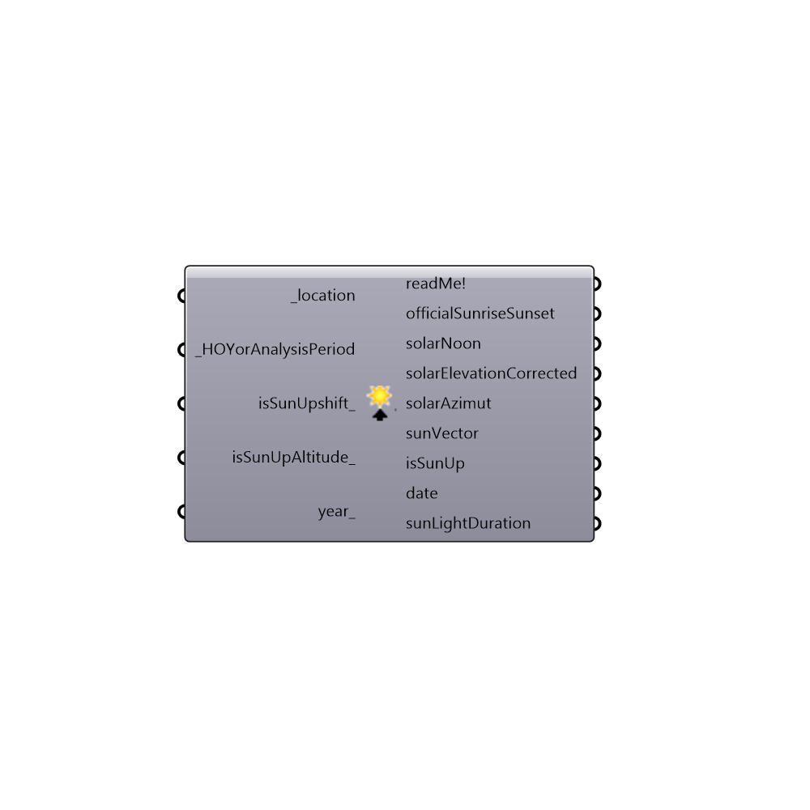

##  SunriseSunset

Use this component to get information about the sun
 -
 This component is based on NOAA's research (National Oceanic and Atmospheric Administration) and it uses equations from Astronomical Algorithms, by Jean Meeus.
 "The sunrise and sunset results are theoretically accurate to within a minute for locations between +/- 72° latitude, and within 10 minutes outside of those latitudes."
 Special thanks goes to the authors of the spreadsheets Solar Calculation and the web page
 http://www.esrl.noaa.gov/gmd/grad/solcalc/index.html
 -
 This component calculates sunrise and sunset per hourly data. The approximation error of OfficialSunriseSunset could be about one-two minutes.
 -
 Despite this component does not consider the leap day (FEB 29th), results are accurate enough.
 -
 

#### Inputs
* ##### location [Required]
The output from the importEPW or constructLocation component.  This is essentially a list of text summarizing a location on the earth.
* ##### HOYorAnalysisPeriod [Required]
Connect: 
 a) a list of HOYs from outputs of the Ladybug_DOY_HOY for specific date;
 b) OR a list of values from 1 to 8760 for the whole year;
 c) OR Ladybug Analysis Period for the whole year.
* ##### isSunUpshift [Optional]
Set the number of hour after the sunrise and before the sunset you intend to exclude from the calculation of isSunUp. If no value is connected, the default value is 0.
* ##### isSunUpAltitude [Optional]
write a conditional statement about solar altitude. Use 'v' as variable.
 -
 Here's an example:          v > 25.5 and v < 67.3
 -
 It is possible to use the following symbols:
 and, or, ==, !=, >, <, >=, <=, ), (
* ##### year [Optional]
A number between -1000 to 3000. The approximations used in these script are very good for years between 1800 and 2100. Results should still be sufficiently accurate for the range from -1000 to 3000.

#### Outputs
* ##### readMe!
...
* ##### officialSunriseSunset
It is the time between day and night when there is light outside and the Sun is on the horizon (90°50').
* ##### solarNoon
Solar noon is when the sun is at its highest point in the sky each day.
* ##### solarElevationCorrected
Number(s) indicating the sun altitude(s) in degrees for each sun position on the sun path. It consider the atmospheric refraction.
* ##### solarAzimut
Number(s) indicating the sun azimuths in degrees for each sun position on the sun path.
* ##### sunVector
Vector(s) indicating the direction of sunlight for each sun position.
* ##### isSunUp
A list of number. 1 if the sun is up and 0 if the sun is down.
 -
 Use Ladybug Analysis Period or a list of values from 1 to 8760 to generate data for the whole year.
 -
 Try to connect this output to Ladybug 3D Chart to get a daylight chart of your location.
* ##### date
Detailied information for each sun position including date and time.
* ##### sunLightDuration
Duration of sunlight per day expressed in minutes.
 -
 This output is available just for _HOYorAnalysisPeriod type a) and b)
 -
 Try to connect this output to Ladybug_Average Data to create charts of your location using Ladybug_Monthly Bar Chart.

[Check Hydra Example Files for SunriseSunset](https://hydrashare.github.io/hydra/index.html?keywords=Ladybug_SunriseSunset)