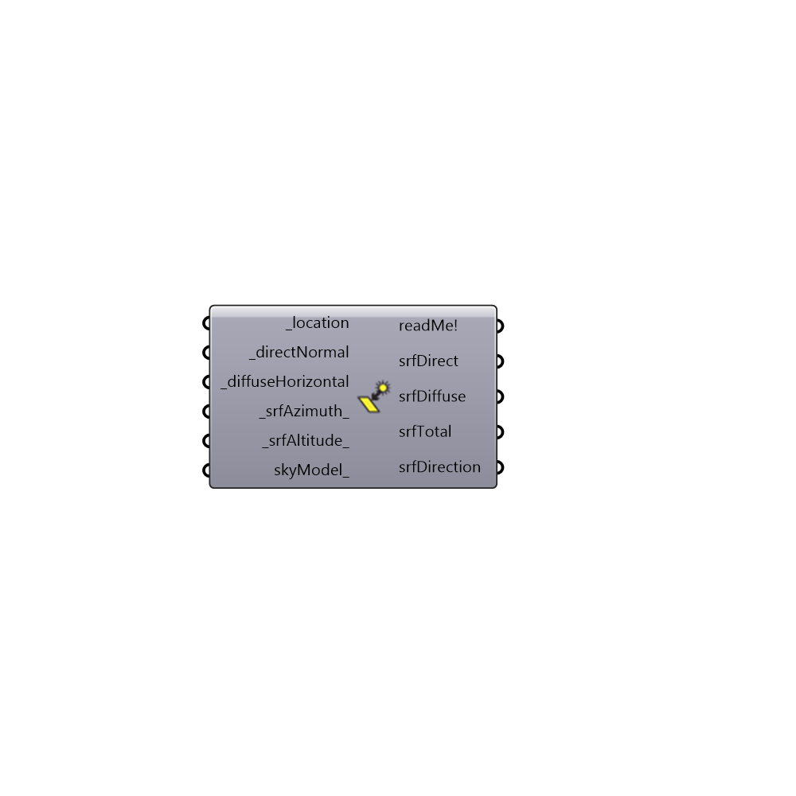

##  Surface Hourly Solar - [[source code]](https://github.com/mostaphaRoudsari/ladybug/tree/master/src/Ladybug_Surface%20Hourly%20Solar.py)

Use this component to quickly compute the hourly solar radiation or illuminance falling on an unobstructed surface that faces any direction from EPW inputs.
 _
 The calculation method of this component is faster than running a full Ladybug Solar Radiation Analysis but this comes at the cost of not being able to account for obstructions that block the sun.
 -
 

#### Inputs
* ##### location [Required]
The output from the importEPW or constructLocation component.  This is essentially a list of text summarizing a location on the earth.
* ##### directNormal [Required]
A list of 8760 hourly values (with an optional Ladybug header on it) that denotes direct normal solar.  This can be either directNormalRadiation or directNormalIlluminance (depending on what output is needed).  These values can be obtained from the "Ladybug_Import EPW" component or the "Ladybug_Design Day Sky Model" component.
* ##### diffuseHorizontal [Required]
A list of 8760 hourly values (with an optional Ladybug header on it) that denotes diffuse horizontal solar.  This can be either globalHorizontalRadiation or globalHorizontallIlluminance (depending on what output is needed).  These values can be obtained from the "Ladybug_Import EPW" component or the "Ladybug_Design Day Sky Model" component.
* ##### srfAzimuth [Default]
A number between 0 and 360 that represents the azimuth that a surface is facing in degrees.  A value of 0 means North, 90 means East, 180 means South, and 270 means West.  If no value is connected here, a default azimuth of 180 will be assumed for a south facing window.
* ##### srfAltitude [Default]
A number between 0 and 90 that represents the altitude that a surface is facing in degrees.  A value of 0 means the surface is facing the horizon and a value of 90 means a surface is facing straight up.  If no value is connected here, a default altitude of 90 will be assumed for a surface facing straignt up.

#### Outputs
* ##### readMe!
...
* ##### srfDirect
Hourly direct solar falling on the surface.
* ##### srfDiffuse
Hourly diffuse solar falling on the surface.
* ##### srfTotal
Hourly total solar falling on the surface.
* ##### srfDirection
A vector showing the direction that the surface is facing in the Rhino scene.

[Check Hydra Example Files for Surface Hourly Solar](https://hydrashare.github.io/hydra/index.html?keywords=Ladybug_Surface Hourly Solar)