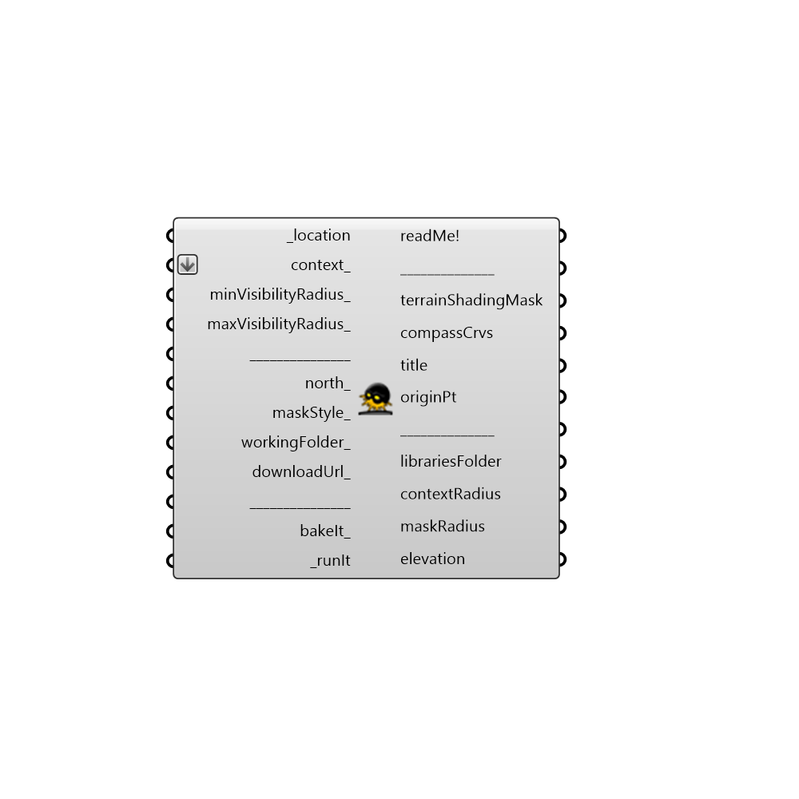

##  Terrain Shading Mask

Use this component to create a 3D Terrain shading mask for a particular location.
 It's a diagram which maps the silhouette of the surrounding terrain (hills, valleys, mountains, tree tops...) in 360 degrees directions seen from above the astronomical horizon.
 It can be used as a "context_" input in mountainous or higher latitude regions for any kind of sun related analysis: sunlight hours analysis, solar radiation analysis, view analysis, photovoltaics/solar water heating sunpath shading ...
 -
 !!! ATTENTION !!!   This component may crash Rhino 5 application due to requirement to generate large topography data! To prevent this, it is suggested to own a 64 bit version of Rhino 5 and have strong enough PC configuration. If you do not have either of these two, it is recommended to keep the maxVisibilityRadius_ value to default value of 100 to prevent the crash of Rhino.
 Also try saving your .gh definition before running this component!
 -
 Component requires that you are connected to the Internet, as it has to download topography data for each terrain shading mask.
 It also requires certain GDAL libraries to be downloaded manually. Component will provide instructions on where to download these libraries.
 Additionally you can find the instructions in here:
 For Rhino5 x86:  https://github.com/stgeorges/terrainShadingMask/blob/master/miscellaneous/Installation_instructions_Rhino5_x86.md
 For Rhino5 x64:  https://github.com/stgeorges/terrainShadingMask/blob/master/miscellaneous/Installation_instructions_Rhino5_x64.md
 -
 Component mainly based on:
 "Mathematical cartography", V. Jovanovic, VGI 1983.
 "Surveying and Levelling Second Edition", Tata McGraw-Hill Education Pvt. Ltd., 5.7 Corrections to be applied, N.N. Basak, 2004
 "Vincenty solutions of geodesics on the ellipsoid" article by Chris Veness
 https://books.google.rs/books/about/Matemati%C4%8Dka_kartografija.html?id=GcXEMgEACAAJ&redir_esc=y
 https://books.google.rs/books?id=fIvvAwAAQBAJ&printsec=frontcover#v=onepage&q&f=false
 http://www.movable-type.co.uk/scripts/latlong-vincenty.html
 -
 Topography data from: http://opentopography.org
 GDAL Libraries from: http://gisinternals.com
 -
 

#### Inputs
* ##### location [Required]
The output from the "importEPW" or "constructLocation" component.  This is essentially a list of text summarizing a location on the Earth.
 -
 "timeZone" and "elevation" data from the location, are not important for the creation of a Terrain shading mask.
* ##### context [Optional]
Input every kind of context to this input: buildings, houses, trees; and all the other objects: PV/SWHsurfaces or planar "_geometry" (surface) on which the future analysis (view, sunlight hours, radiation...) will be conducted.
 -
 This input is important for calculation of the final radius of the Terrain shading mask (that's "maskRadius" output). The larger the context_ input, the Terrain shading mask radius might be longer.
 For sunpath visualization purposes, you can make this input empty (not supply anything to it). In this way the "maskRadius" output will always be equal to 200 meters (655 feets) which corresponds to the _sunPathScale_ = 1 input of the Ladybug_Sunpath component.
 -
 If nothing supplied to the context_ input, the default Terrain shading mask radius of 200 meters (655 feets) will be used.
* ##### minVisibilityRadius [Optional]
Horizontal distance FROM which the surrounding terrain will be taken into account. Anything closer than that will not be considered for creation of a Terrain shading mask.
 Unless you are doing an analysis of large areas, for example longer than 200 meters in radius (e.g. city's blocks) do not change this input's default value (0)!
 -
 If it is not equal to 0, it can not be shorter than 0.1 km nor longer than 10 km.
 Also it must not be longer than one third of maxVisibilityRadius_. For example, if maxVisibilityRadius_ is 27, the maximal minVisibilityRadius_ can not be longer than 9.
 It should be mentioned that every number supplied to the minVisibilityRadius_ input will by rounded at 1 decimal. For example, if you supply: 0.2345, it will be rounded to 0.2 kilometers.
 -
 This input depends on the radius of your context geometry (that's "contextRadius" output). If the radius of your context geometry ranges up to 200 meters (which will likely happen in most cases), just keep the minVisibilityRadius_ equal to 0.
 However, if you intend to use Terrain shading mask for a context whose radius is a couple of hundreds of meters (e.g. solar radiation analysis of a city block), you need to remove the terrain very near to your _location.
 This is what the minVisibilityRadius_ input is used for. For example you can use the value 3 times the radius of your contextRadius: let's say the radius of your context is 600 meters, then you can use the minVisibilityRadius_ of 1.8 km.
 -
 If not supplied, default value of 0 km will be used (all the terrain from the _location point will be taken into account up to maxVisibilityRadius_).
 -
 In kilometers.
* ##### maxVisibilityRadius [Optional]
Horizontal distance TO which the surrounding terrain will be taken into account. Anything beyond that will not be considered for creation of a Terrain shading mask.
 -
 It can not be shorter than 1km or longer than 400 km.
 -
 The component itself might inform the user to alter the initial maxVisibilityRadius_ inputted by the user.
 This is due to restriction of topography data, being limited to 56 latitude South to 60 latitude North range. If maxVisibilityRadius_ value for chosen location gets any closer to the mentioned range, the component will inform the user to shrink it for a certain amount, so that the maxVisibilityRadius_ stops at the range limit.
 -
 If not supplied, default value of 100 km will be used.
 -
 In kilometers.
* ##### north [Optional]
Input a vector to be used as a true North direction, or a number between 0 and 360 that represents the clockwise degrees off from the Y-axis.
 -
 If not supplied, default North direction will be set to the Y-axis (0 degrees).
* ##### maskStyle [Optional]
The style of the mask
 -
 0 - spherical terrain shading mask - the terrain shading mask "is cut" from a half sphere.
 1 - extruded (vertical) terrain shading mask - the terrain shading mask "is cut" from a cylinder.
 -
 !!! NOTICE !!!   Changing maskStyle_ input will result in reruning the component from the very start, and creating a new Terrain shading mask. This can be time consuming.
 It could be better, in order to see how extruded(1) maskStyle_ looks like, to lower the value of the maxVisibilityRadius_ input to 10, for example.
 In this way, the time needed for reruning the component and creating a new Terrain shading mask will vastly be reduced.
 Once you see the effect of extruded maskStyle_, in case you prefer it over the spherical(0) maskStyle_, simply edit the maxVisibilityRadius_ input to the value it had before you lowered it to 10.
 -
 If not supplied, 0 will be used as a default (spherical terrain shading mask).
* ##### workingFolder [Optional]
Folder path where downloaded and created terrain shading mask files will be located.
 -
 This component may download topography files up to 600 MB in size from the Internet, and then create the Terrain shading masks from them.
 Make sure that the "workingFolder_" you choose is a hard disk partition with enough space on it.
 -
 If not supplied, the default Ladybug folder path will be used: C:\ladybug or C:\Users\%USERNAME%\AppData\Roaming\Ladybug.
* ##### downloadUrl [Optional]
Address of a web page which contains download links of already created Terrain shading masks.
 -
 This component downloads a topography data first, then creates a terrain model from it, and in the end creates a Terrain shading mask.
 Mentioned process can be both time consuming (component may ran for 10 minutes) or even crash your Rhino 5, in case you have 32 bit Rhino 5 with lower performance PC.
 In order to avoid this, a number of premade Terrain shading masks will be uploaded to the Internet. Another reason for uploading premade masks is that some of them might not be able to be created with this component. But they could be directly downloaded through downloadUrl_ input.
 Downloading a premade Terrain shading mask can last only a couple of seconds.
 -
 !!! NOTICE !!!  Only premade Terrain shading masks with minVisibilityRadius_ = 0, maxVisibilityRadius_ = 100 and maskStyle_ = 0 (spherical) will be uploaded!
 So if you would like to download a premade Terrain shading mask, make sure that you set your inputs to the same upper mentioned values (minVisibilityRadius_ = 0, maxVisibilityRadius_ = 100, maskStyle_ = 0).
 -
 If not supplied, the following default downloadUrl_ input will be used
 raw.githubusercontent.com/stgeorges/terrainShadingMask/master/objFiles/0_terrain_shading_masks_download_links.tsv
* ##### bakeIt [Optional]
Set to "True" to bake the Terrain shading mask results into the Rhino scene.
 -
 If not supplied default value "False" will be used.
* ##### runIt [Required]
!!! ATTENTION !!!   This component may crash Rhino 5 application due to requirement to generate large topography data! To prevent this, it is suggested to own a 64 bit version of Rhino 5 and have strong enough PC configuration.
 If you do not have either of these two, try keeping the maxVisibilityRadius_ value to its default value: 100.
 Also try saving your .gh definition before running this component.

#### Outputs
* ##### readMe!
...
* ##### terrainShadingMask
The geometry of the terrain shading mask.
 -
 It is scaled according to "context_" input (that is its "contextRadius"), and centered to "context_" centroid (this is "originPt" output).
* ##### compassCrvs
Compass azimuth labels and curves.
 -
 Connect this output to a Grasshopper's "Geo" parameter in order to preview the compassCrvs geometry in the Rhino scene.
* ##### title
Title geometry with information about location, maxVisibilityRadius, elevation.
 -
 Connect this output to a Grasshopper's "Geo" parameter in order to preview the title geometry in the Rhino scene.
* ##### originPt
The origin (center) point of the "terrainShadingMask" and "compassCrvs" geometry.
 -
 The originPt represent the center point of the inputted "context_" geometry. It's Z coordinate will always correspond to the Z coordinate of the lowest part of the "context_" geometry.
 -
 Use this point to move the "terrainShadingMask", "compassCrvs" and "title" geometry around in the Rhino scene with grasshopper's "Move" component.
* ##### librariesFolder
Folder path where GDAL libraries should be copied.
 -
 It is created as:
 Ladybug_Ladybug component's "defaultFolder_" + "terrain shading mask libraries 32-bit"  for Rhino5 x86,
 Ladybug_Ladybug component's "defaultFolder_" + "terrain shading mask libraries 64-bit"  for Rhino5 x64.
* ##### contextRadius
The radius of the "context_" input
 -
 If nothing supplied to the "context_" input, the contextRadius will be equal to 0.
 -
 In Rhino document units.
* ##### maskRadius
The radius of the "terrainShadingMask" output.
 -
 If nothing supplied to the "context_" input, the maskRadius is set to 200 meters (655 feets).
 If something supplied to the "context_" input, the minimal maskRadius is set to 10000 meters (32786 feets).
 -
 In Rhino document units.
* ##### elevation
Elevation of the viewpoint.
 The default and fixed height of the viewpoint from the ground is set to 2 meters.
 The summation of the height of the viewpoint and location's elevation represents this "elevation" output.
 -
 In meters.

[Check Hydra Example Files for Terrain Shading Mask](https://hydrashare.github.io/hydra/index.html?keywords=Ladybug_Terrain Shading Mask)