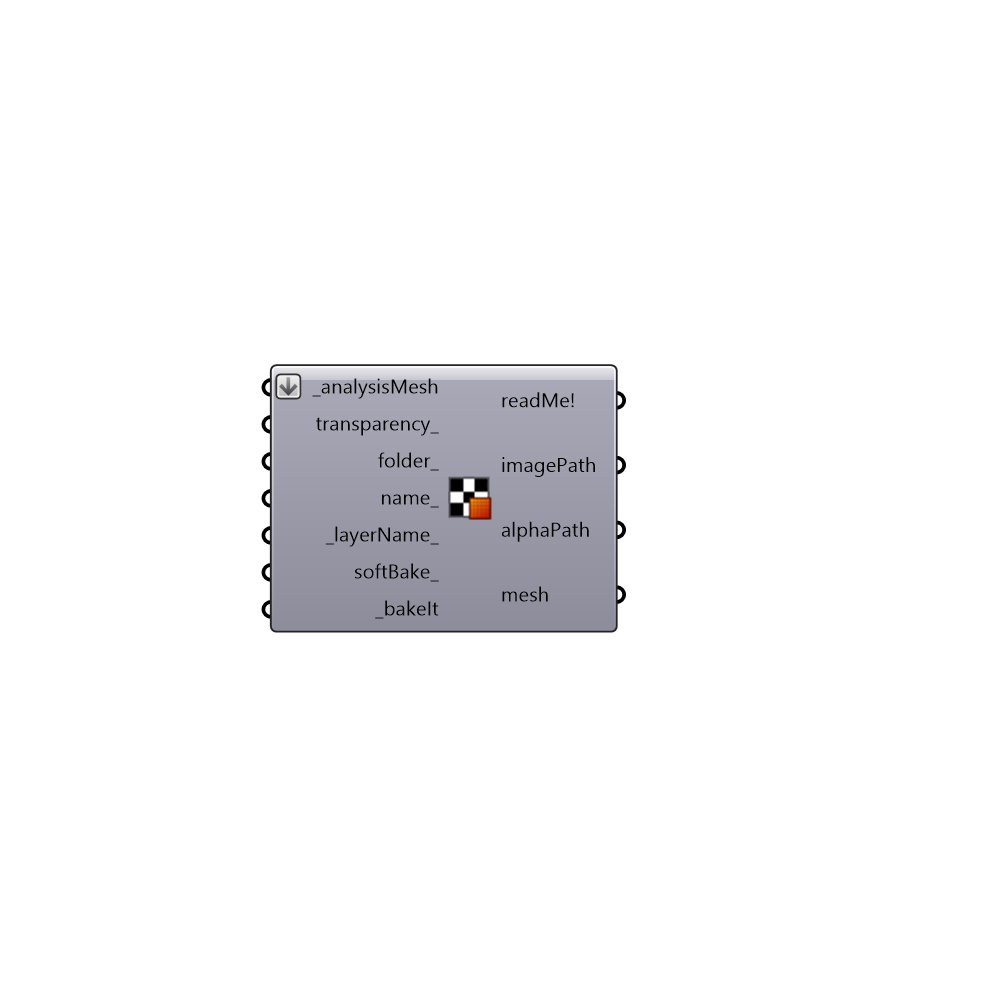

##  Texture Maker - [[source code]](https://github.com/mostaphaRoudsari/ladybug/tree/master/src/Ladybug_Texture%20Maker.py)

Use this component to generate textures from colored meshes.
 In order to export model as *obj you should Bake the new mesh and apply texture to its layer material.
 It is also compatible with Google Earth.
 How to use it:
 1) connect colored mesh which comes from LB analysis component
 2) run the component
 The output are: a new mesh that you have to bake and a texture that you should add to material of the layer where your mesh will be.
 -
 Special thanks goes to the author of the function, Vincente Soler.
 .
 http://www.grasshopper3d.com/forum/topics/how-to-render-mesh-colors
 -
 

#### Inputs
* ##### analysisMesh [Required]
A list of colored Meshes that comes from Grasshopper OR
 .
 "radiationMesh" of "Ladybug_Radiation Analysis"
 .
 "viewStudyMesh" of "Ladybug_View Analysis"
 .
 and so on..
* ##### transparency [Optional]
An optional number between 0 and 1 to set the opacity/transparency of the image.  Note that Rhino may not display this transparency but rendering programs like V-Ray will be able to render it.
* ##### folder [Optional]
The folder into which you would like to write the image file. This should be a complete file path to the folder. If no folder is provided, the images will be written to C:/USERNAME/AppData/Roaming/Ladybug/LB_TextureMesh.
* ##### name [Optional]
The file name that you would like the image to be saved as. If no input is provided it will be created automatically.
* ##### layerName [Default]
An optional text string to set the name of the layer onto which the image-mapped mesh will be baked.
* ##### softBake [Optional]
Set to "True" to run the component and bake the mesh with image material.  However, if this component runs again, the old geometry in the Rhino scene will be overwritten by new geometry, allowing you to make things like rendered animations.
* ##### bakeIt [Required]
Set to "True" to run the component, generate texture images, and bake the mesh into the scene with the image as a material.

#### Outputs
* ##### readMe!
...
* ##### imagePath
Use this image as texture for the new mesh. Connect imagePath to "DB" input of "Human Create/Modify material" and its output to "Human Create/Modify Layers" to apply material to a layer.
* ##### alphaPath
Script variable Texture Maker
* ##### mesh
A new mesh that is structured to correctly accept the image map. This has been baked into the scene for you.

[Check Hydra Example Files for Texture Maker](https://hydrashare.github.io/hydra/index.html?keywords=Ladybug_Texture Maker)