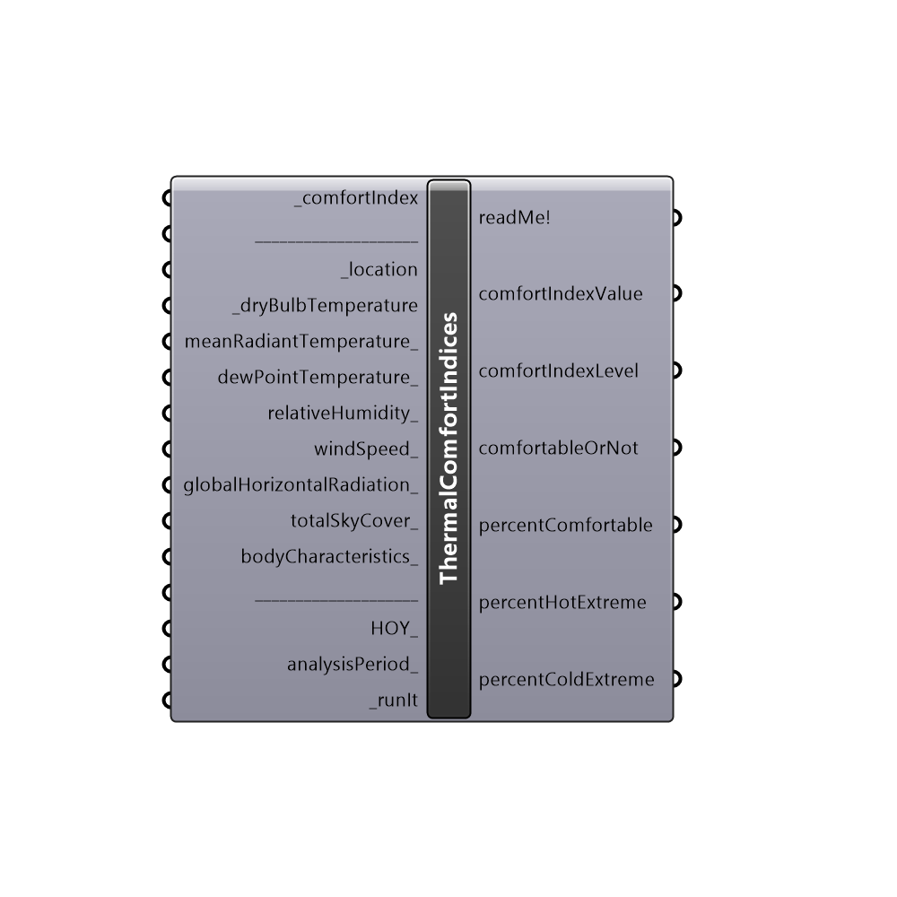

##  Thermal Comfort Indices

Use this component to calculate various thermal comfort indices:
 ------
 - HI (Heat Index)
 - humidex (humidity index)
 - DI (Discomfort Index)
 - WCI (Wind Chill Index)
 - WCT (Wind Chill Temperature)
 - WBGT (Wet-Bulb Globe Temperature) indoors
 - WBGT (Wet-Bulb Globe Temperature) outdoors
 - TE (Effective Temperature)
 - AT (Apparent Temperature)
 - TS (Thermal Sensation)
 - ASV (Actual Sensation Vote)
 - MRT (Mean Radiant Temperature)
 - Iclp (Predicted Insulation Index Of Clothing)
 - HR (Heart Rate)
 - DhRa (Dehydration Risk)
 - PET (Physiological Equivalent Temperature)
 - THI (Temperature Humidity Index)
 - PHS (Predicted Heat Strain)
 -
 

#### Inputs
* ##### comfortIndex [Required]
Choose one of the comfort indices:
 0 - HI (Heat Index)
 1 - humidex (humidity index)
 2 - DI (Discomfort Index)
 3 - WCI (Wind Chill Index)
 4 - WCT (Wind Chill Temperature)
 5 - WBGT (Wet-Bulb Globe Temperature) indoors
 6 - WBGT (Wet-Bulb Globe Temperature) outdoors
 7 - TE (Effective Temperature)
 8 - AT (Apparent Temperature)
 9 - TS (Thermal Sensation)
 10 - ASV (Actual Sensation Vote)
 11 - MRT (Mean Radiant Temperature)
 12 - Iclp (Predicted Insulation Index Of Clothing)
 13 - HR (Heart Rate)
 14 - DhRa (Dehydration Risk)
 15 - PET (Physiological Equivalent Temperature) for temperate climates
 16 - PET (Physiological Equivalent Temperature) for tropical and subtropical humid climates
 17 - THI (Temperature Humidity Index)
 18 - PHS (Predicted Heat Strain)
* ##### location [Required]
Input data from Ladybug's "Import epw" "location" output, or create your own location data with Ladybug's "Construct Location" component.
* ##### dryBulbTemperature [Required]
Air temperature.
 Input a single value or a whole list from "Import epw" component's "dryBulbTemperature" output.
 -
 In Celsius degrees (C).
* ##### meanRadiantTemperature [Optional]
An average temperature of the surfaces that surround the analysis location.
 For indoor conditions or outdoor in-shade, it should be equal to air temperature. So just input the same data you inputted to "_dryBulbTemperature".
 -
 If nothing supplied, it will be calculated for outdoor conditions (both in-shade and out-shade).
 -
 In Celsius degrees (C).
* ##### dewPointTemperature [Optional]
Dew point temperature.
 Input a single value or a whole list from "Import epw" component's "dewPointTemperature" output.
 -
 If not supplied, it will be calculated from _dryBulbTemperature and relativeHumidity_ data.
 -
 In Celsius degrees (C).
* ##### relativeHumidity [Optional]
Relative humidity.
 Input a single value or a whole list from "Import epw" component's "relativeHumidity" output.
 -
 If not supplied 50% will be used as a default (indoor conditions).
 -
 In percent (from 0% to 110%).
* ##### windSpeed [Optional]
Wind speed at 1.1 meters height from analysis surface (height of standing person’s gravity center). It can be a single value or a list of values.
 Take the "windSpeed" output from "Import epw" component and plug it to "Wind Speed Calculator" component's "_windSpeed_tenMeters" input. Set the "heightAboveGround_" input to "1.1". Then plug in the data from "Wind Speed Calculator" component's "windSpeedAtHeight" output to this component's "windSpeed_" input.
 In this way we converted the 10 meter wind speed from the .epw file to required 1.1m.
 -
 If not supplied, default value of 0.3 m/s is used (meaning: the analysis is conducted in outdoor no wind conditions, or indoor conditions).
 -
 In meters/second.
* ##### totalSkyCover [Optional]
Amount of sky dome covered by clouds.
 Input a single value or a whole list from "Import epw" component's "totalSkyCover" output.
 It ranges from from 1 to 10. For example: 1 is 1/10 covered. 10 is total coverage (10/10).
 -
 If not supplied 6/10 will be used (cloud coverage of temperate humid climate).
 -
 In tenths of sky cover.
* ##### solarRadiationPerHour [Optional]
Amount of solar radiation that an analysis person received.
 -
 1) If you would like to do an analysis accounted for shading (more precise) use the "Sunpath shading" component and its "shadedSolarRadiationPerHour" output.
 Or use "Radiation Analysis" component's "radiationResult" output. Be sure to scale the "radiationResult" output data 1000 times (to convert it from kW/m2 to W/m2).
 The "Sunpath shading" component will account for partial shading from the trees, while "Radiation Analysis" will not.
 -
 2) If you would not like to do an analysis accounted for shading (because it's quicker that way), then you can simply supply the data from "Import epw" component's "diffuseHorizontalRadiation" output. In this way it will be assumed that an analysis is being conducted in outdoor in-shade conditions, or indoor conditions.
 -
 If nothing supplied, default value of 0 Wh/m2 will be used (no solar radiation at all).
 -
 In Wh/m2.
* ##### bodyCharacteristics [Optional]
A list of body characteristics in the following order: age, sex, height, weight, bodyPosition, clothingInsulation, acclimated, metabolicRate, activityDuration.
 Use Ladybug's "Body Characteristics" component to generate it.
 -
 If not supplied, the following default values will be used:
 --
 35 - age
 "male" - sex
 175 - height in centimeters
 75 - weight in kilograms
 "standing" - bodyPosition
 None (clothingInsulation - "None" means that it will be calculated based on air temperature)
 37 - clothingAlbedo in % (for medium colored clothes)
 "unacclimated" - acclimated
 2.32 - metabolicRate in mets (2.32 corresponds to walking 4km/h)
 480 - activityDuration in minutes
* ##### HOY [Optional]
An hour (or hours) of the year for which you would like to calculate thermal indices. These hours must be a value between 1 and 8760.
 This input will override the analysisPeriod_ input below.
 -
 If not supplied, this input will be ignored.
* ##### analysisPeriod [Optional]
An optional analysis period from the "Analysis Period" component.
 -
 If not supplied, the whole year period will be used as an analysis period.
* ##### runIt [Required]
...

#### Outputs
* ##### readMe!
If your _comfortIndex is set to either 15 or 16, and you are performing analysis for a single hour, then this output will show additional results related with PET (Physiological Equivalent Temperature).
* ##### comfortIndexValue
The value of the chosen comfort.
* ##### comfortIndexLevel
The level (category, sensation) of the chosen index.
* ##### comfortableOrNot
Indication of whether that person is comfortable (1) or not (0) at particular hour.
* ##### percentComfortable
Percentage of time, during which chosen index falls into the comfortable category.
* ##### percentHotExtreme
Percentage of time, during which chosen index falls into the hot extreme category.
* ##### percentColdExtreme
Percentage of time, during which chosen index falls into the cold extreme category.

[Check Hydra Example Files for Thermal Comfort Indices](https://hydrashare.github.io/hydra/index.html?keywords=Ladybug_Thermal Comfort Indices)