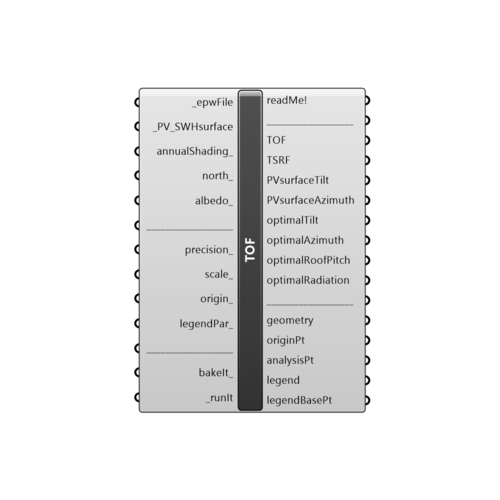

##  Tilt And Orientation Factor

This component calculates the Optimal Tilt, Optimal Orientation and TOF (Tilt and Orientation Factor) for PV modules or Solar water heating collectors.
 TOF is a solar radiation at the actual tilt and orientation divided by the solar radiation at the optimum tilt and orientation.
 -
 

#### Inputs
* ##### epwFile [Required]
Input .epw file path by using the "File Path" parameter, or Ladybug's "Open EPW And STAT Weather Files" component.
* ##### PV_SWHsurface [Required]
- Input planar Grasshopper/Rhino Surface (not a polysurface) on which the PV modules/SWH collectors will be applied. If you have a polysurface, explode it (using "Deconstruct Brep" component) and then feed its Faces(F) output to _PV_SWHsurface. Surface normal should be faced towards the sun.
 - Or create the Surface based on initial PV/SWH system size by using "PV SWH system size" component.
* ##### annualShading [Optional]
Losses due to buildings, structures, trees, mountains or other objects that prevent solar radiation from reaching the PV module/Solar water heating collector.
 Input range: 0 to 100(%), 0 being unshaded, and 100 being totally shaded PV module/SWH collector.
 -
 If not supplied default value of 0(%) will be used.
* ##### north [Optional]
Input a vector to be used as a true North direction, or a number between 0 and 360 that represents the clockwise degrees off from the Y-axis.
 -
 If not supplied, default North direction will be set to the Y-axis (0 degrees).
* ##### albedo [Optional]
A list of 8767 (with header) or 8760 (without the header) albedo values for each hour during a year.
 Albedo (or Reflection coefficient) is an average ratio of the global incident solar radiation reflected from the area surrounding the PV surface.
 It ranges from 0 to 1.
 -
 It depends on the time of the year/day, surface type, temperature, vegetation, presence of water, ice and snow etc.
 -
 If no list supplied, default value of 0.20 will be used, corrected(increased) for the presence of snow (if any).
 -
 Unitless.
* ##### precision [Optional]
Represents the square root number of analysis field for the output "geometry" mesh. Ranges from 1-100.
 Example - precision of 4, would mean that 4 fields in X direction (Azimuth) and 4 fields in Y direction (Tilt) = 16 fields, will be used to calculate the final "geometry" mesh.
 For lower precision numbers (say < 20) even precision numbers are more accurate.
 -
 CAUTION!!! Precision numbers (10 >) require stronger performance PCs. If your PC is somewhat "weaker", the precision of < 10 will be just fine.
 -
 If not supplied, default value of 2 will be used.
* ##### scale [Optional]
Scale of the overall geometry.
 -
 If not supplied, default value of 1 will be used.
* ##### origin [Optional]
Origin for the final "geometry" output.
 -
 If not supplied, default point of (-15,0,0) will be used.
* ##### legendPar [Optional]
Optional legend parameters from the Ladybug "Legend Parameters" component.
* ##### bakeIt [Optional]
Set to "True" to bake the Tilt and orientation factor results into the Rhino scene.
 -
 If not supplied default value "False" will be used.
* ##### runIt [Required]
...

#### Outputs
* ##### readMe!
...
* ##### TOF
Tilt and Orientation Factor - solar radiation at the actual tilt and azimuth divided by the solar radiation at the optimum tilt and azimuth.
 In percent(%).
* ##### TSRF
Total Solar Resource Fraction - the ratio of solar radiation available accounting for both annual shading and TOF, compared to the solar radiation available at a given location at the optimum tilt and azimuth and with no shading.
 Calculated according to the following equation:
 TSRF = TOF * (100-annualShading)/100
 Some USA states, like Oregon and Washington require TSRF to be minimum 75% in order for the PV system to be applicable for incentive programs.
 -
 In percent(%).
* ##### PVsurfaceTilt
Tilt angle of the inputted PV_SWHsurface.
 In degrees (°).
* ##### PVsurfaceAzimuth
Orientation angle of the inputted PV_SWHsurface.
 In degrees (°).
* ##### optimalTilt
Optimal tilt of the PV_SWHsurface for a given location. Optimal tilt being the one that receives the most annual solar radiation.
 In degrees (°).
* ##### optimalAzimuth
Optimal orientation of the PV_SWHsurface for a given location. Optimal azimuth being the one that receives the most annual solar radiation.
 In degrees (°).
* ##### optimalRoofPitch
Optimal steepness of the PV_SWHsurface for a given location. Optimal steepness being the one that receives the most annual solar radiation.
 In inches/inches
* ##### optimalRadiation
Total solar radiation per square meter for a whole year received on a PV_SWHsurface of optimal tilt and azimuth, at given location.
 In kWh/m2
* ##### geometry
Geometry of the whole TOF mesh chart.
 Connect this output to a Grasshopper's "Geo" parameter in order to preview the "geometry" separately in the Rhino scene.
* ##### originPt
The origin point of the "geometry" output.
 Use this point to move "geometry" output around in the Rhino scene with the grasshopper's "Move" component.
* ##### analysisPt
A point indicating inputted PV_SWHsurface's Tilt/Azimuth position on the solar radiation table.
* ##### legend
A legend for the annual total solar radiation (in kWh/m2). Connect this output to a Grasshopper's "Geo" parameter in order to preview the legend separately in the Rhino scene.  
* ##### legendBasePt
Legend base point, which can be used to move the "legend" geometry with grasshopper's "Move" component.

[Check Hydra Example Files for Tilt And Orientation Factor](https://hydrashare.github.io/hydra/index.html?keywords=Ladybug_Tilt And Orientation Factor)