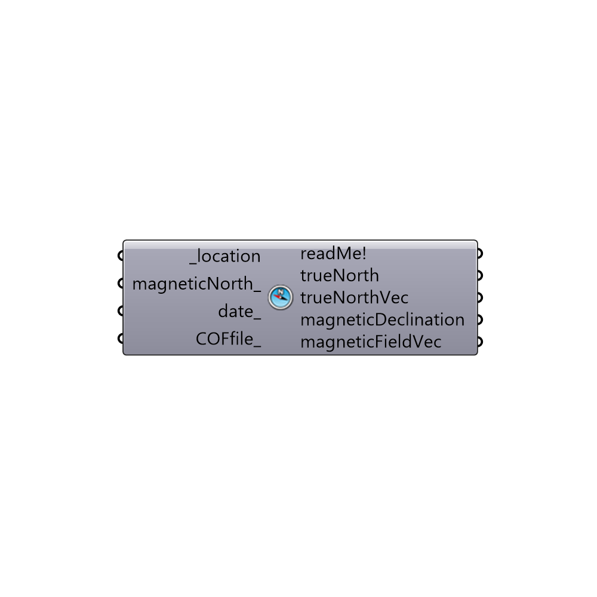

##  True North - [[source code]](https://github.com/ladybug-tools/ladybug-legacy/tree/master/src/Ladybug_True%20North.py)

Use this component to calculate Earth's true north from magnetic north.
 -
 If you are working with location plan generated by Google Maps or any other web mapping service, North will always be positioned in direction of Rhino's Y axis.
 In case you imported a location plan to Rhino, which has a North direction assigned in a form of magnetic North, then you need to correct that North direction for the influence of Earth's magnetic variation. Which is what this component does.
 -
 All credit goes to Christopher Weiss (cmweiss@gmail.com), the author of the World Magnetic Model python code.
 source: https://pypi.python.org/pypi/geomag
 -
 Based on World Magnetic Model of the NOAA:
 http://www.ngdc.noaa.gov/geomag/WMM/DoDWMM.shtml
 -
 

#### Inputs
* ##### location [Required]
Input data from Ladybug's "Import epw" "location" output, or create your own location data with Ladybug's "Construct Location" component.
* ##### magneticNorth [Optional]
Input a vector to be used as a magnetic North direction, or a number between 0 and 360 that represents the clockwise degrees off from the Y-axis.
 Magnetic north direction is direction a compass-needle points to.
 -
 If not supplied, default North direction will be set to the Y-axis (0 degrees).
* ##### date [Optional]
Date for which magnetic north should be calculated. Input a date in the following order: month, day, year.
 Example "5,24,2016" (24nd May 2016).
 -
 If not supplied, present date will be used.
* ##### COFfile [Optional]
By default "Magnetic north" component already has 2015-2020 integrated WMM coefficients data.
 In case you would like to analysis periods of time before the year 2015, input an appropriate WMM.COF file path in here.
 -
 If not supplied, integrated WMM.COF 2015-2020 coefficients data will be used.

#### Outputs
* ##### readMe!
...
* ##### trueNorth
Geographic north (direction towards the North Pole) - magnetic north corrected for the value of magnetic declination. Ranges from 0-360.
 -
 In decimal degrees (°).
* ##### trueNorthVec
Vector representation of the upper "trueNorth".
* ##### magneticDeclination
An angle between magnetic north and true north. It is positive east of true north and negative west of true north.
 -
 In decimal degrees (°).
* ##### magneticFieldVec
Earth's magnetic field vector at chosen location.
 Vector's intensity represents the strength in nanoTeslas (nT).

[Check Hydra Example Files for True North](https://hydrashare.github.io/hydra/index.html?keywords=Ladybug_True North)