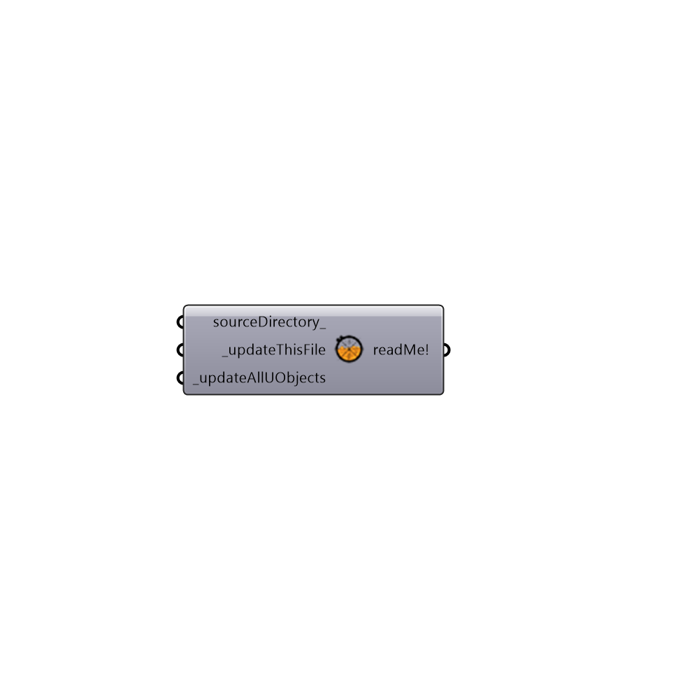

##  Update_Ladybug

Code Developers and Beta Testers of new Ladybug components can use this component to remove old Ladybug components, add new Ladybug components, and update existing Ladybug components from a synced Github folder on their computer.
 This component can also update outdated Ladybug components in an old Grasshopper file so long as the updates to the components do not involve new inputs or outputs.
 -
 

#### Inputs
* ##### sourceDirectory_ [Optional]
An optional address to a folder on your computer that contains the updated Ladybug userObjects. If no input is provided here, the component will download the latest version from GitHUB.
* ##### _updateThisFile [Required]
Set to "True" if you want this component to search through the current Grasshopper file and update Ladybug components that have changed.
* ##### _updateAllUObjects [Required]
Set to "True" to sync all the Ladybug and Honeybee userObjects in your Grasshopper folder with the GitHUB.

#### Outputs
* ##### readMe!
...

[Check Hydra Example Files for Update Ladybug](https://hydrashare.github.io/hydra/index.html?keywords=Ladybug_Update Ladybug)