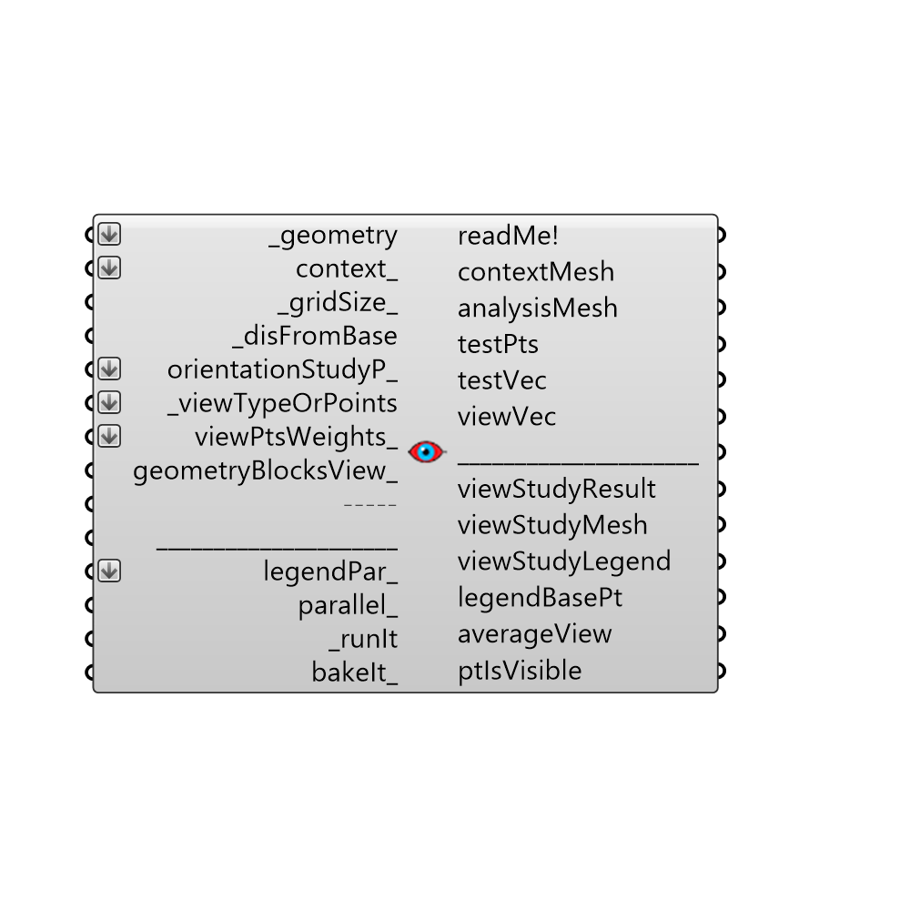

##  View Analysis

Use this component to evaluate the visibility of input _geometry from a set of key viewing points.
 For example, this component can be used to evaluate the visibility of an 3D architectural feature from a set of key viewing points along a nearby street or park where people congregate.
 Another example would be evaluating the visibility of park vegetation geometry from a set of key sun position points from the sunPath component.
 Yet another example would be evaluating the "visibility" of an outdoor overhead radiative heater from a set of key "viewing" points located over a human body standing beneath it.
 This component outputs a percentage of viewpoints seen by the input _geometry.  In the three examples here, this would be the percentage of the 3D architectural feature seen from the street, the percentage of sunlit hours received by the vegetation, or the percentage of the human body warmed by the heater.
 This component will evaluate view from the test points objectively in all directions. 
 -
 

#### Inputs
* ##### geometry [Required]
Geometry for which visibility analysis will be conducted.  Geometry must be either a Brep, a Mesh, or a list of Breps or Meshes.
* ##### context [Optional]
Context geometry that could block the view from the _viewPoints to the test _geometry.  Conext geometry must be either a Brep, a Mesh, or a list of Breps or Meshes.
* ##### gridSize [Default]
A number in Rhino model units that represents the average size of a grid cell for visibility analysis on the test _geometry.  This value should be smaller than the smallest dimension of the test _geometry for meaningful results.  Note that, the smaller the grid size, the higher the resolution of the analysis and the longer the calculation will take.
* ##### disFromBase [Required]
A number in Rhino model units that represents the offset distance of the test point grid from the input test _geometry.  Usually, the test point grid is offset by a small amount from the test _geometry in order to ensure that visibility analysis is done for the correct side of the test _geometry.  If the resulting mesh of this component is offset to the wrong side of test _geometry, you should use the "Flip" Rhino command on the test _geometry before inputting it to this component.
* ##### orientationStudyP [Optional]
Optional output from the "Orientation Study Parameter" component.  You can use an Orientation Study input here to answer questions like "What orientation of my building will give me the highest or lowest visibility from the street?"  An Orientation Study will automatically rotate your input _geometry around several times and record the visibility results each time in order to output a list of values for averageView and a grafted data stream for viewStudyResult.
* ##### viewPoints [Required]
Key viewing points from which the visibility of the test _geometry is important.
* ##### viewPtsWeights [Optional]
Use this input to assign weights of importance to the several _viewPoints that have been connected.  Weighted values should be between 0 and 1 and should be closer to 1 if a certain point is more important. The default value for all points is 0, which means they all have an equal importance. This input could be useful in cases such as the radiative heater example where points on the human body with exposed skin could be weighted at a higher value.
* ##### legendPar [Optional]
Optional legend parameters from the Ladybug Legend Parameters component.
* ##### parallel [Optional]
Set to "True" to run the visibility analysis using multiple CPUs.  This can dramatically decrease calculation time but can interfere with other intense computational processes that might be running on your machine.
* ##### runIt [Required]
Set to "True" to run the component and perform visibility analysis of the input _geometry.
* ##### bakeIt [Optional]
Set to "True" to bake the analysis results into the Rhino scene.
* ##### workingDir [Optional]
Use this input to change the working directory of the visibility analysis on your system. Input here must be a valid file path location on your computer.  The default is set to "C:\Ladybug" and it is from this file location that visibility results are loaded into grasshopper after the analysis is done.
* ##### projectName [Optional]
Use this input to change the project name of the files generated in the working directory.  Input here must be a string without special characters.  If "bakeIt_" is set to "True", the result will be baked into a layer with this project name.

#### Outputs
* ##### readMe!
...
* ##### contextMesh
An uncolored mesh representing the context_ geometry that was input to this component. Connect this output to a "Mesh" grasshopper component to preview this output seperately from the others of this component. Note that this mesh is generated before the analysis is run, allowing you to be sure that the right geometry will be run through the analysis before running this component.
* ##### analysisMesh
An uncolored mesh representing the test _geometry that will be analyzed.  Connect this output to a "Mesh" grasshopper component to preview this output seperately from the others of this component. Note that this mesh is generated before the analysis is run, allowing you to be sure that the right geometry will be run through the analysis before running this component.
* ##### testPts
The grid of test points on the test _geometry that will be used to perform the visibility analysis.  Note that these points are generated before the analysis is run, allowing you to preview the resolution of the result before you run the component.
* ##### testVec
Vectors for each of the test points on the test _geometry, which indicate the direction for which visibility analysis is performed.  Hook this and the test points up to a Grasshopper "Vector Display" component to see how analysis is performed on the test _geometry.
* ##### viewStudyResult
The percentage of _viewPoints visible from each of the test points of the input test _geometry.
* ##### viewStudyMesh
A colored mesh of the test _geometry representing the percentage of _viewPoints visible by each part of the input _geometry.
* ##### viewStudyLegend
A legend for the visibility analysis showing the percentage of visible points that correspond to the colors of the viewStudyMesh. Connect this output to a grasshopper "Geo" component in order to preview the legend separately in the Rhino scene.  
* ##### legendBasePt
The legend base point, which can be used to move the legend in relation to the view study mesh with the grasshopper "move" component.
* ##### averageView
The average percentage of the _viewPoints seen by all of the test _geometry.
* ##### ptIsVisible
A grafted data stream for each _geometry test point with a "1" for each _viewPoint that is visible by the test point and a "0" for each _viewPoint that is blocked.

[Check Hydra Example Files for View Analysis](https://hydrashare.github.io/hydra/index.html?keywords=Ladybug_View Analysis)