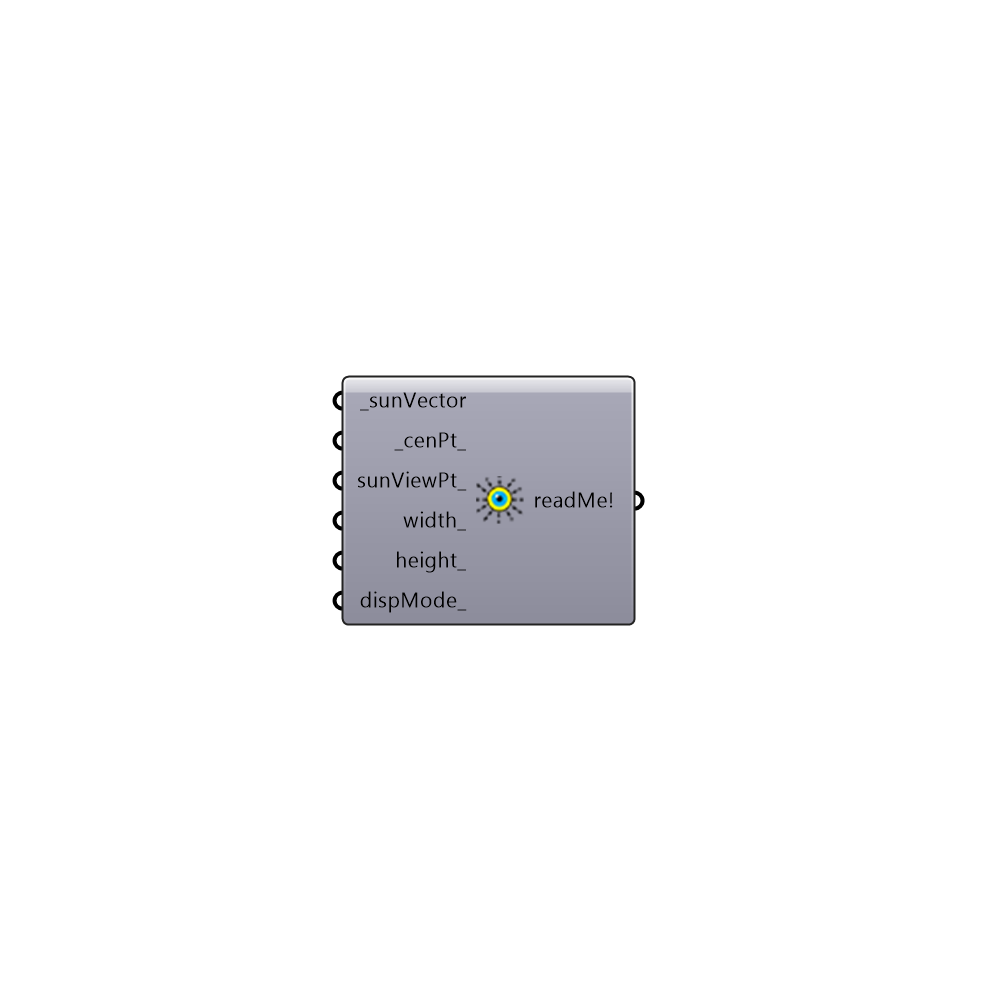

##  View_From_Sun

Use this component to open a new viewport in Rhino that shows the view from the sun.  This is useful for understanding what parts of Rhino geometry are shaded at a particular hour of the day.
 -
 

#### Inputs
* ##### sunVector [Required]
A sun vector from which the the Rhino view will be generated. Use the Ladybug sunPath component to generate sunVectors.
* ##### cenPt [Default]
The target point of the camera for the Rhino view that will be generated.  This point should be close to Rhino geometry that you are interested in viewing from the sun. If no point is progived, the Rhino origin will be used (0,0,0).
* ##### sunViewPt [Optional]
An optional point for the camera position (or sun position). Use this to move the camera closer to the geometry you would like to view if the initial view is too far away..
* ##### width [Optional]
An optional interger that represents the width (in pixels) of the Rhino viewport that will be generated.
* ##### height [Optional]
An optional interger that represents the height (in pixels) of the Rhino viewport that will be generated.
* ##### dispMode [Optional]
An optional text input for the display mode of the Rhino viewport that will be generated. For example: Wireframe, Shaded, Rendered, etc.

#### Outputs
* ##### readMe!
...

[Check Hydra Example Files for View From Sun](https://hydrashare.github.io/hydra/index.html?keywords=Ladybug_View From Sun)