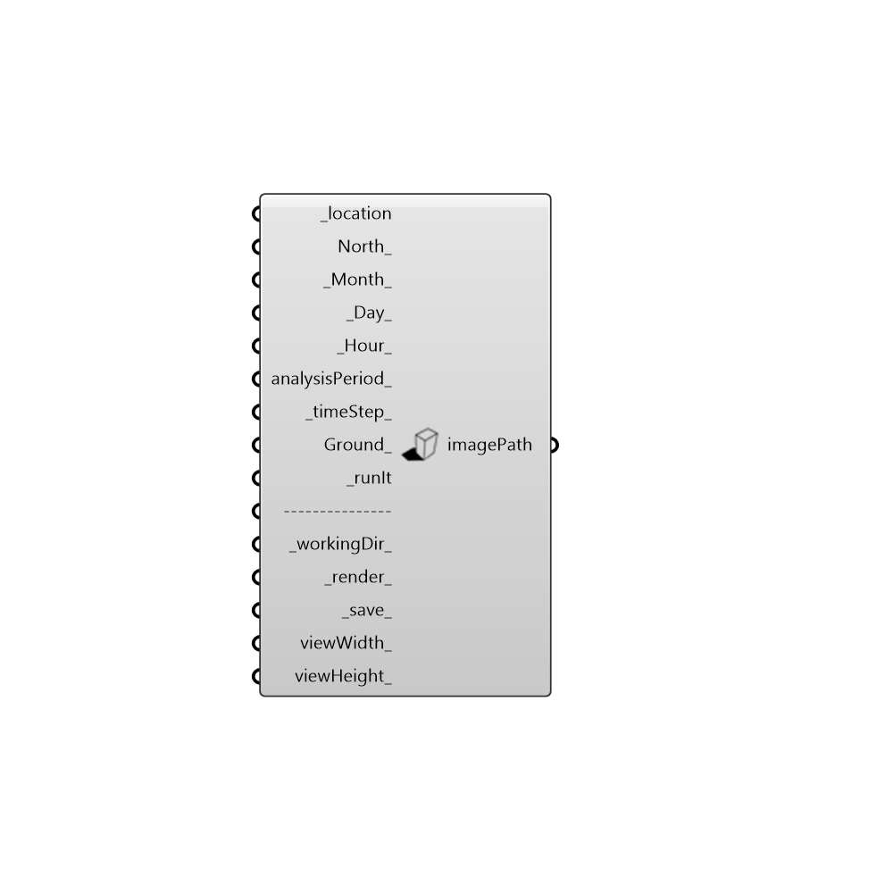

##  Visualize_Shadows

Use this component to link Rhino solar system to grasshopper and create sun positions according to the weatherfile. Furthermore, this component can be used to render the active viewport (with the selected renderer), and/or save the image of the viewport or render.
 -
 

#### Inputs
* ##### location [Required]
get location from Ladybug_Import epw component. This will update rhino solar system to the correct coordinates and timezone
* ##### North [Optional]
North direction of the model. This can be either an number representing angle, or a vector. (by default North is set on the y axis)
* ##### Month [Default]
A number that represents the month you want to visualize
* ##### Day [Default]
A number that represents the Day you want to visualize
* ##### Hour [Default]
A number that represents the Hour you want to visualize
* ##### analysisPeriod [Optional]
An optional analysis period from the Analysis Period component.  Inputs here will override the hour, day, and month inputs above. (this is to visualize up to a full)
* ##### timeStep [Default]
if analysisPeriod is used, this will divide the hour into steps (2 = 30 minutes, 4 = 15 minutes..)
* ##### Ground [Optional]
enable if you want to create a generic floor at 0.0 in order to visualize shadows in case there is no floor in the model.
* ##### runIt [Required]
Script variable Visualize_Shadows
* ##### workingDir [Default]
A folder path where your images or renders will be saved. Each image will be named according to the time of day that it represents
* ##### render [Default]
Enable to render the active viewport. (current rendered will be used, set up the render setting according to your need)
* ##### save [Default]
Enable to save a print of the active viewport. If _render_ is also active, this will save a copy of the rendered image in your folder
* ##### viewWidth [Optional]
A number that represents the image width in pixels
* ##### viewHeight [Optional]
A number that represents the image height in pixels

#### Outputs
* ##### imagePath
A path that represents the last saved image

[Check Hydra Example Files for Visualize_Shadows](https://hydrashare.github.io/hydra/index.html?keywords=Ladybug_Visualize_Shadows)