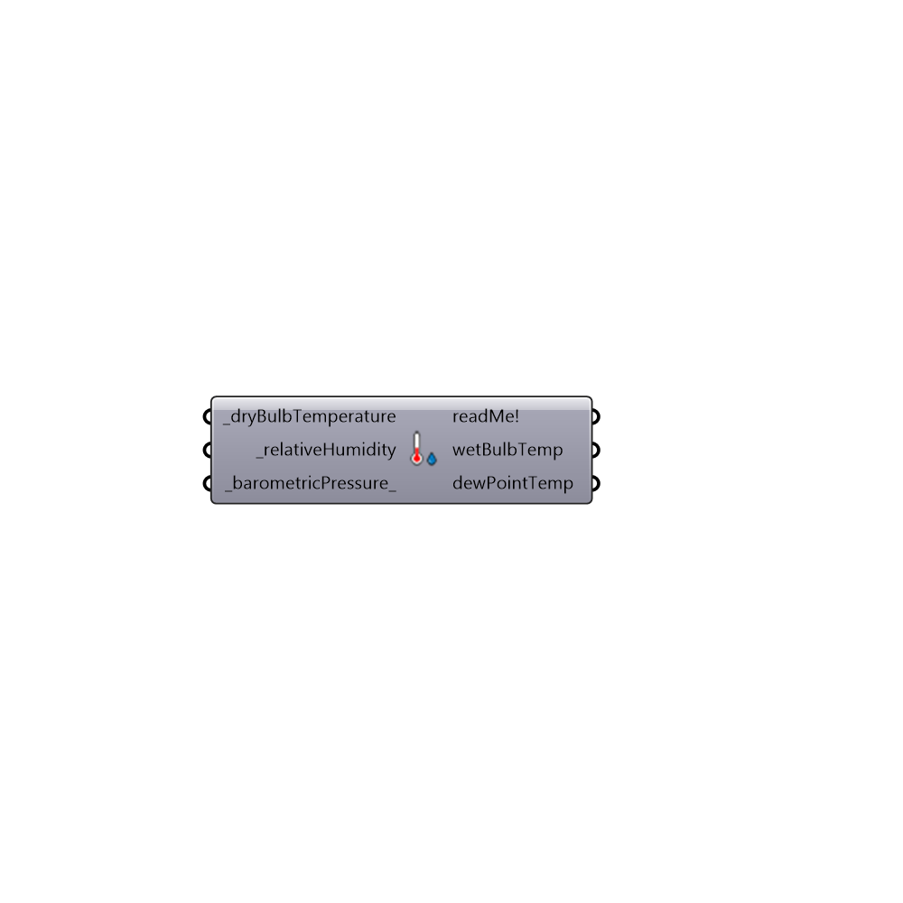

##  WetBulbTemp

Use this component to calculate Wet Bulb Temperature and Dew Point Temperature
 -
 This component uses the "Method for obtaining wet-bulb temperatures by modifying the psychrometric formula"
 created by J. Sullivan and L. D. Sanders (Center for Experiment Design and Data Analysis).
 NOAA - National Oceanic and Atmospheric Administration
 Special thanks goes to the authors of the online wet-bulb temperature calculator 
 http://www.srh.noaa.gov/epz/?n=wxcalc_rh
 -
 

#### Inputs
* ##### dryBulbTemperature [Required]
The dry bulb temperature [°C] from Import epw component and Ladybug_Average Data or generic lists of numbers.
* ##### relativeHumidity [Required]
The relative humidity [%] from Import epw component and Ladybug_Average Data or generic lists of numbers.
* ##### barometricPressure [Default]
The barometric pressure [Pa] from Import epw component and Ladybug_Average Data or generic lists of numbers. If no value is connected here, the default pressure will be 101325 Pa, which is air pressure at sea level.

#### Outputs
* ##### readMe!
...
* ##### wetBulbTemp
The lowest temperature that can be reached by evaporating water into the air.
* ##### dewPointTemp
The temperature at which the water vapor contained in a volume of air at a given atmospheric pressure reaches saturation and condenses to form dew.

[Check Hydra Example Files for WetBulbTemp](https://hydrashare.github.io/hydra/index.html?keywords=Ladybug_WetBulbTemp)