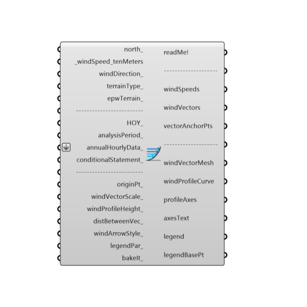

##  Wind Boundary Profile

Use this component to visualize a wind profile curve for a given terrain type.  Wind speed increases as one leaves the ground and wind profiles are a means of visualizing this change in wind speed with height.
 -
 More information on the power law of the wind profile can be found here: http://en.wikipedia.org/wiki/Wind_profile_power_law
 -
 

#### Inputs
* ##### north [Optional]
Input a vector to be used as a true North direction for the sun path or a number between 0 and 360 that represents the degrees off from the y-axis to make North.  The default North direction is set to the Y-axis (0 degrees).
* ##### windSpeed_tenMeters [Required]
The wind speed from the import EPW component or a number representing the wind speed at 10 meters off the ground.  If this value is input without a corresponding wind direction below, the profile will be drawn with the average of the speed input here.  If corresponding values are connected to the windDirection, the speed on the profile will be the average speed of the prevailing wind direction.
* ##### windDirection [Optional]
An optional number representing the degrees from north of the wind direction.  This can also be the windDirection output from the import EPW component.  This direction will be used to orient the wind profile in 3 dimensions to the direction of the prevailing wind.
* ##### terrainType [Optional]
An interger from 0 to 3 that sets the terrain class associated with the output windSpeedAtHeight. Interger values represent the following terrain classes:
 0 = Urban: large city centres, 50% of buildings above 21m over a distance of at least 2000m upwind.
 1 = Suburban: suburbs, wooded areas.
 2 = Country: open, with scattered objects generally less than 10m high.
 3 = Water: Flat, unobstructed areas exposed to wind flowing over a large water body (no more than 500m inland).
* ##### epwTerrain [Optional]
An optional interger from 0 to 3 that sets the terrain class associated with the output windSpeedAtHeight. The default is set to 2 for flat clear land, which is typical for most EPW files that are recorded at airports.  Interger values represent the following terrain classes:
 0 = Urban: large city centres, 50% of buildings above 21m over a distance of at least 2000m upwind.
 1 = Suburban: suburbs, wooded areas.
 2 = Country: open, with scattered objects generally less than 10m high.
 3 = Water: Flat, unobstructed areas exposed to wind flowing over a large water body (no more than 500m inland).
* ##### HOY [Optional]
Use this input to select out specific indices of a list of values connected for wind speed and wind direction.  If you have connected hourly EPW data, this is the equivalent of a "HOY" input and you can use the "Ladybug_DOY_HOY" component to select out a specific hour and date.  Note that this overrides the analysisPeriod_ input below.
* ##### analysisPeriod [Optional]
If you have connected data from an EPW component, plug in an analysis period from the Ladybug_Analysis Period component to calculate data for just a portion of the year. The default is Jan 1st 00:00 - Dec 31st 24:00, the entire year.
* ##### annualHourlyData [Optional]
An optional list of hourly data from the Import epw component, which will be overlaid on wind rose (e.g. dryBulbTemperature)
* ##### conditionalStatement [Optional]
This input allows users to remove data that does not fit specific conditions or criteria from the wind rose. To use this input correctly, hourly data, such as temperature or humidity, must be plugged into the annualHourlyData_ input. The conditional statement input here should be a valid condition statement in Python, such as "a>25" or "b<80" (without quotation marks).
 The current version of this component accepts "and" and "or" operators. To visualize the hourly data, only lowercase English letters should be used as variables, and each letter alphabetically corresponds to each of the lists (in their respective order): "a" always represents the 1st list, "b" always represents the 2nd list, etc.
 For the WindBoundaryProfile component, the variable "a" always represents windSpeed. For example, if you have hourly dry bulb temperature connected as the second list, and relative humidity connected as the third list (both to the annualHourlyData_ input), and you want to plot the data for the time period when temperature is between 18C and 23C, and humidity is less than 80%, the conditional statement should be written as “18<b<23 and c<80” (without quotation marks).
* ##### originPt [Optional]
An optional point that can be used to change the base point at shich the wind profile curves are generated.  By default, the wond profile curves generate at the Rhino model origin.
* ##### windVectorScale [Optional]
An optional number that can be used to change the scale of the wind vectors in relation to the height of the wind profile curve.  The default is set to 5 so that it is easier to see how the wind speed is changing with height.
* ##### windProfileHeight [Optional]
An optional number in rc model units that can be used to change the height of the wind profile curve.  By default, the height of the curve is set to 30 meters (or the equivalent distance in your Rhino model units).  You may want to move this number higher or lower depending on the wind effects that you are interested in.
* ##### distBetweenVec [Optional]
An optional number in rhino model units that represents the distance between wind vectors in the profile curve.  The default is set to 2 meters (or the equivalent distance in your rc model units).
* ##### windArrowStyle [Optional]
An optional integer to set the style of the wind vectors.  The default is set to 1 for colored arrows.  Choose from the following options:
 0 = No Wind Arrows - use this option if you do not want to gerenate arrows.
 1 = 3D Colored Wind Arrows - use this option to generate arrows as a colored 3D mesh (arrows will be colored based on the magnitude of their wind speed).
 2 = High-Res 3D Colored Wind Arrows - use this option to create color arrows just like Option 1 but with a circular cross section and smooth edges.
 3 = Colored Line Wind Arrows - use this option to generate arrows as lines with colored tips.
 4 = Black Line Wind Arrows - use this option to generate arrows as lines with black tips.
* ##### legendPar [Optional]
Optional legend parameters from the Ladybug Legend Parameters component.
* ##### bakeIt [Optional]
Set to "True" to bake the wind boundary profile into the Rhino scene.

#### Outputs
* ##### readMe!
...
* ##### windSpeeds
The wind speeds that correspond to the wind vectors in the wind profile visualization.
* ##### windVectors
The wind vectors that correspond to those in the wind profile visualization.  Note that the magnitude of these vectors will be scaled based on the windVectorScale_ input.
* ##### vectorAnchorPts
Anchor points for each of the vectors above, which correspond to the height above the ground for each of the vectors.  Connect this along with the output above to a Grasshopper "Vector Display" component to see the vectors as a grasshopper vector display (as opposed to the vector mesh below).
* ##### windVectorMesh
A mesh displaying the wind vectors that were used to make the profile curve.
* ##### windProfileCurve
A curve outlining the wind speed as it changes with height.  This may also be a list of wind profile curves if multiple "HOY_" inputs are connected or "averageData_" is set to False."
* ##### profileAxes
Script variable WindBoundaryProfile
* ##### axesText
The meshes of the axes text (labelling wind speeds and heights).
* ##### legend
A legend of the wind profile curves. Connect this output to a grasshopper "Geo" component in order to preview the legend separately in the rc scene.
* ##### legendBasePt
The legend base point(s), which can be used to move the legend in relation to the wind profile with the grasshopper "move" component.

[Check Hydra Example Files for Wind Boundary Profile](https://hydrashare.github.io/hydra/index.html?keywords=Ladybug_Wind Boundary Profile)