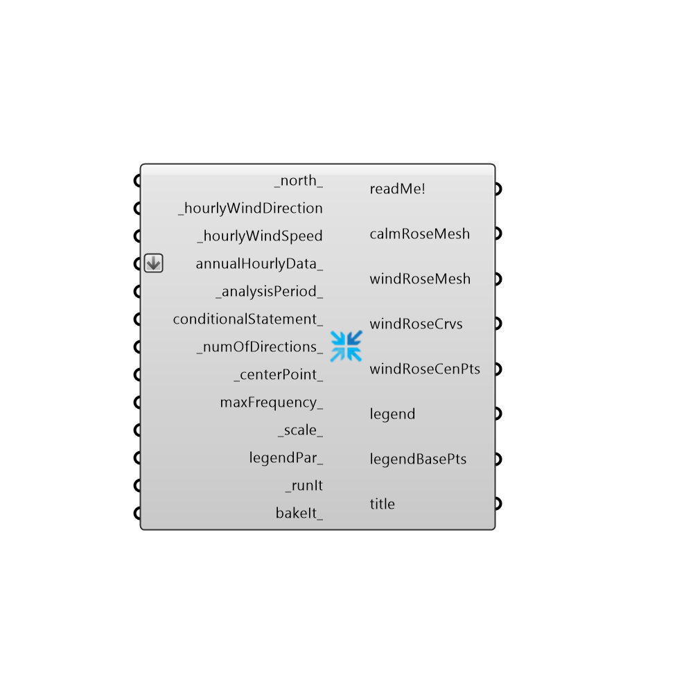

## Wind Rose []

Use this component to make a windRose in the Rhino scene.
 -
 

#### Inputs
* ##### _north_ [Default]
Input a vector to be used as a true North direction for the wind rose or a number between 0 and 360 that represents the degrees off from the y-axis to make North.  The default North direction is set to the Y-axis (0 degrees).
* ##### _hourlyWindDirection [Required]
The list of hourly wind direction data from the Import epw component.
* ##### _hourlyWindSpeed [Required]
The list of hourly wind speed data from the Import epw component.
* ##### annualHourlyData_ [Optional]
An optional list of hourly data from the Import epw component, which will be overlaid on wind rose (e.g. dryBulbTemperature)
* ##### _analysisPeriod_ [Default]
An optional analysis period from the Analysis Period component.
* ##### conditionalStatement_ [Optional]
This input allows users to remove data that does not fit specific conditions or criteria from the wind rose. To use this input correctly, hourly data, such as temperature or humidity, must be plugged into the annualHourlyData_ input. The conditional statement input here should be a valid condition statement in Python, such as "a>25" or "b<80" (without quotation marks).
 The current version of this component accepts "and" and "or" operators. To visualize the hourly data, only lowercase English letters should be used as variables, and each letter alphabetically corresponds to each of the lists (in their respective order): "a" always represents the 1st list, "b" always represents the 2nd list, etc.
 For the WindBoundaryProfile component, the variable "a" always represents windSpeed. For example, if you have hourly dry bulb temperature connected as the second list, and relative humidity connected as the third list (both to the annualHourlyData_ input), and you want to plot the data for the time period when temperature is between 18C and 23C, and humidity is less than 80%, the conditional statement should be written as “18<b<23 and c<80” (without quotation marks).
* ##### _numOfDirections_ [Default]
A number of cardinal directions with which to divide up the data in wind rose. Values must be greater than 4 since you can have no fewer than 4 cardinal directions.
* ##### _centerPoint_ [Default]
Input a point here to change the location of the wind rose in the Rhino scene.  The default is set to the Rhino model origin (0,0,0).
* ##### maxFrequency_ [Optional]
An optional number between 1 and 100 that represents the maximum percentage of hours that the outer-most ring of the wind rose represents.  By default, this value is set by the wind direction with the largest number of hours (the highest frequency) but you may want to change this if you have several wind roses that you want to compare to each other.  For example, if you have wind roses for different months or seasons, which each have different maximum frequencies.
* ##### _scale_ [Default]
Input a number here to change the scale of the wind rose.  The default is set to 1.
* ##### legendPar_ [Optional]
Optional legend parameters from the Ladybug Legend Parameters component.
* ##### _runIt [Required]
Set this value to "True" to run the component and generate a wind rose in the Rhino scene.
* ##### bakeIt_ [Optional]
Set this value to "True" to bake the wind rose into the Rhino scene.

#### Outputs
* ##### readMe!
...
* ##### calmRoseMesh
A mesh in the center of the wind rose representing the relative number of hours where the wind speed is around 0 m/s.
* ##### windRoseMesh
A mesh representing the wind speed from different directions for all hours analyzed.
* ##### windRoseCrvs
A set of guide curves that mark the number of hours corresponding to the windRoseMesh.
* ##### windRoseCenPts
The center point(s) of wind rose(s).  Use this to move the wind roses in relation to one another using the grasshopper "move" component.
* ##### legend
A legend of the wind rose. Connect this output to a grasshopper "Geo" component in order to preview the legend separately in the Rhino scene.  
* ##### legendBasePts
The legend base point(s), which can be used to move the legend in relation to the rose with the grasshopper "move" component.
* ##### title
The title for the wind rose. Connect this output to a grasshopper "Geo" component in order to preview the legend separately in the Rhino scene.  

[Check Hydra Example Files for Wind Rose](https://hydrashare.github.io/hydra/index.html?keywords=Ladybug_Wind Rose)