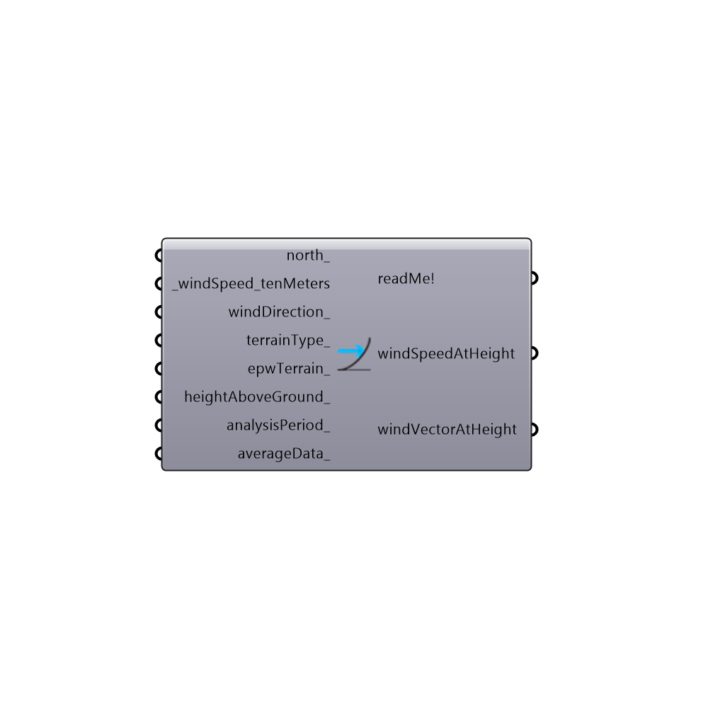

## Wind Speed Calculator []

Use this component to calculate wind speed at a specific height for a given terrain type.  By default, the component will calculate ground wind speed, which is useful for comfrt calculations.  Also, by hooking up wind data from an epw file, you can use the resulting data to create a wind rose at any height.
 -
 

#### Inputs
* ##### north_ [Optional]
Input a vector to be used as a true North direction for the sun path or a number between 0 and 360 that represents the degrees off from the y-axis to make North.  The default North direction is set to the Y-axis (0 degrees).
* ##### _windSpeed_tenMeters [Required]
The wind speed from the import EPW component or a number representing the wind speed at 10 meters off the ground in agricultural or airport terrian.  This input also accepts lists of numbers representing different speeds at 10 meters.
* ##### windDirection_ [Optional]
The wind direction from the import EPW component or a number in degrees represeting the wind direction from north,  This input also accepts lists of numbers representing different directions.
* ##### terrainType_ [Optional]
An interger from 0 to 3 that sets the terrain class associated with the output windSpeedAtHeight. Interger values represent the following terrain classes:
 0 = Urban: large city centres, 50% of buildings above 21m over a distance of at least 2000m upwind.
 1 = Suburban: suburbs, wooded areas.
 2 = Country: open, with scattered objects generally less than 10m high.
 3 = Water: Flat, unobstructed areas exposed to wind flowing over a large water body (no more than 500m inland).
* ##### epwTerrain_ [Optional]
An optional interger from 0 to 3 that sets the terrain class associated with the output windSpeedAtHeight. The default is set to 2 for flat clear land, which is typical for most EPW files that are recorded at airports.  Interger values represent the following terrain classes:
 0 = Urban: large city centres, 50% of buildings above 21m over a distance of at least 2000m upwind.
 1 = Suburban: suburbs, wooded areas.
 2 = Country: open, with scattered objects generally less than 10m high.
 3 = Water: Flat, unobstructed areas exposed to wind flowing over a large water body (no more than 500m inland).
* ##### heightAboveGround_ [Optional]
Optional. This is the height above ground for which you would like to measure wind speed. Providing more than one value will generate a list of speeds at each given height. Default height is 1 m above ground, which is what a person standing on the ground would feel.
* ##### analysisPeriod_ [Optional]
If you have connected data from an EPW component, plug in an analysis period from the Ladybug_Analysis Period component to calculate data for just a portion of the year. The default is Jan 1st 00:00 - Dec 31st 24:00, the entire year.
* ##### averageData_ [Optional]
Set to "True" to average all of the wind data that you have connected into a single speed and wind vector. The default is False, which means the component will return a list of all hours within the analysis period.  If se tot Ture, the wind data will be averaged for the entire analysis period into a single value. 

#### Outputs
* ##### readMe!
...
* ##### windSpeedAtHeight
The wind speed at the connected height above the ground.  If averageData_ = True, this will be a single value representing the average speed for all connected values or values within the analysis period at each height. If averageData_ = False, this returns a list of wind speeds for every hour within the analysis period at each height. Note than when averageData_ =  False, the list will include a header specific to each list. This header can be removed by using the "Ladybug_Separate Data" component.
* ##### windVectorAtHeight
Returns a list of vectors representing wind speed and direction at every hour within the analysis period, at each height provided.

[Check Hydra Example Files for Wind Speed Calculator](https://hydrashare.github.io/hydra/index.html?keywords=Ladybug_Wind Speed Calculator)