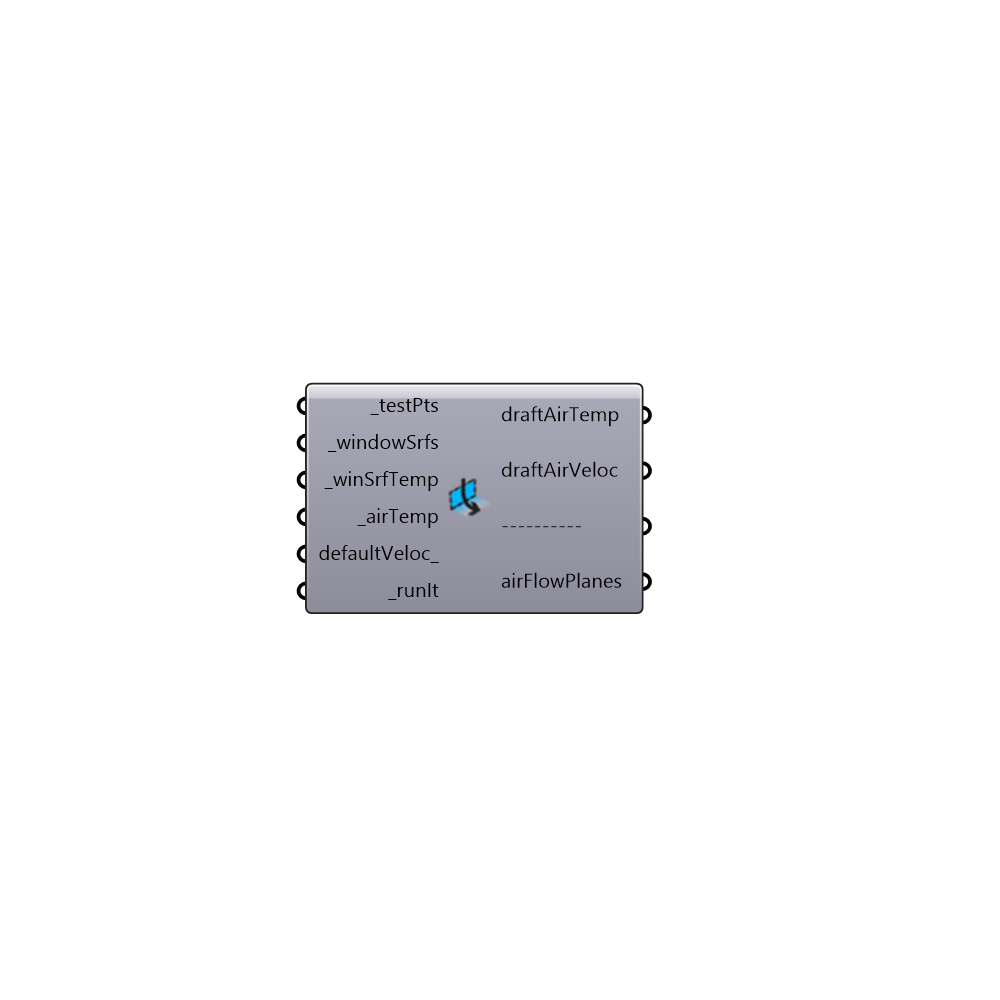

##  Window Downdraft - [[source code]](https://github.com/mostaphaRoudsari/ladybug/tree/master/src/Ladybug_Window%20Downdraft.py)

Use this component to compute the floor-level downdraft air temperature and velocity at a given set of points that are located close to a cold surface such as a window.  The draft conditions produced by this model are assumed to be 10 cm off of the floor.
 _
 The model used in this component comes from physical measurements of window downdraft that were further validated using several CFD experiments.  Ther are published in these papers:
 _
 Heiselberg, P. (1994). “Draft Risk from Cold Vertical Surfaces.” Building and Environment, 29: 297-301.
 Manz, H. and Frank, T. (2003). "Analysis of Thermal Comfort near Cold Vertical Surfaces by Means of Computational Fluid Dynamics." Indoor Built Environment. 13: 233-242.
 -
 

#### Inputs
* ##### testPts [Required]
The test points at which downdraft conditions will be evaluated.
* ##### windowSrfs [Required]
Breps or Surfaces representing the window surfaces off of which downdraft flows.
* ##### winSrfTemp [Required]
A number representing the surface temperature of the windows in degrees Celcius.
* ##### airTemp [Required]
A number representing the air temperature of the room in degrees Celcius.
* ##### defaultVeloc [Optional]
A number in m/s that represents the speed of the air that is not in the downdraft. The default is set to 0.05 m/s.
* ##### runIt [Required]
Set to 'True' to run the component and claculate downdraft conditions.

#### Outputs
* ##### draftAirTemp
Script output PPD.
* ##### draftAirVeloc
Script variable downDraft
* ##### airFlowPlanes
Script variable downDraft

[Check Hydra Example Files for Window Downdraft](https://hydrashare.github.io/hydra/index.html?keywords=Ladybug_Window Downdraft)