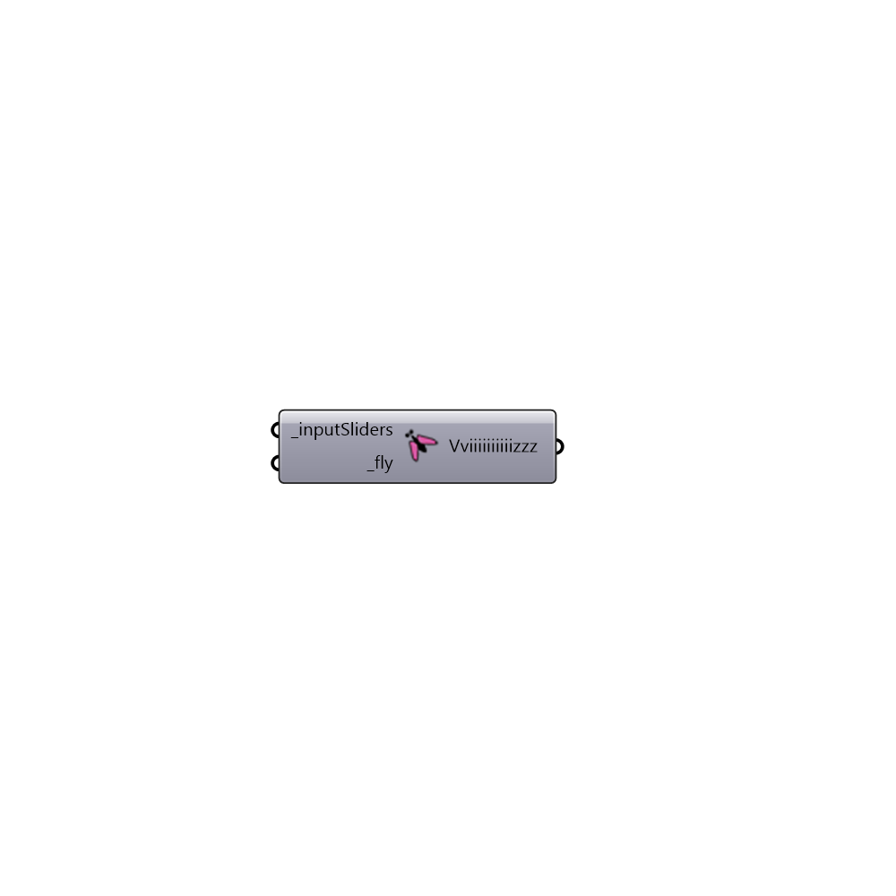

##  fly

Use Fly to cycle through all connected sliders. If no slider is connects it will cycle through all the sliders in the document!
       Fly is originally posted as a code snippet by David Rutten. The code has been modified by James Ramsedn and Mostapha Sadeghipour Roudsari.
 
       -
       

#### Inputs
* ##### inputSliders [Required]
Script Variable _inputSliders
* ##### fly [Required]
Script Variable _fly

#### Outputs
* ##### Vviiiiiiiiiizzz
Output parameter Vviiiiiiiiiizzz

[Check Hydra Example Files for fly](https://hydrashare.github.io/hydra/index.html?keywords=Ladybug_fly)